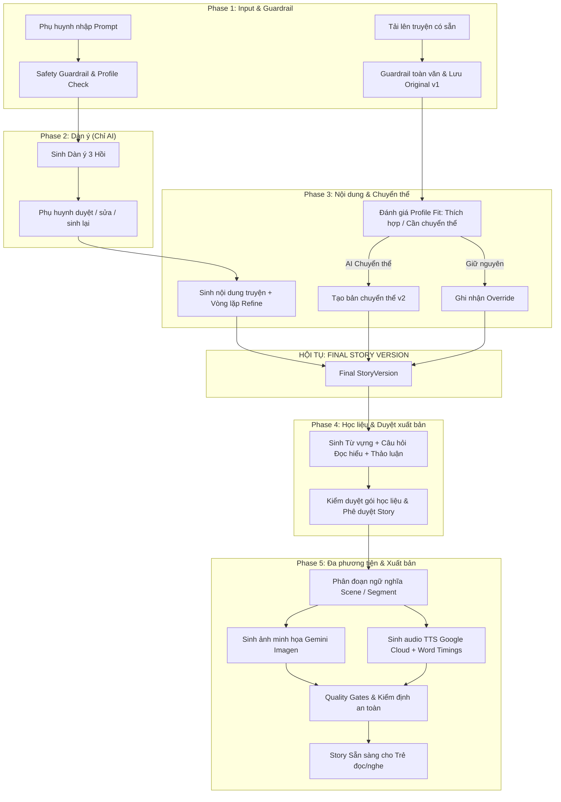
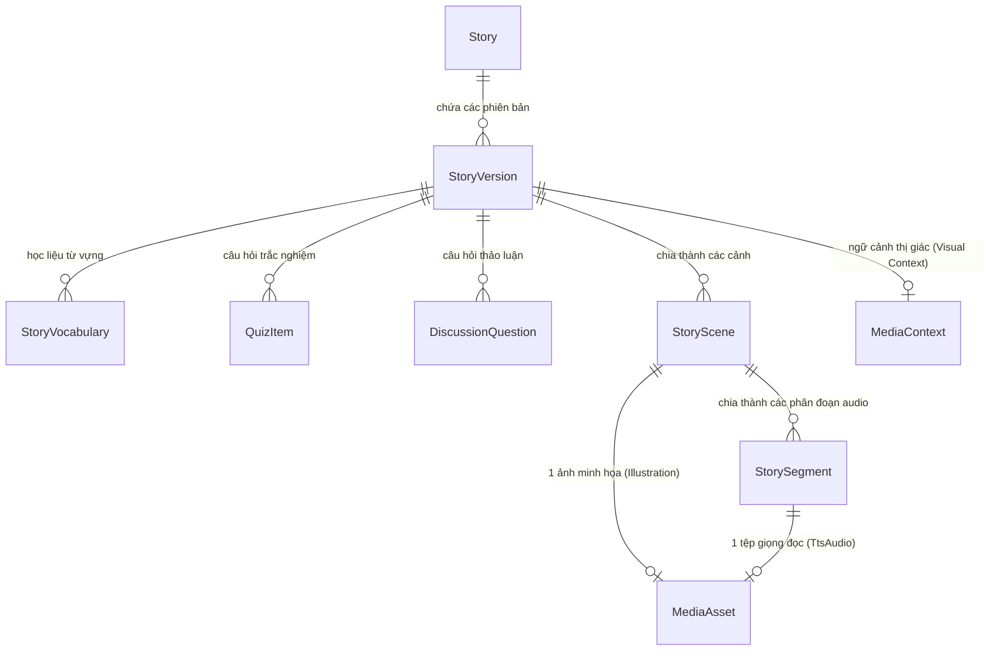

# LUỒNG 2: TỔNG QUAN KIẾN TRÚC HỆ THỐNG & THIẾT KẾ CHUẨN 5 PHASE
**(Flow 2: Guided Story Generation & Adaptation Pipeline)**

---

## 1. TỔNG QUAN HỆ THỐNG & BÀI TOÁN KINH DOANH

### 1.1. Hệ thống giải quyết bài toán gì?
Hệ thống **AI Storytelling for Children** giải quyết bài toán tạo ra nội dung truyện giáo dục tương tác, được cá nhân hóa cao theo từng đứa trẻ (dựa trên độ tuổi, năng lực ngôn ngữ, sở thích, mối quan tâm đạo đức và chính sách an toàn của phụ huynh/nhà trường).

Trước đây, việc sáng tác truyện thủ công hoặc đọc truyện có sẵn gặp nhiều rào cản:
1. **Thiếu cá nhân hóa**: Trẻ có độ tuổi, tốc độ đọc, và vốn từ khác nhau nhưng phải đọc cùng một nội dung tĩnh.
2. **Nội dung sẵn có (Existing Stories) không phù hợp lứa tuổi**: Nhiều truyện dân gian, truyện tranh cổ tích chứa yếu tố bạo lực, ngôn từ phức tạp hoặc bài học không phù hợp nhưng phụ huynh khó rà soát hết.
3. **Thiếu tính đa phương tiện đồng bộ**: Trẻ nhỏ học hiệu quả nhất qua âm thanh và hình ảnh đồng bộ. Việc tạo hình ảnh minh họa liên tục (consistent visual) và giọng đọc chuẩn kèm đánh dấu từ (karaoke word-highlighting) đòi hỏi chi phí sản xuất cực lớn.
4. **An toàn trẻ em (Child Safety)**: Trí tuệ nhân tạo (LLM) dễ bị ảo giác (hallucination), tạo ra nội dung thiên kiến, kinh dị hoặc không an toàn cho trẻ nếu không có hệ thống kiểm duyệt nghiêm ngặt.

### 1.2. Giải pháp Luồng 2 (Flow 2)
Luồng 2 thiết lập một **quy trình 5 Phase có kiểm soát chặt chẽ (Human-in-the-loop + Automated Quality Gates)**, hỗ trợ song song hai nguồn truyện:
- **Nhánh A (AI Generated Story)**: Sáng tác mới hoàn toàn từ ý tưởng/yêu cầu của phụ huynh, tuân thủ hồ sơ trẻ (`ChildProfile`, `LearningProfile`, `SafetyPolicy`).
- **Nhánh B (Existing / User-provided Story)**: Nhập truyện có sẵn (Paste text, TXT, DOCX), phân tích độ phù hợp với trẻ, hỗ trợ chuyển thể (Adaptation) bằng AI hoặc giữ nguyên có ghi nhận kiểm duyệt.

Cả hai nhánh hội tụ tại **Final StoryVersion**, sau đó dùng chung quy trình tạo học liệu giáo dục (Phase 4) và sinh đa phương tiện hình ảnh/âm thanh (Phase 5).



---

## 2. RANH GIỚI KIẾN TRÚC & QUYỀN SỞ HỮU (OWNERSHIP BOUNDARIES)

Hệ thống tuân thủ nghiêm ngặt nguyên tắc **Clean Architecture** và phân tách rõ ràng quyền sở hữu giữa Core Backend và AI Processing:

```
src/
├── Core/
│   ├── StoryPlatform.Domain/          --> Thực thể nghiệp vụ, Aggregate Roots, Enums
│   ├── StoryPlatform.Application/     --> UseCases, Orchestrators, Interfaces
│   ├── StoryPlatform.Infrastructure/  --> EF Core, AI Providers, Storage, DB Migrations
│   └── StoryPlatform.Api/             --> REST Controllers, Auth, Middleware
├── AI/
│   ├── StoryPlatform.AI.Domain/       --> Prompt Models, Generation Value Objects
│   ├── StoryPlatform.AI.Application/  --> AI Pipeline Services, Refine Loops
│   ├── StoryPlatform.AI.Infrastructure/ -> LLM HTTP Clients, Parsing, Prompts
│   └── StoryPlatform.AI.Api/          --> Dedicated AI Processing Endpoints
└── Shared/
    └── StoryPlatform.Contracts/       --> DTOs và Contracts dùng chung
```

### 2.1. Phân định quyền sở hữu (Ownership Rules)
| Thành phần | Core Service (`src/Core`) | AI Service (`src/AI`) |
| :--- | :--- | :--- |
| **Dữ liệu & Database** | Sở hữu toàn bộ `DbContext`, Entities (`Story`, `StoryVersion`, `MediaAsset`, `StorySegment`), Migration, Transaction. | **Không sở hữu database**, không tham chiếu EF Core, không truy cập trực tiếp bảng của Core. |
| **Nghiệp vụ cốt lõi** | Quản lý tài khoản, quan hệ giám sát phụ huynh - trẻ, xác thực JWT, quyền duyệt truyện, xuất bản. | Không quản lý User/Child profile; chỉ nhận Context qua request DTO. |
| **Năng lực AI** | Gọi interface trừu tượng (`IMediaGenerationService`, `ISceneSegmentationProvider`). | Sở hữu Prompt Templates, JSON Schemas, cấu hình LLM temperature/topP, chiến lược parse output, refine loop. |
| **Giao tiếp** | Giao tiếp qua HTTP REST hoặc Dependency Injection nội bộ sử dụng shared contracts `StoryPlatform.Contracts`. | Nhận input dạng DTO không trạng thái (stateless DTO), trả về kết quả có cấu trúc. |

---

## 3. MÔ HÌNH DỮ LIỆU & QUAN HỆ THỰC THỂ (DATA MODELS)

Toàn bộ dữ liệu của Luồng 2 xoay quanh tính **Bất biến của phiên bản (Version Immutability)**:



### Chi tiết các thực thể cốt lõi:
1. **`Story`**: Đại diện cho câu chuyện tổng thể (`Title`, `Source: AI | Manual`, `Status: Draft | ContentReview | Approved | MediaProcessing | Ready | Archived`, `ChildProfileId`).
2. **`StoryVersion`**: Bản ghi nội dung truyện bất biến (`VersionNo`, `Content`, `RawContent`, `GenerationType: AiGenerated | UploadedOriginal | AiAdapted | ManualEdit`, `IsCurrent`). Khi người dùng sửa truyện hoặc AI adapt, một version mới được sinh ra; version cũ được giữ nguyên phục vụ audit trail.
3. **`StoryScene`**: Đại diện cho 1 cảnh trực quan (Visual & Narrative Scene) phục vụ việc vẽ tranh minh họa. Đảm bảo phủ 100% nội dung truyện không bị trùng lặp hay sót từ.
4. **`StorySegment`**: Phân đoạn câu nói trong cảnh phục vụ Text-To-Speech (`SegmentOrder`, `RawText`, `CleanText`, `SsmlContent`, `WordCount`, `EstimatedDurationMs`).
5. **`MediaAsset`**: Tệp nhị phân đã sinh ra gắn chặt vào StoryVersion:
   - Nếu `Type == Illustration`: Gắn với `StorySceneId` (`StorySegmentId` bắt buộc NULL).
   - Nếu `Type == TtsAudio`: Gắn với `StorySegmentId` (`StorySceneId` có thể gán cảnh cha).
   - Chứa metadata truy vết: `Provider`, `Model`, `ValidationStatus` (`Pending`, `Passed`, `Failed`), `WordTimings` (JSON vị trí từng từ theo mili-giây), `AttemptCount`, `Url`.
6. **`MediaContext`**: Lưu thông tin nhất quán thị giác (`Visual Consistency`): mô tả ngoại hình nhân vật chính, trang phục, bảng màu, bối cảnh xuyên suốt, kèm trường `Revision` để phân biệt các lần chỉnh sửa prompt media.

---

## 4. BẢNG TRẠNG THÁI & CƠ CHẾ BẢO VỆ DỮ LIỆU (STATE MACHINE & SAFEGUARDS)

### 4.1. Vòng đời trạng thái Story (`stories.status`)
Hệ thống phân biệt rõ trạng thái nghiệp vụ cấp cao (`Story.Status`) và trạng thái tiến trình xử lý kỹ thuật (`StoryGenerationJob.Stage`):

| Trạng thái | Ý nghĩa nghiệp vụ | Hành động cho phép |
| :--- | :--- | :--- |
| `Draft` | Truyện đang trong giai đoạn khởi tạo (Phase 1, 2, 3). | AI sinh nội dung, phụ huynh sửa dàn ý/chuyển thể. |
| `ContentReview` | Đã có Final StoryVersion và gói học liệu Phase 4. | Phụ huynh xem xét, chỉnh sửa từ vựng, quiz, duyệt truyện. |
| `Approved` | Phụ huynh đã phê duyệt nội dung và học liệu. | Chuyển sang kích hoạt sinh media Phase 5. |
| `MediaProcessing` | Đang sinh ảnh minh họa và audio TTS bất đồng bộ. | Hệ thống chạy background jobs; chưa hiển thị cho trẻ em. |
| `Ready` | Toàn bộ ảnh và audio của version hiện tại đã sẵn sàng. | Trẻ em có thể đọc và tương tác đầy đủ. |
| `Archived` | Truyện bị hủy hoặc lưu trữ ẩn. | Không cho phép chỉnh sửa hay sinh tiếp. |

### 4.2. Các cơ chế bảo vệ cốt lõi (Core Safeguards)
1. **Version Immutability (Bất biến phiên bản)**:
   - Bản gốc của người dùng (`UploadedOriginal`) không bao giờ bị ghi đè.
   - Khi chỉnh sửa ở Phase 3 hoặc Phase 4, hệ thống tự động tăng `version_no` (v1 $\rightarrow$ v2 $\rightarrow$ v3).
2. **Version-Bound Artifacts (Ràng buộc phiên bản cho học liệu)**:
   - Từ vựng (`StoryVocabulary`), Quiz, Câu hỏi thảo luận và Media đều trỏ trực tiếp đến `StoryVersionId`.
   - Nếu nội dung truyện thay đổi tạo ra version mới, toàn bộ học liệu của version cũ bị đánh dấu `stale` và bắt buộc phải re-validate hoặc regenerate.
3. **Stale Job Protection (Chống ghi đè dữ liệu cũ do bất đồng bộ)**:
   - Các tác vụ AI và Media chạy bất đồng bộ (Background worker). Nếu một job sinh ảnh cho `v1` hoàn thành sau khi người dùng đã chuyển sang `v2`, hệ thống kiểm tra `JobToken` và `VersionId` hiện tại; nếu phát hiện lệch phiên bản, kết quả cũ sẽ bị hủy an toàn (`STALE_MEDIA_RESULT`), ngăn chặn ghi đè tài nguyên sai lệch.
4. **Readiness Aggregation**:
   - Truyện chỉ được chuyển sang `Ready` khi và chỉ khi **100% các Scene có ảnh đạt chuẩn** và **100% các Segment có audio đạt chuẩn** gắn với đúng phiên bản được phê duyệt (`Approved StoryVersion`).

---

## 5. CÁC DỊCH VỤ THIRD-PARTY ĐƯỢC TÍCH HỢP

| Dịch vụ / Thư viện | Vai trò trong hệ thống | Giao thức / Phiên bản | Lý do lựa chọn |
| :--- | :--- | :--- | :--- |
| **Google Gemini API** (`gemini-1.5-flash`, `gemini-1.5-pro`, `imagen-3`) | - Guardrail an toàn đầu vào.<br>- Sinh dàn ý & mở rộng truyện.<br>- Chuyển thể văn phong theo độ tuổi.<br>- Trích xuất từ vựng & quiz.<br>- Sinh ảnh minh họa Imagen.<br>- Đánh giá đa phương tiện (Multimodal evaluation). | REST API v1 (`x-goog-api-key`), JSON mode với schema ràng buộc | Tốc độ cao, hỗ trợ tiếng Việt xuất sắc, chi phí tối ưu, cửa sổ ngữ cảnh lớn, hỗ trợ native structured JSON và multimodal reasoning. |
| **Google Cloud Text-to-Speech** | - Đọc truyện tiếng Việt chuẩn ngữ điệu.<br>- Trích xuất timepoint marks chi tiết từng từ. | SDK NuGet `Google.Cloud.TextToSpeech.V1Beta1` | Là một trong số rất ít provider hỗ trợ **SSML `<mark/>` tags** cho tiếng Việt, cung cấp chính xác thời điểm bắt đầu/kết thúc của từng từ để làm tính năng karaoke. |
| **Supabase Storage** | Lưu trữ toàn bộ tệp nhị phân (Ảnh WebP/PNG, Audio MP3/WAV). | REST Storage API + S3-compatible, Signed URLs | Đơn giản, độ trễ thấp ở khu vực Đông Nam Á, hỗ trợ CDN, tích hợp bảo mật qua Signed URL và cơ chế Upsert. |
| **PostgreSQL 16 + EF Core 10** | Cơ sở dữ liệu quan hệ lưu trữ toàn bộ entities, check constraints, partial indexes. | Npgsql Entity Framework Core Provider | Khả năng kiểm soát ràng buộc dữ liệu toàn vẹn (Check Constraints, JSONB, Unique Partial Indexes), độ tin cậy chuẩn doanh nghiệp. |
| **Polly / System.Net.Http** | Quản lý khả năng tự phục hồi (Resilience & Retry). | `HttpClientFactory`, Exponential Backoff | Tự động retry khi gặp lỗi tạm thời (HTTP 429, 503), phân biệt rõ lỗi mạng và lỗi logic nghiệp vụ. |

---

## 6. MA TRẬN ĐỘ KHÓ VÀ THÁCH THỨC TRIỂN KHAI TOÀN HỆ THỐNG

```
Mức độ thách thức:
[CỰC KỲ CAO]  ████████████  Đồng bộ Timestamp âm thanh & Đánh dấu từ (Phase 5)
[CAO]         ██████████    Nhất quán thị giác nhân vật qua nhiều cảnh (Phase 5)
[CAO]         ██████████    Bảo toàn cấu trúc & sự kiện khi AI Chuyển thể truyện cũ (Phase 3)
[TRUNG BÌNH]  ███████       Đảm bảo an toàn trẻ em & Guardrail đa tầng (Phase 1, 3, 5)
[TRUNG BÌNH]  ███████       Điều phối bất đồng bộ, Stale protection & Idempotency
```

1. **Thách thức về độ trễ và chi phí**:
   - Việc sinh một truyện hoàn chỉnh gồm 5-8 ảnh chất lượng cao và 20-40 câu audio TTS có thể tốn từ 30 đến 60 giây và nhiều lượt gọi API. Hệ thống phải thiết kế bất đồng bộ hoàn toàn với worker queue, polling status và thông báo realtime cho người dùng.
2. **Thách thức về tính nhất quán thị giác (Visual Consistency)**:
   - Các model sinh ảnh AI thường "quên" đặc điểm nhân vật giữa các cảnh khác nhau (ví dụ: cảnh 1 nhân vật mặc áo đỏ, cảnh 2 lại mặc áo xanh). Hệ thống khắc phục bằng `GlobalVisualContext` và prompt kỹ thuật kèm reference constraints.
3. **Thách thức về đồng bộ âm thanh - chữ viết**:
   - Trẻ nhỏ cần nhìn thấy từng chữ sáng lên khi giọng đọc phát đến từ đó. Nếu tokenization của SSML bị lệch chỉ 1 dấu cách hoặc ký tự đặc biệt tiếng Việt, toàn bộ audio sẽ mất đồng bộ. Cần bộ tokenizer chuyên dụng và `IAudioQualityGate` kiểm tra trước khi lưu.
