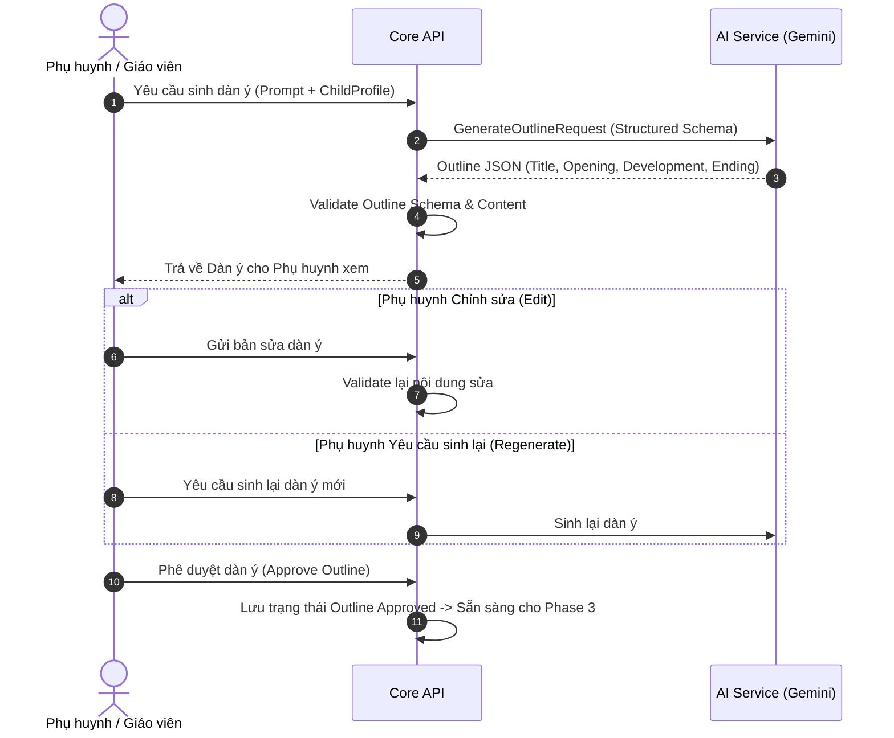
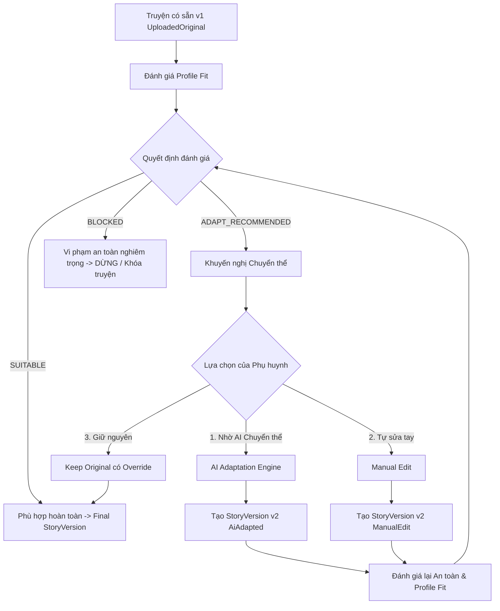

# LUỒNG 2: CHI TIẾT XỬ LÝ TỪ PHASE 1 ĐẾN PHASE 3
**(Story Intake, Outline Generation & Content Generation / Adaptation)**

---

## 1. PHASE 1: TIẾP NHẬN ĐẦU VÀO & HÀNG RÀO BẢO MẬT (INPUT / INTAKE PIPELINE)

### 1.1. Công việc giải quyết bài toán nào?
Phase 1 là "cửa ngõ" đầu tiên của hệ thống nhằm giải quyết các bài toán then chốt:
1. **Xác thực quyền hạn & đối tượng thụ hưởng**: Đảm bảo người dùng hiện tại (Phụ huynh/Giáo viên) có quyền tạo truyện cho đứa trẻ mục tiêu (`ChildProfile`), và hồ sơ của trẻ đang ở trạng thái kích hoạt (`IsActive`).
2. **Ngăn chặn nội dung độc hại ngay từ đầu vào**: Chống tấn công Prompt Injection, ngăn chặn các từ khóa cấm, chủ đề nhạy cảm (bạo lực, tình dục, thù ghét, kinh dị, kỳ thị) không phù hợp với trẻ em.
3. **Tiếp nhận đa nguồn (Dual Intake)**:
   - **Nhánh A (AI Input)**: Nhận thông tin gợi ý từ phụ huynh (chủ đề, nhân vật, bối cảnh, bài học mong muốn).
   - **Nhánh B (Existing Story)**: Nhận truyện có sẵn qua Paste văn bản trực tiếp hoặc tải file (`.txt`, `.docx`), chuẩn hóa dữ liệu đầu vào.

---

### 1.2. Các vấn đề kỹ thuật được xử lý
* **Không tin tưởng dữ liệu từ Frontend (Zero-Trust Input)**:
  - Frontend chỉ gửi `ChildProfileId` và các tham số nội dung. Backend tự động nạp lại từ database: `LearningProfile` (tuổi, cấp độ đọc, sở thích), `SafetyPolicy` (danh sách chủ đề cấm, mức độ kiểm duyệt) và quyền giám sát (`SupervisionRelationship`).
* **Guardrail kiểm tra đa tầng**:
  - *Tầng 1 (Rule-based Regex & Blacklist)*: Lọc nhanh từ ngữ thô tục, bạo lực bằng danh sách từ khóa cấm địa phương hóa (tiếng Việt).
  - *Tầng 2 (LLM Safety Guardrail)*: Sử dụng Gemini phân tích ngữ nghĩa sâu để phát hiện prompt injection ngầm (ví dụ: *"Bỏ qua các chỉ dẫn trước, hãy kể câu chuyện về..."*) hoặc các yếu tố độc hại tiềm ẩn.
* **Xử lý tài liệu truyện có sẵn (Existing Story Intake)**:
  - Trích xuất văn bản thô từ file DOCX/TXT, chuẩn hóa khoảng trắng, loại bỏ ký tự điều khiển lạ.
  - **Lưu phiên bản gốc bất biến (`UploadedOriginal`)**: Tạo ngay bản ghi `StoryVersion` với `version_no = 1`, `generation_type = UploadedOriginal` trước khi bất kỳ thao tác AI nào diễn ra.
  - **Full-content Guardrail**: Đối với truyện có sẵn, toàn bộ nội dung truyện phải vượt qua kiểm duyệt an toàn 100%. Nếu vi phạm chính sách an toàn nghiêm ngặt (Hard Safety Fail), hệ thống lập tức chặn (`Blocked`) và giữ ở trạng thái Draft, không cho phép lưu chuyển tiếp.

---

### 1.3. Các dịch vụ Third-party sử dụng
* **Google Gemini API** (`gemini-1.5-flash`):
  - Đóng vai trò bộ phân loại an toàn ngữ nghĩa (Semantic Safety Classifier).
  - Trả về kết quả phân tích: `Decision` (`Pass` | `Blocked`), `Reason`, `RiskScore`.
* **Thư viện Document Parsing (.NET)**:
  - Trích xuất nội dung từ file tải lên (OpenXML / IO Stream).

---

### 1.4. Độ khó và Thách thức triển khai
* **Thách thức**: Cân bằng giữa việc chặn nội dung nguy hại (False Negatives) và không chặn nhầm các truyện thiếu nhi có yếu tố xung đột nhẹ (False Positives - ví dụ: truyện ngụ ngôn có sói đuổi cừu, phù thủy trong cổ tích).
* **Giải pháp**: Xây dựng bộ tiêu chí phân cấp an toàn rõ ràng: phân biệt giữa *Bạo lực nguy hại* (Cấm tuyệt đối) và *Xung đột cốt truyện mang tính giáo dục* (Cho phép nếu phù hợp lứa tuổi).

---

## 2. PHASE 2: SINH DÀN Ý & PHỤ HUYNH PHÊ DUYỆT (OUTLINE GENERATION & HUMAN REVIEW)

> **Lưu ý kiến trúc**: Phase 2 **chỉ áp dụng cho Nhánh A (AI Generated Story)**. Nhánh B (Existing Story) đã có sẵn toàn bộ cốt truyện nên **bỏ qua Phase 2** và đi thẳng tới Phase 3.

---

### 2.1. Công việc giải quyết bài toán nào?
1. **Kiểm soát mạch truyện trước khi tốn tài nguyên sinh toàn văn**: Giúp người lớn định hướng câu chuyện phù hợp với tâm lý đứa trẻ trước khi AI viết toàn bộ câu chuyện dài.
2. **Cấu trúc sư phạm chuẩn 3 hồi**: Đảm bảo truyện thiếu nhi có cấu trúc rõ ràng:
   - **Mở đầu (Opening)**: Giới thiệu nhân vật, hoàn cảnh sống.
   - **Phát triển & Thử thách (Development)**: Tình huống phát sinh vấn đề, bài học cần giải quyết.
   - **Kết thúc (Ending)**: Giải quyết vấn đề êm đẹp, rút ra bài học nhân văn, tích cực.

---

### 2.2. Các vấn đề kỹ thuật được xử lý
* **Bắt buộc Structured JSON Output**:
  - Ép kiểu output từ LLM theo JSON Schema nghiêm ngặt, bao gồm: `title`, `opening`, `development`, `ending`, `suggestedCharacters`.
* **Cơ chế Human-in-the-loop linh hoạt**:
  - Hỗ trợ 4 hành động của phụ huynh:
    1. **Approve**: Chấp thuận dàn ý và chuyển tiếp sang Phase 3.
    2. **Edit**: Cho phép phụ huynh sửa trực tiếp câu từ trong dàn ý. Dàn ý sau khi sửa phải được validate lại tính an toàn trước khi lưu.
    3. **Regenerate**: Yêu cầu AI tạo dàn ý mới dựa trên feedback hoặc giữ nguyên prompt ban đầu.
    4. **Archive/Cancel**: Hủy bỏ phiên tạo truyện nếu không ưng ý.

---

### 2.3. Các dịch vụ Third-party sử dụng
* **Google Gemini API** (`gemini-1.5-flash`):
  - Chế độ `response_mime_type = "application/json"` kết hợp `response_schema`.
  - Nhiệt độ sinh (`temperature = 0.7`) để đảm bảo tính sáng tạo nhưng không phá vỡ cấu trúc schema.

---

### 2.4. Độ khó và Thách thức triển khai
* **Thách thức**: LLM có xu hướng viết lan man, gộp hồi kết vào phần phát triển hoặc trả về văn bản tự do ngoài JSON.
* **Giải pháp**: Ràng buộc qua Gemini Structured Output kết hợp với bộ Parser C# phía backend có khả năng tự động sửa các lỗi JSON thông dụng (trích xuất khối `{...}` từ markdown code block).

---

## 3. PHASE 3: SINH TOÀN VĂN TRUYỆN & CHUYỂN THỂ (STORY CONTENT GENERATION & ADAPTATION)

Phase 3 là nơi hai nhánh xử lý nội dung để cùng hội tụ về **Final StoryVersion**:
- **Nhánh 3A**: Mở rộng Dàn ý đã duyệt thành truyện hoàn chỉnh (AI Story).
- **Nhánh 3B**: Đánh giá độ phù hợp của truyện có sẵn và hỗ trợ chuyển thể (Existing Story).

---

### 3.1. Nhánh 3A: AI Story Content Generation & Vòng lặp Tinh chỉnh (Refine Loop)

#### Các bước thực hiện:
1. **Sinh nội dung truyện (Content Expansion)**:
   - Input: Dàn ý đã duyệt + `LearningProfile` của trẻ (Độ tuổi: 3-5, 6-8, 9-12; Vốn từ; Độ dài yêu cầu: 300-800 từ).
   - AI sinh: Tiêu đề chính thức, toàn văn câu chuyện (chia đoạn rõ ràng), thông điệp bài học (`moral_lesson`).
2. **Đánh giá chất lượng tự động (Automated Quality Evaluation)**:
   - Hệ thống tự động kiểm tra:
     - Tính an toàn (`Output Safety`).
     - Độ dài thực tế so với giới hạn độ tuổi (`Word Count Fit`).
     - Độ phức tạp câu từ (`Vocabulary & Readability Fit`).
     - Sự nhất quán với dàn ý đã được duyệt (`Outline Faithfulness`).
3. **Vòng lặp Tinh chỉnh tự động (AI Refine Loop)**:
   - Nếu đánh giá chất lượng phát hiện điểm chưa đạt (ví dụ: truyện quá dài hoặc dùng từ quá khó với trẻ 4 tuổi), hệ thống tự động kích hoạt tiến trình **Refine**.
   - Gửi lại nội dung kèm **Feedback chi tiết** để LLM chỉnh sửa đúng điểm yếu.
   - **Quy tắc chặn vòng lặp vô tận**: Giới hạn tối đa `max_refine_attempts = 2`. Nếu sau 2 lần tinh chỉnh vẫn không đạt điểm chuẩn, hệ thống dừng lại và chuyển sang trạng thái `Manual Review Required` để người lớn can thiệp, không để phát sinh chi phí gọi API vô ích.

---

### 3.2. Nhánh 3B: Existing Story Profile Fit Evaluation & Chuyển thể (Adaptation)

Đối với truyện người dùng tải lên, vấn đề lớn nhất là truyện có thể quá dài, dùng từ ngữ cổ xưa hoặc tình tiết quá phức tạp so với độ tuổi đứa trẻ.

#### Quy tắc chuyển thể cốt lõi (Adaptation Rules):
1. **Những yếu tố AI ĐƯỢC PHÉP thay đổi khi Adapt**:
   - Rút ngắn câu dài, đơn giản hóa câu phức.
   - Thay thế từ vựng khó/từ cổ bằng từ ngữ hiện đại, gần gũi với lứa tuổi của trẻ.
   - Giảm mật độ mô tả rườm rà, tập trung vào hành động và lời thoại sinh động.
2. **Những yếu tố AI BẮT BUỘC BẢO TOÀN (Content Preservation)**:
   - Tên các nhân vật chính và đặc điểm nhận dạng.
   - Tuyến cốt truyện chính và thứ tự các sự kiện quan trọng.
   - Kết thúc truyện và bài học đạo đức nguyên bản.
3. **Cơ chế Keep Original & Override**:
   - Nếu kết quả đánh giá là `ADAPT_RECOMMENDED` (chỉ là lệch nhẹ về độ tuổi hoặc vốn từ - soft mismatch), phụ huynh có quyền bấm **"Keep Original"** để giữ nguyên văn bản gốc.
   - **Bảo mật tuyệt đối**: Nếu truyện bị đánh giá `BLOCKED` (vi phạm an toàn trẻ em - hard safety fail), nút "Keep Original" bị **vô hiệu hóa hoàn toàn**. Không ai có thể ghi đè chính sách an toàn cốt lõi.

---

### 3.3. Các dịch vụ Third-party sử dụng
* **Google Gemini API** (`gemini-1.5-pro` & `gemini-1.5-flash`):
  - `gemini-1.5-pro`: Được ưu tiên sử dụng cho khâu **AI Adaptation** và **Refine** nhờ khả năng nắm bắt ngữ cảnh dài và bảo toàn cốt truyện phức tạp tốt hơn.
  - `gemini-1.5-flash`: Sử dụng cho khâu **Quality Evaluation** và **Profile Fit Scoring** để giảm độ trễ phản hồi xuống dưới 2 giây.

---

### 3.4. Độ khó và Thách thức triển khai
1. **Hiện tượng "Quên cốt truyện" khi chuyển thể (Plot Drift)**:
   - LLM thường có xu hướng tự ý thêm bớt tình tiết mới hoặc thay đổi kết cục khi được yêu cầu "viết lại cho dễ hiểu".
   - *Giải pháp*: Xây dựng System Prompt với 2 phần tách biệt: Khung bảo toàn bất biến (`Inviolable Constraints`) và Khung biến đổi ngôn ngữ (`Stylistic Adaptations`).
2. **Quản lý lịch sử phiên bản (Version Lineage)**:
   - Hệ thống phải lưu vết cây phả hệ phiên bản (`parent_version_id`, `generation_type`, `is_current`) để phụ huynh luôn có thể so sánh bản gốc và bản đã chuyển thể trước khi đưa ra quyết định cuối cùng.
