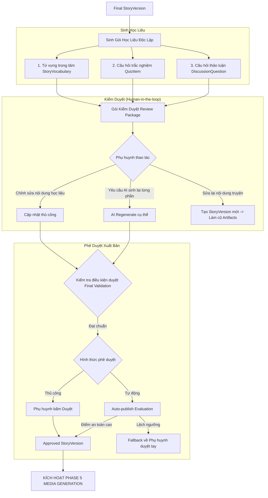
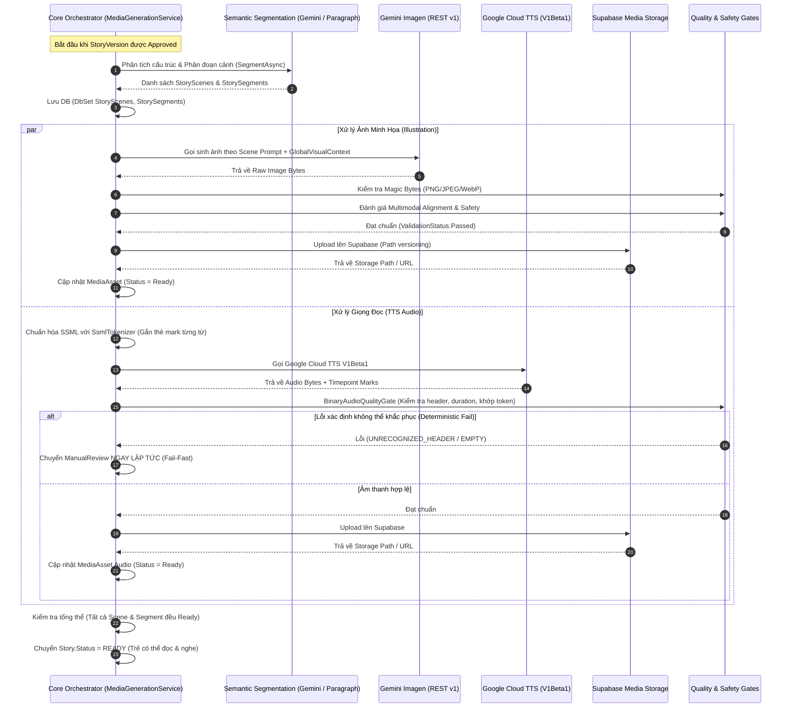

# LUỒNG 2: CHI TIẾT XỬ LÝ PHASE 4 & PHASE 5
**(Learning Artifacts, Human Review/Approval & Multimedia Generation Pipeline)**

---

## 1. PHASE 4: SINH HỌC LIỆU GIÁO DỤC, KIỂM DUYỆT & PHÊ DUYỆT
**(Learning Artifacts Generation, Human Review & Approval Gate)**

Sau khi câu chuyện đạt được **Final StoryVersion** (ở cuối Phase 3), hệ thống chuyển sang giai đoạn tạo các giá trị gia tăng mang tính sư phạm và trao quyền kiểm duyệt cuối cùng cho người lớn trước khi truyện được sản xuất đa phương tiện.



---

### 1.1. Công việc giải quyết bài toán nào?
1. **Biến việc đọc truyện thành trải nghiệm học tập chủ động (Active Learning)**: Thay vì chỉ đọc thụ động, đứa trẻ được giải thích các từ vựng mới, làm bài quiz tương tác kiểm tra độ hiểu, và cùng cha mẹ trao đổi về bài học đạo đức qua các câu hỏi mở.
2. **Cá nhân hóa học liệu theo năng lực nhận thức**: Cùng một câu chuyện, đứa trẻ 4 tuổi sẽ nhận bộ câu hỏi ngắn đơn giản, trong khi trẻ 9 tuổi sẽ nhận câu hỏi suy luận sâu hơn.
3. **Quyền kiểm soát tối thượng của phụ huynh (Parental Governance)**: Phụ huynh hoặc giáo viên có quyền chỉnh sửa, xóa, thêm mới hoặc yêu cầu AI tạo lại từng câu hỏi/từ vựng trước khi cấp phép cho truyện xuất bản.

---

### 1.2. Các vấn đề kỹ thuật được xử lý
* **Tính độc lập của học liệu (Artifact Independence)**:
  - 3 nhóm học liệu (Từ vựng, Quiz, Thảo luận) được tạo bằng các tác vụ độc lập. Nếu người dùng chỉ muốn sinh lại Quiz, hệ thống chỉ gọi AI sinh Quiz mà không cần chạy lại Từ vựng hay Thảo luận, giúp tiết kiệm thời gian và chi phí API.
* **Ràng buộc chặt chẽ vào phiên bản (Strict Version Binding)**:
  - Mọi bản ghi `StoryVocabulary`, `QuizItem`, `DiscussionQuestion` đều bắt buộc liên kết với `StoryVersionId` (không chỉ liên kết với `StoryId`).
  - **Cơ chế Stale Invalidation**: Nếu phụ huynh sửa đổi nội dung truyện ở Phase 4, hệ thống lập tức tạo một `StoryVersion` mới (`version_no++`) và đánh dấu toàn bộ học liệu của version cũ là hết hạn (`Stale`), ngăn chặn tình trạng câu hỏi kiểm tra những chi tiết không còn tồn tại trong truyện.
* **Quy trình Phê duyệt kép (Approval Gate)**:
  - **Manual Approval**: Kiểm tra quyền hạn của người dùng (`approve_story`), kiểm tra trạng thái an toàn toàn diện (`Final Validation`) trước khi chuyển trạng thái sang `Approved`.
  - **Auto-publish Evaluation**: Nếu hệ thống được cấu hình cho phép tự động xuất bản (dành cho tổ chức giáo dục), AI sẽ tự chấm điểm độ an toàn và chất lượng. Nếu đạt ngưỡng cao sẽ tự duyệt; nếu dưới ngưỡng, hệ thống **tuyệt đối không tự từ chối** mà tự động chuyển về cho phụ huynh duyệt thủ công (`Fallback to Manual ContentReview`).

---

### 1.3. Các dịch vụ Third-party sử dụng
* **Google Gemini API** (`gemini-1.5-flash`):
  - Sinh từ vựng với cấu trúc: từ vựng, định nghĩa dễ hiểu cho trẻ, ngữ cảnh trong truyện.
  - Sinh Quiz trắc nghiệm gồm câu hỏi, 3-4 lựa chọn, đáp án đúng và giải thích ngắn.
  - Sinh câu hỏi gợi mở thảo luận giữa phụ huynh và con cái dựa trên bài học đạo đức.

---

### 1.4. Độ khó và Thách thức triển khai
* **Thách thức**: LLM thường tạo ra các câu hỏi trắc nghiệm quá lộ liễu, đáp án đúng luôn nằm ở vị trí A, hoặc câu hỏi hỏi về những chi tiết không có thật trong truyện (hallucination).
* **Giải pháp**: Xây dựng thuật toán đảo ngẫu nhiên vị trí đáp án đúng (`Fisher-Yates shuffle`) và yêu cầu Gemini trích dẫn đoạn văn chứng minh trước khi sinh câu hỏi.

---

## 2. PHASE 5: ĐA PHƯƠNG TIỆN ĐỒNG BỘ & HOÀN TẤT TRUYỆN
**(Media Generation, Semantic Segmentation, Illustration, TTS Audio & Quality Gates)**

Phase 5 là giai đoạn kỹ thuật phức tạp nhất trong toàn bộ hệ sinh thái, biến văn bản truyện đã duyệt thành một ấn phẩm nghe - nhìn hoàn chỉnh.



---

### 2.1. Công việc giải quyết bài toán nào?
1. **Phân đoạn ngữ nghĩa tự nhiên (Semantic Scene Segmentation)**: Chia câu chuyện thành các cảnh thị giác hợp lý (theo sự chuyển đổi không gian, thời gian, nhân vật), đảm bảo toàn bộ câu chuyện được vẽ tranh minh họa mà không sót từ nào.
2. **Đồng bộ hóa hình ảnh - âm thanh - câu chữ (Multimodal Audio-Visual Sync)**:
   - Mỗi cảnh (Scene) có 1 tranh minh họa đẹp mắt, chuẩn tỉ lệ.
   - Mỗi câu (Segment) trong cảnh có giọng đọc truyền cảm.
   - Khi phát âm thanh, từng từ hiển thị trên màn hình sáng lên theo thời gian thực (tính năng Karaoke), hỗ trợ trẻ tập đọc chữ và phát âm chuẩn xác.
3. **Duy trì tính nhất quán hình ảnh nhân vật (Visual Continuity)**: Đảm bảo cậu bé tóc nâu mặc áo xanh ở cảnh 1 vẫn giữ nguyên diện mạo ở tất cả các cảnh tiếp theo.

---

### 2.2. Các vấn đề kỹ thuật và giải pháp kiến trúc đã triển khai

#### A. Phân đoạn cảnh ngữ nghĩa & Dự phòng an toàn (Semantic Segmentation & Fallback)
* Sử dụng interface trừu tượng không phụ thuộc nhà cung cấp: `ISceneSegmentationProvider` và `ISemanticSceneSegmentationProvider`.
* **Cơ chế Fallback thông minh**: Service ưu tiên gọi `GeminiSemanticSceneSegmentationProvider` để phân tích ngữ nghĩa. Nếu AI gặp lỗi hoặc vi phạm cấu trúc văn bản, hệ thống tự động fallback 100% sang `ParagraphSceneSegmentationProvider` (phân đoạn dựa trên đoạn văn bản gốc).
* **Quy tắc bảo toàn nội dung tuyệt đối (100% Coverage Rule)**: Sau khi phân đoạn, thuật toán kiểm tra:
  $$\text{Concat}(\text{All Scene Texts}) == \text{Normalized Original Story Content}$$
  Nếu phát hiện AI tự ý viết lại từ hoặc bỏ sót nội dung, tiến trình lập tức bị hủy bỏ để đảm bảo tính toàn vẹn của tác phẩm.

#### B. Chuẩn hóa SSML & Trích xuất Timestamp từng từ (SSML Tokenization & Timing Extraction)
* Để Google Cloud TTS trả về timestamp chính xác cho từng từ tiếng Việt, hệ thống phát triển service chuyên dụng [SsmlTokenizer.cs](file:///D:/Capstone_AI_Storytelling/AI_Storytelling_Backend/src/Core/StoryPlatform.Application/Features/MediaGeneration/Services/SsmlTokenizer.cs):
  - Tách câu thành danh sách từ (words) và dấu câu.
  - Bao bọc văn bản trong thẻ `<speak>`.
  - Chèn thẻ rỗng tự đóng `<mark name="w_{index}"/>` ngay trước mỗi từ:
    ```xml
    <speak>
      <mark name="w_0"/>Ngày <mark name="w_1"/>xửa <mark name="w_2"/>ngày <mark name="w_3"/>xưa...
    </speak>
    ```
  - Google Cloud TTS trả về danh sách `Timepoint` tương ứng với mỗi thẻ mark. Hệ thống tính toán thời điểm bắt đầu (`start`) và kết thúc (`end`) của từng từ để lưu vào cột `WordTimings` dạng JSON trong database.

#### C. Bộ kiểm định chất lượng nhị phân & Hàng rào phòng thủ sâu (Defense-in-depth Quality Gates)
1. **[MagicByteValidators.cs](file:///D:/Capstone_AI_Storytelling/AI_Storytelling_Backend/src/Core/StoryPlatform.Infrastructure/AI/MagicByteValidators.cs)**:
   - Kiểm tra trực tiếp các byte đầu tiên của mảng nhị phân nhận từ nhà cung cấp để xác thực định dạng thật:
     - PNG: `89 50 4E 47`
     - JPEG: `FF D8 FF`
     - WebP: `52 49 46 46 ... 57 45 42 50`
     - WAV: `52 49 46 46 ... 57 41 56 45`
     - MP3: `49 44 33` (ID3v2) hoặc sync word `FF FB / FF F3`.
   - Ngăn chặn triệt để tình trạng nhà cung cấp trả về file lỗi dạng HTML/JSON nhưng gắn đuôi ảnh/audio.
2. **Kiểm tra tại tầng Storage ([SupabaseMediaStorage.cs](file:///D:/Capstone_AI_Storytelling/AI_Storytelling_Backend/src/Core/StoryPlatform.Infrastructure/Storage/SupabaseMediaStorage.cs))**:
   - Trước khi upload bất kỳ stream dữ liệu nào lên cloud, phương thức `ValidateContentMatchesMime` kiểm tra lại magic bytes một lần nữa. Nếu header không khớp với `mimeType`, hệ thống ném `ArgumentException` ngay tại tầng lưu trữ.
3. **[BinaryAudioQualityGate.cs](file:///D:/Capstone_AI_Storytelling/AI_Storytelling_Backend/src/Core/StoryPlatform.Infrastructure/AI/BinaryAudioQualityGate.cs)**:
   - Kiểm tra file âm thanh không rỗng, thời lượng tối thiểu hợp lệ, và số lượng word timing marks nhận được phải khớp chính xác với số lượng từ của phân đoạn văn bản gốc.

#### D. Cơ chế Thất bại Nhanh Xác định (Deterministic Fail-Fast)
* Trong các phiên bản cũ, khi gặp lỗi audio, hệ thống sẽ cố gắng thử lại đủ 3 lần (`_assetMaxAttempts`).
* Tuy nhiên, nếu gặp các lỗi mang tính **xác định (Deterministic)** như:
  - `UNRECOGNIZED_AUDIO_HEADER` (Header âm thanh hỏng).
  - `CONTENT_TOO_SHORT` (Độ dài âm thanh bất thường).
  - `AUDIO_CONTENT_EMPTY` (Nhà cung cấp trả về file rỗng).
* Việc thử lại sẽ chỉ làm tốn chi phí và kéo dài thời gian chờ đợi vô ích. Hệ thống hiện tại áp dụng quy tắc **Deterministic Fail-Fast**: phát hiện ngay lần đầu tiên, lập tức dừng vòng lặp retry, đánh dấu `MediaAsset.Status = ManualReview` và thông báo cho ban quản trị kiểm tra.

#### E. Đường dẫn lưu trữ bất biến theo phiên bản (Versioned Immutable Storage Paths)
* Đường dẫn file trên Supabase Storage được đặt tên có kèm phiên bản và số lần thử (Attempt index), ngăn chặn hoàn toàn lỗi bộ nhớ đệm (CDN caching) khi sinh lại ảnh/audio:
  - Ảnh minh họa: `{storyId}/v{revision}/scene-{sceneIndex}-a{attempt + 1}.{ext}`
  - Audio giọng đọc: `{storyId}/v{revision}/audio-s{sceneIndex}-{segmentOrder}-a{attempt + 1}.{ext}`

---

### 2.3. Các dịch vụ Third-party sử dụng
1. **Google Gemini Imagen API** (REST v1 với Header `x-goog-api-key`):
   - Sinh hình ảnh chất lượng cao theo prompt mô tả bối cảnh cảnh truyện và phong cách mỹ thuật đã định sẵn.
   - Hỗ trợ tham số tỉ lệ khung hình `AspectRatio` trong body JSON (`1:1`, `4:3`, `16:9`).
2. **Google Cloud Text-to-Speech V1Beta1 Client** (`Google.Cloud.TextToSpeech.V1Beta1`):
   - Sử dụng giọng đọc Wavenet/Neural2 chuẩn tiếng Việt.
   - Kích hoạt chế độ trả về metadata `Timepoint` thông qua SSML tags.
3. **Supabase Media Storage** (REST Storage API):
   - Quản lý Bucket lưu trữ tệp nhị phân, cung cấp Signed URL có thời hạn phục vụ việc hiển thị an toàn trên ứng dụng di động/web của trẻ.

---

### 2.4. Độ khó và Thách thức triển khai
1. **Thách thức lớn nhất: Đồng bộ Word-Timing Tiếng Việt**:
   - Tiếng Việt có các từ ghép (ví dụ: *"xinh xắn"*, *"học sinh"*) và thanh dấu đặc thù. Khi chuyển qua SSML, một số ký tự đặc biệt có thể làm Cloud TTS bỏ qua mark hoặc đếm sai vị trí từ.
   - *Giải pháp*: Xây dựng bộ Tokenizer làm sạch văn bản (`CleanText`), chuẩn hóa Unicode (NFC), và dùng `IAudioQualityGate` kiểm tra số lượng `marks` trả về khớp chính xác với `wordCount` trước khi cho phép lưu trữ.
2. **Đánh giá hình ảnh đa phương tiện tự động (Multimodal Image Evaluation)**:
   - Làm thế nào để phần mềm tự biết ảnh do Imagen vẽ ra có an toàn cho trẻ và có vẽ đúng nội dung câu chuyện hay không?
   - *Giải pháp*: Triển khai `GeminiMediaAlignmentEvaluator` và `GeminiMediaSafetyEvaluator`. Sau khi ảnh được tạo, hệ thống gửi đồng thời cả bức ảnh dạng nhị phân và nội dung cảnh truyện cho model Gemini Vision để phân tích và chấm điểm tính liên kết (`AlignmentDecision`) cùng độ an toàn (`SafetyDecision`).
3. **Kiểm soát tính toàn vẹn dữ liệu trong môi trường bất đồng bộ**:
   - Việc sinh đồng thời hàng chục ảnh và đoạn audio dễ dẫn đến xung đột khóa ngoại hoặc điều kiện cạnh tranh (Race condition) trên cơ sở dữ liệu.
   - *Giải pháp*: Sử dụng Check Constraints của PostgreSQL kết hợp với Partial Unique Indexes:
     - Cột `(StorySceneId, Type)` là Unique chỉ khi `StorySegmentId IS NULL`.
     - Cột `(StorySegmentId, Type)` là Unique chỉ khi `StorySegmentId IS NOT NULL`.
     - Kiểm tra `AssertFreshAsync` trước mỗi lần cập nhật trạng thái để đảm bảo không ghi đè dữ liệu cũ.
