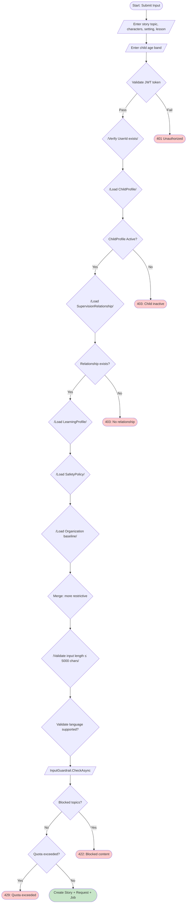
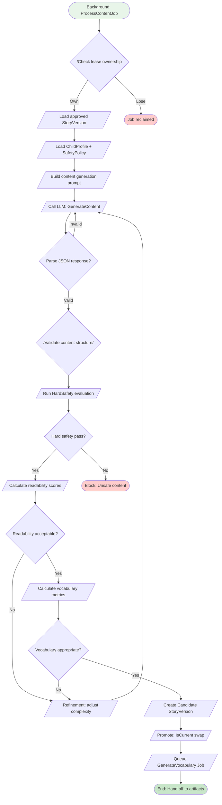
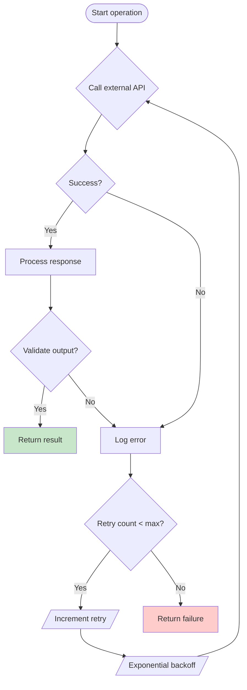
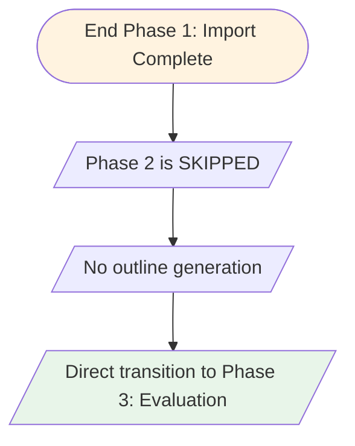
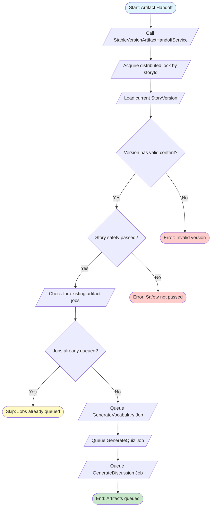

# Activity Diagram — AI Generation Story

> Sử dụng Mermaid để render: [Mermaid Live Editor](https://mermaid.live) hoặc VS Code with Mermaid extension

---

## Tổng quan Luồng Chính

```mermaid
flowchart TD
    subgraph Phase1["PHASE 1: Input & Guardrail"]
        A1([Start: Parent/Teacher submits story input])
        A2{Validate User Auth & Permissions?}
        A3[/Load ChildProfile & LearningProfile/]
        A4{Child Active?}
        A5[/Resolve SafetyPolicy/]
        A6[/InputGuardrail.CheckAsync/]
        A7{Input Allowed?}
    end

    subgraph Phase2["PHASE 2: Outline Generation"]
        B1[/Create Story + Request + Job/]
        B2([Background: ProcessOutlineJob])
        B3[/Build prompt with profile/]
        B4[/Call LLM for outline/]
        B5[/Parse & Validate outline/]
        B6[/Create StoryVersion v1/]
        B7[/Update Status: OutlineReview/]
    end

    subgraph Phase2Review["PHASE 2: Human Outline Review"]
        C1([Get current outline])
        C2{Human approves?}
        C3[/Human edits outline/]
        C4[/Create Version v2: HumanEdited/]
        C5[/Regenerate with AI/]
        C6[/Create Version vN: AiRegenerated/]
        C7[/Set OutlineApprovedAt/]
        C8[/Create GenerateContent Job/]
    end

    subgraph Phase3["PHASE 3: Content Generation"]
        D1([Background: ProcessContentJob])
        D2[/Load approved outline + context/]
        D3[/Build content prompt/]
        D4[/Call LLM for content/]
        D5[/Parse & Validate content/]
        D6[/Safety Evaluation/]
        D7{Quality Pass?}
        D8[/Refinement Loop: max 2 attempts/]
        D9[/Create Candidate Version/]
        D10[/Promote Stable Version: IsCurrent swap/]
    end

    subgraph ArtifactPipeline["PHASE 3a-3c: Artifact Pipeline"]
        E1[/Queue Vocabulary Job/]
        E2([Background: ProcessVocabulary])
        E3[/Extract vocabulary + LLM/]
        E4{/Validate terms/}
        E5[/Persist Vocabulary/]
        E6[/Queue Quiz Job/]
        E7([Background: ProcessQuiz])
        E8[/Generate quiz questions/]
        E9{/Validate quiz/}
        E10[/Persist Quiz/]
        E11[/Queue Discussion Job/]
        E12([Background: ProcessDiscussion])
        E13[/Generate discussion questions/]
        E14{/Validate questions/}
        E15[/Persist Discussion/]
        E16[/Update Status: ContentReview/]
    end

    subgraph Phase4["PHASE 4: Human Content Review"]
        F1([Review content package])
        F2{Human approves?}
        F3[/Manual edit content/]
        F4[/Create New Version/]
        F5[/AI regenerate proposal/]
        F6{Apply proposal?}
        F7[/Apply AI changes/]
        F8[/Reject & return to draft/]
        F9[/Create Media Job/]
        F10[/Update Status: Approved/]
    end

    subgraph Phase5["PHASE 5: Media Generation"]
        G1([Background: ProcessMediaJob])
        G2[/Parse content into scenes/]
        G3[/Generate scene specs/]
        G4[/Parallel: Generate images/]
        G5[/Parallel: Generate TTS/]
        G6{/All assets ready?/}
        G7[/Persist Scenes + Assets/]
        G8[/Update Status: Ready/]
    end

    H([End: Story ready for children])

    %% Main Flow
    A1 --> A2
    A2 -->|No| X1([Reject: Auth failed])
    A2 -->|Yes| A3 --> A4
    A4 -->|No| X2([Reject: Child inactive])
    A4 -->|Yes| A5 --> A6 --> A7
    A7 -->|No| X3([Block: Unsafe content])
    A7 -->|Yes| B1

    B1 --> B2
    B2 --> B3 --> B4 --> B5 --> B6 --> B7

    B7 --> C1
    C1 --> C2
    C2 -->|Approve| C7
    C2 -->|Edit| C3 --> C4 --> C7
    C2 -->|Regenerate| C5 --> C6 --> C7
    C7 --> C8

    C8 --> D1
    D1 --> D2 --> D3 --> D4 --> D5 --> D6 --> D7
    D7 -->|Yes| D9 --> D10
    D7 -->|No| D8 --> D7
    D8 -.->|max 2| X4([Block: Quality failed])

    D10 --> E1
    E1 --> E2 --> E3 --> E4
    E4 -->|Retry max 3| E3
    E4 -->|Pass| E5 --> E6
    E6 --> E7 --> E8 --> E9
    E9 -->|Retry max 3| E8
    E9 -->|Pass| E10 --> E11
    E11 --> E12 --> E13 --> E14
    E14 -->|Retry max 3| E13
    E14 -->|Pass| E15 --> E16

    E16 --> F1
    F1 --> F2
    F2 -->|Approve| F9
    F2 -->|Edit| F3 --> F4 --> F1
    F2 -->|AI Regenerate| F5 --> F6
    F6 -->|Yes| F7 --> F1
    F6 -->|No| F1
    F2 -->|Reject| F8 --> X5([Archive])

    F9 --> F10
    F10 --> G1
    G1 --> G2 --> G3 --> G4
    G4 --> G5
    G4 & G5 --> G6
    G6 -->|No| G4
    G6 -->|Yes| G7 --> G8 --> H

    style X1 fill:#ffcccc
    style X2 fill:#ffcccc
    style X3 fill:#ffcccc
    style X4 fill:#ffcccc
    style X5 fill:#ffcccc
    style Phase1 fill:#e1f5fe
    style Phase2 fill:#fff3e0
    style Phase2Review fill:#fff3e0
    style Phase3 fill:#e8f5e9
    style ArtifactPipeline fill:#e8f5e9
    style Phase4 fill:#f3e5f5
    style Phase5 fill:#fce4ec
```



---

## Phase 1: Input & Guardrail (Chi tiết)



---

## Phase 2: Outline Generation (Chi tiết)

```mermaid
flowchart TD
    A([Background Job: ProcessOutline])
    B[/Load StoryGenerationRequest/]
    C{/Check lease ownership}
    D{/Load ChildProfile + SafetyPolicy/]
    E[/Build system instruction/]
    F[/Build outline prompt template/]
    G[/Substitute placeholders/]
    H[/Call LLM: GenerateOutline/]
    I{Parse response JSON?}
    J{Validate outline structure?}

    A --> B --> C
    C -->|Lose lease| X1([Job reclaimed])
    C -->|Own lease| D --> E --> F --> G --> H
    H --> I
    I -->|Fail| H
    I -->|Success| J
    J -->|Fail| X2([Log error, finalize failed])
    J -->|Success| K[/Create StoryVersion v1/]
    K --> L[/Persist opening/development/ending/]
    L --> M[/Update Story.Status = OutlineReview/]
    M --> N[/Complete job/]
    N --> Y([Notify: Outline ready])

    style A fill:#fff3e0
    style Y fill:#c8e6c9
    style X1 fill:#ffcccc
    style X2 fill:#ffcccc
```

---

## Phase 2: Human Outline Review (Chi tiết)

```mermaid
flowchart TD
    A([Start: Review Outline])
    B[/GET /stories/{id}/outline/]
    C[/Display: opening, development, ending/]
    D[/Display: version history/]

    E{Choice}
    F1[Approve]
    F2[Edit]
    F3[Regenerate]
    F4[Reject]

    G1[/Set OutlineApprovedAt/]
    G2[/Create StoryVersion v2: HumanEdited/]
    G3[/Create StoryVersion vN: AiRegenerated/]
    G4[/Set Status = Rejected/]

    H1[/Create GenerateContent Job/]
    H2[/Create RegenerateOutline Job/]
    H3[/Archive outline/]

    A --> B --> C --> D --> E
    E --> F1 --> G1 --> H1 --> Y([End: Handoff to Content])
    E --> F2 --> G2 --> H2 --> Y
    E --> F3 --> G3 --> H2
    E --> F4 --> G4 --> H3

    style A fill:#fff3e0
    style Y fill:#c8e6c9
```

---

## Phase 3: Content Generation (Chi tiết)



---

## Artifact Pipeline: Vocabulary → Quiz → Discussion

```mermaid
flowchart LR
    subgraph Vocab["Generate Vocabulary"]
        V1([Start])
        V2[/Call LLM: Extract vocabulary/]
        V3{/Validate terms exist in story?}
        V4[/Persist StoryVocabulary/]
        V5([Complete])
    end

    subgraph Quiz["Generate Quiz"]
        Q1([Start])
        Q2[/Call LLM: Generate quiz/]
        Q3{/Validate quiz structure?}
        Q4[/Persist QuizItems/]
        Q5([Complete])
    end

    subgraph Discussion["Generate Discussion"]
        D1([Start])
        D2[/Call LLM: Generate questions/]
        D3{/Validate questions contextual?}
        D4[/Persist DiscussionQuestions/]
        D5([Complete])
    end

    V1 --> V2 --> V3
    V3 -->|Retry max 3| V2
    V3 -->|Pass| V4 --> V5
    V5 --> Q1

    Q1 --> Q2 --> Q3
    Q3 -->|Retry max 3| Q2
    Q3 -->|Pass| Q4 --> Q5
    Q5 --> D1

    D1 --> D2 --> D3
    D3 -->|Retry max 3| D2
    D3 -->|Pass| D4 --> D5

    D5 --> Y([Update Status: ContentReview])

    style Y fill:#c8e6c9
```



---

## Phase 4: Human Content Review (Chi tiết)

```mermaid
flowchart TD
    A([Start: Review Content])
    B[/GET /stories/{id}/review/]
    C[/Display: Story content/]
    D[/Display: Vocabulary/]
    E[/Display: Quiz/]
    F[/Display: Discussion questions/]

    G{Choice}
    G1[Approve]
    G2[Edit]
    G3[AI Regenerate]
    G4[Reject]

    H1[/Create Media Job/]
    H1A[/Update Status: Approved/]

    H2[/Edit content/]
    H2A[/Create New Version/]
    H2B[/Re-validate artifacts/]

    H3[/Call LLM: Regenerate/]
    H3A[/Show AI proposal/]
    H3B{Accept?}
    H3C[/Apply changes/]

    H4[/Set Status: Rejected/]
    H4A[/Notify parent/]

    A --> B --> C --> D --> E --> F --> G
    G --> G1 --> H1 --> H1A --> Y1([End: Hand off to Media])
    G --> G2 --> H2 --> H2A --> H2B --> A
    G --> G3 --> H3 --> H3A --> H3B
    H3B -->|Yes| H3C --> H2A
    H3B -->|No| A
    G --> G4 --> H4 --> H4A --> Y2([End: Archived])

    style Y1 fill:#c8e6c9
    style Y2 fill:#ffcccc
```

---

## Phase 5: Media Generation (Chi tiết)

```mermaid
flowchart TD
    A([Background: ProcessMediaJob])
    B[/Parse canonical content/]
    C[/Identify scene boundaries/]
    D[/Generate scene specifications/]

    E[/For each scene:]
    F1[/Call Image Gen API/]
    F2[/Call TTS API/]

    G1{Image ready?}
    G2{TTS ready?}

    H1[/Validate image/]
    H2[/Validate TTS/]

    I{/All scenes complete?}

    J[/Persist Scene entities/]
    K[/Persist MediaAsset entities/]

    L[/Update Story.Status = Ready/]
    M([End: Story visible to child])

    A --> B --> C --> D
    D --> E
    E --> F1 & F2
    F1 --> G1
    F2 --> G2
    G1 -->|Retry| F1
    G2 -->|Retry| F2
    G1 -->|Pass| H1
    G2 -->|Pass| H2
    H1 & H2 --> I
    I -->|No| E
    I -->|Yes| J --> K --> L --> M

    style A fill:#fce4ec
    style M fill:#c8e6c9
```

---

## Error Handling & Retry Logic



---

## Tổng quan 2 Luồng Song Song

```mermaid
flowchart TD
    subgraph Start["BẮT ĐẦU"]
        START([Parent/Teacher])
    end

    START --> CHOICE{Chọn loại}

    subgraph AIStory["FLOW 1: AI STORY GENERATION"]
        direction TB
        A1[/Submit creative input: topic, characters, setting/]
        A2[/Phase 1: Input Guardrail/]
        A3[/Phase 2: Generate & Review Outline/]
        A4[/Phase 3: Generate Content/]
        A5[/Phase 3a-3c: Vocabulary → Quiz → Discussion/]
        A6[/Phase 4: Human Content Review/]
        A7[/Phase 5: Media Generation/]
        A1 --> A2 --> A3 --> A4 --> A5 --> A6 --> A7
    end

    subgraph ExistingStory["FLOW 2: EXISTING STORY / IMPORT"]
        direction TB
        E1[/Paste or Upload existing story/]
        E2[/Phase 1: Import & Validate/]
        E3[/Phase 2: SKIP (No Outline)/]
        E4[/Phase 3: Evaluate Profile Fit/]
        E5[/Phase 3: Supervisor Decision/]
        E6[/Phase 3a-3c: Vocabulary → Quiz → Discussion (Reuse)/]
        E7[/Phase 4: Human Content Review (Reuse)/]
        E8[/Phase 5: Media Generation (Reuse)/]
        E1 --> E2 --> E3 --> E4 --> E5 --> E6 --> E7 --> E8
    end

    CHOICE -->|AI Story| AIStory
    CHOICE -->|Existing Story| ExistingStory

    AIStory & ExistingStory --> CONVERGE

    subgraph CONVERGE["CONVERGENCE POINT"]
        C1[/StableVersionArtifactHandoffService/]
        C2[/GenerateVocabulary Job/]
        C3[/GenerateQuiz Job/]
        C4[/GenerateDiscussion Job/]
        C5[/Status = ContentReview/]
        C1 --> C2 --> C3 --> C4 --> C5
    end

    CONVERGE --> READY([Story Ready for Children])

    style START fill:#e3f2fd
    style AIStory fill:#e8f5e9
    style ExistingStory fill:#fff3e0
    style CONVERGE fill:#e1f5fe
    style READY fill:#c8e6c9
```

---

# PHẦN 2: EXISTING STORY / IMPORT STORY (FLOW 2)

---

## Existing Story Phase 1: Import & Intake (Chi tiết)

```mermaid
flowchart TD
    A([Start: Import Story])
    B[/Choose input method: Paste / TXT/]
    C[/Paste or upload content/]
    D[/Parse input content/]
    E[/Normalize whitespace & encoding/]
    F[/Validate content length ≤ max/]
    G{Validate JWT token}
    H{/Load ChildProfile/}
    I{ChildProfile Active?}
    J{/Load SupervisionRelationship/]
    K{Relationship exists?}
    L{/Load SafetyPolicy + LearningProfile/]
    M{Check permission GenerateStory?}
    N[/InputGuardrail.CheckAsync/]
    O{Hard safety pass?}

    A --> B --> C --> D --> E --> F --> G
    G -->|Fail| X1([401 Unauthorized])
    G -->|Pass| H --> I
    I -->|No| X2([403: Child inactive])
    I -->|Yes| J --> K
    K -->|No| X3([403: No relationship])
    K -->|Yes| L --> M
    M -->|No| X4([403: Permission denied])
    M -->|Yes| N --> O
    O -->|Fail| X5([422: Unsafe content - block progression])
    O -->|Pass| Y1([Atomic Transaction])

    subgraph Y1["Atomic Transaction"]
        T1[/Create Story (Source=Manual, Status=Draft)/]
        T2[/Create StoryVersion v1 (EditType=Initial)/]
        T3[/Persist original content/]
        T4[/Create basic guardrail record/]
    end

    T1 --> T2 --> T3 --> T4 --> Y([End: Story imported, awaiting evaluation])

    style A fill:#fff3e0
    style Y fill:#c8e6c9
    style Y1 fill:#e8f5e9
    style X1 fill:#ffcccc
    style X2 fill:#ffcccc
    style X3 fill:#ffcccc
    style X4 fill:#ffcccc
    style X5 fill:#ffcccc
```

---

## Existing Story Phase 2: SKIP



---

## Existing Story Phase 3: Evaluation (Chi tiết)

```mermaid
flowchart TD
    A([Start: Evaluate Story])
    B[/POST /stories/{id}/existing/evaluate/]
    C[/Load current StoryVersion/]
    D[/Load ChildProfile + SafetyPolicy/]
    E[/Load LearningProfile/]

    F[/Run Hard Safety Evaluation/]
    G{Hard Safety Pass?}

    H[/Run Length Validation/]
    I{Length within policy?}

    J[/Evaluate Reading Level/]
    K{Reading level match age?}

    L[/Analyze Vocabulary Difficulty/]
    M{Vocabulary appropriate?}

    N[/Check Age Suitability/]
    O{Age appropriate?}

    P[/Assess Narrative Complexity/]
    Q{Complexity suitable?}

    R[/Generate Evaluation Decision/]
    S{Decision}

    A --> B --> C --> D --> E
    E --> F --> G
    G -->|Fail| X1([BLOCKED: Hard safety violation])
    G -->|Pass| H --> I
    I -->|Fail| X2([BLOCKED: Too long])
    I -->|Pass| J --> K
    K -->|Fail| X3([ADAPT_RECOMMENDED: Level mismatch])
    K -->|Pass| L --> M
    M -->|Fail| X4([ADAPT_RECOMMENDED: Vocabulary hard])
    M -->|Pass| N --> O
    O -->|Fail| X5([ADAPT_RECOMMENDED: Age not suitable])
    O -->|Pass| P --> Q
    Q -->|Fail| X6([ADAPT_RECOMMENDED: Too complex])
    Q -->|Pass| R --> S

    S -->|SUITABLE| Y1([Proceed to artifact handoff])
    S -->|ADAPT_RECOMMENDED| Y2([Await supervisor decision])
    S -->|BLOCKED| Y3([Await archive])

    style A fill:#fff3e0
    style Y1 fill:#c8e6c9
    style Y2 fill:#fff9c4
    style Y3 fill:#ffcccc
    style X1 fill:#ffcccc
    style X2 fill:#ffcccc
    style X3 fill:#fff9c4
    style X4 fill:#fff9c4
    style X5 fill:#fff9c4
    style X6 fill:#fff9c4
```

---

## Existing Story Phase 3: Supervisor Decision (Chi tiết)

```mermaid
flowchart TD
    A([Start: Supervisor Decision])
    B[/GET /stories/{id}/existing/evaluation/]
    C[/Display: Evaluation result/]
    D[/Display: Story content preview/]
    E[/Display: Profile mismatch details/]

    F{Decision}
    F1[SUITABLE]
    F2[ADAPT_RECOMMENDED]
    F3[BLOCKED]

    G1[/Proceed to artifact handoff/]
    G2A[AI Adapt]
    G2B[Manual Edit]
    G2C[Keep Original + Override Reason]
    G3[/Archive story/]

    A --> B --> C --> D --> E --> F
    F --> F1 --> G1 --> Y([End: Hand off to artifacts])
    F --> F2
    F2 --> G2A
    F2 --> G2B
    F2 --> G2C
    G2A --> Y
    G2B --> Y
    G2C --> Y
    F --> F3 --> G3 --> Y2([End: Archived])

    style A fill:#fff3e0
    style Y fill:#c8e6c9
    style Y2 fill:#ffcccc
```

---

## Existing Story: AI Adaptation Flow

```mermaid
flowchart TD
    A([Start: AI Adapt])
    B[/POST /stories/{id}/existing/adapt/]
    C[/Load base StoryVersion/]
    D[/Load ChildProfile + SafetyPolicy/]
    E[/Build adaptation prompt/]
    F[/Substitute placeholders/]
    G[/Call LLM: AdaptContent/]
    H{Parse response?}
    I[/Create StoryVersion v2 (EditType=AiRefined)/]
    J[/Re-run Hard Safety/]
    K{Hard safety pass?}

    A --> B --> C --> D --> E --> F --> G
    G --> H
    H -->|Invalid| X1([422: Invalid response])
    H -->|Valid| I --> J --> K
    K -->|Fail| X2([Block: Adapted content unsafe])
    K -->|Pass| Y([End: New AI-adapted version created])

    style A fill:#fff3e0
    style Y fill:#c8e6c9
    style X1 fill:#ffcccc
    style X2 fill:#ffcccc
```

---

## Existing Story: Manual Edit Flow

```mermaid
flowchart TD
    A([Start: Manual Edit])
    B[/PUT /stories/{id}/existing/content/]
    C[/Load current StoryVersion/]
    D[/Lock Story for version change/]
    E{Verify base version still current?}
    F[/Set old version IsCurrent = false/]
    G[/Create StoryVersion vN (EditType=HumanEdited)/]
    H[/Increment VersionNo/]
    I[/Persist edited content/]
    J[/Re-run Safety & Profile Fit/]
    K{Hard safety pass?}

    A --> B --> C --> D --> E
    E -->|Stale| X1([409: Base version changed])
    E -->|Current| F --> G --> H --> I --> J --> K
    K -->|Fail| X2([Block: Edited content unsafe])
    K -->|Pass| Y([End: New human-edited version created])

    style A fill:#fff3e0
    style Y fill:#c8e6c9
    style X1 fill:#ffcccc
    style X2 fill:#ffcccc
```

---

## Existing Story: Keep Original Flow

```mermaid
flowchart TD
    A([Start: Keep Original])
    B[/POST /stories/{id}/existing/keep-original/]
    C[/Require override reason/]
    D{Reason provided?}
    E[/Validate supervisor permission/]
    F[/Record override in audit log/]
    G[/Keep current StoryVersion/]
    H[/Proceed to artifact handoff/]

    A --> B --> C
    C -->|No reason| X1([400: Override reason required])
    C -->|Yes| E --> D
    D -->|No permission| X2([403: Permission denied])
    D -->|Yes| F --> G --> H --> Y([End: Original version preserved])

    style A fill:#fff3e0
    style Y fill:#c8e6c9
    style X1 fill:#ffcccc
    style X2 fill:#ffcccc
```

---

## Existing Story: Archive Flow

```mermaid
flowchart TD
    A([Start: Archive Story])
    B[/POST /stories/{id}/existing/archive/]
    C[/Set Story.Status = Archived/]
    D[/Set Story.ArchivedReason/]
    E[/Log in audit trail/]

    A --> B --> C --> D --> E --> Y([End: Story archived])

    style A fill:#fff3e0
    style Y fill:#ffcccc
```

---

## Existing Story: Version Management (Chi tiết)

```mermaid
flowchart TD
    subgraph VersionCreate["Version Creation Rules"]
        V1[/Upload original → v1 (EditType=Initial)/]
        V2[/Manual edit → vN (EditType=HumanEdited)/]
        V3[/AI adapt → vN (EditType=AiRefined)/]
        V4[/Keep original → same version/]
    end

    subgraph VersionFlow["Version Lifecycle"]
        L1[/Lock Story by storyId/]
        L2{Check base version still IsCurrent?}
        L3[/Set old version IsCurrent = false/]
        L4[/Create new version/]
        L5[/VersionNo = old.VersionNo + 1/]
        L6[/Set new version IsCurrent = true/]
        L7[/Re-run Safety + Profile Fit/]
        L8[/Audit log version creation/]
        L9[/Release lock/]
    end

    V1 --> L1
    V2 --> L1
    V3 --> L1
    L1 --> L2
    L2 -->|No| X1([409 Conflict])
    L2 -->|Yes| L3 --> L4 --> L5 --> L6 --> L7
    L7 -->|Fail| X2([Block: Safety failed])
    L7 -->|Pass| L8 --> L9 --> Y([Version created])

    style L1 fill:#e1f5fe
    style Y fill:#c8e6c9
    style X1 fill:#ffcccc
    style X2 fill:#ffcccc
```

---

## Existing Story: Artifact Handoff (Chi tiết)



---

## Existing Story: Full Flow Sequence

```mermaid
sequenceDiagram
    autonumber
    participant Parent as Parent/Teacher
    participant API as Backend API
    participant LLM as LLM Service
    participant Worker as Background Worker
    participant DB as Database

    Note over Parent,DB: FLOW 2: EXISTING STORY / IMPORT

    Parent->>+API: POST /api/v1/stories/import
    API->>+DB: Create Story (Source=Manual)
    DB-->>-API: Story created
    API->>+DB: Create StoryVersion v1 (Initial)
    DB-->>-API: Version created
    API-->>-Parent: 202 Accepted (StoryId)

    Parent->>+API: POST /api/v1/stories/{id}/existing/evaluate
    API->>+DB: Load StoryVersion
    API->>+DB: Load SafetyPolicy + LearningProfile
    API->>+LLM: Evaluate content
    LLM-->>-API: Evaluation result

    Note over API: Decision: SUITABLE / ADAPT_RECOMMENDED / BLOCKED
    API-->>-Parent: Evaluation result

    alt SUITABLE
        Parent->>+API: Confirm SUITABLE
    else ADAPT_RECOMMENDED
        Parent->>+API: POST /api/v1/stories/{id}/existing/adapt
        API->>+LLM: Adapt content
        LLM-->>-API: Adapted content
        API->>+DB: Create StoryVersion v2 (AiRefined)
        DB-->>-API: Version created
    else MANUAL_EDIT
        Parent->>+API: PUT /api/v1/stories/{id}/existing/content
        API->>+DB: Create StoryVersion v2 (HumanEdited)
        DB-->>-API: Version created
    else KEEP_ORIGINAL
        Parent->>+API: POST /api/v1/stories/{id}/existing/keep-original
        API->>+DB: Record override reason
        DB-->>-API: Recorded
    end

    API->>+DB: Call StableVersionArtifactHandoffService
    DB-->>-API: Lock acquired

    Worker->>+API: ProcessVocabularyAsync
    API->>+LLM: Extract vocabulary
    LLM-->>-API: Vocabulary list
    API->>+DB: Save vocabulary
    DB-->>-API: Saved

    Worker->>+API: ProcessQuizAsync
    API->>+LLM: Generate quiz
    LLM-->>-API: Quiz items
    API->>+DB: Save quiz
    DB-->>-API: Saved

    Worker->>+API: ProcessDiscussionAsync
    API->>+LLM: Generate discussion
    LLM-->>-API: Questions
    API->>+DB: Save questions + Status=ContentReview
    DB-->>-API: Ready for review

    Note over Parent,DB: Phase 4-5 giống Flow 1 (reuse)
    Parent->>+API: POST /api/v1/stories/{id}/review/approve
    API->>+DB: Update Status=Approved + Create MediaJob
    DB-->>-API: Approved

    Worker->>+API: ProcessMediaAsync
    API->>+LLM: Generate images + TTS
    LLM-->>-API: Media assets
    API->>+DB: Save scenes + assets + Status=Ready
    DB-->>-API: Ready
```

---

## Swimlane: So sánh Flow 1 vs Flow 2

```mermaid
flowchart LR
    subgraph Phase["Phase"]
        direction TB
        P1[Phase 1]
        P2[Phase 2]
        P3[Phase 3]
        P4[Phase 4]
        P5[Phase 5]
    end

    subgraph AIStory["Flow 1: AI Story"]
        A1[/Input: Topic, Characters, Setting/]
        A2[/Generate + Review Outline/]
        A3[/Generate Content + Safety + Refine/]
        A4[/Review Content Package/]
        A5[/Generate Media/]
    end

    subgraph ExistingStory["Flow 2: Existing Story"]
        E1[/Import: Paste / TXT/]
        E2[/SKIP Outline/]
        E3[/Evaluate + Adapt/Edit/Keep/]
        E4[/Review Content Package (Reuse)/]
        E5[/Generate Media (Reuse)/]
    end

    subgraph Convergence["Convergence"]
        C1[/Vocabulary → Quiz → Discussion/]
    end

    P1 --> P2 --> P3 --> P4 --> P5
    A1 --> A2 --> A3 --> C1 --> A4 --> A5
    E1 --> E2 --> E3 --> C1 --> E4 --> E5

    style AIStory fill:#e8f5e9
    style ExistingStory fill:#fff3e0
    style Convergence fill:#e1f5fe
    style P1 fill:#e1f5fe
    style P2 fill:#fff3e0
    style P3 fill:#e8f5e9
    style P4 fill:#f3e5f5
    style P5 fill:#fce4ec
```

---

*Generated by Claude Code - Use Mermaid Live Editor to render*

---

## Swimlane: User Roles

```mermaid
sequenceDiagram
    autonumber
    participant Parent as Parent/Teacher
    participant API as Backend API
    participant LLM as LLM Service
    participant Worker as Background Worker
    participant DB as Database

    Parent->>+API: POST /api/v1/ai-story-input
    API->>+DB: Create Story + Request
    DB-->>-API: Story created
    API-->>-Parent: 202 Accepted

    Worker->>+API: ProcessNextAsync
    API->>+LLM: GenerateOutline
    LLM-->>-API: Outline response
    API->>+DB: Create StoryVersion v1
    DB-->>-API: Version saved

    Parent->>+API: GET /api/v1/stories/{id}/outline
    API-->>-Parent: Outline details

    Parent->>+API: POST /api/v1/stories/{id}/outline/approve
    API->>+DB: Set OutlineApprovedAt
    DB-->>-API: Approved
    API->>+DB: Create ContentJob
    DB-->>-API: Job created

    Worker->>+API: ProcessContentAsync
    API->>+LLM: GenerateContent
    LLM-->>-API: Content
    API->>+DB: Promote stable version
    DB-->>-API: Version promoted

    Worker->>+API: ProcessVocabularyAsync
    API->>+LLM: Extract vocabulary
    LLM-->>-API: Vocabulary list
    API->>+DB: Save vocabulary

    Worker->>+API: ProcessQuizAsync
    API->>+LLM: Generate quiz
    LLM-->>-API: Quiz items
    API->>+DB: Save quiz

    Worker->>+API: ProcessDiscussionAsync
    API->>+LLM: Generate discussion
    LLM-->>-API: Questions
    API->>+DB: Save questions + Status=ContentReview

    Parent->>+API: GET /api/v1/stories/{id}/review
    API-->>-Parent: Content package

    Parent->>+API: POST /api/v1/stories/{id}/review/approve
    API->>+DB: Update Status=Approved + Create MediaJob
    DB-->>-API: Approved

    Worker->>+API: ProcessMediaAsync
    API->>+LLM: Generate images + TTS
    LLM-->>-API: Media assets
    API->>+DB: Save scenes + assets
    API->>+DB: Update Status=Ready
    DB-->>-API: Ready
```

---

*Generated by Claude Code - Use Mermaid Live Editor to render*
