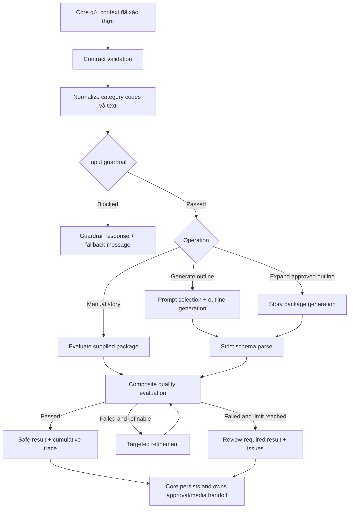

# Kế hoạch thiết kế và triển khai Luồng 2 trong AI Service

## 1. Mục tiêu

Hoàn thiện phần **Guided AI Story Generation Pipeline** thuộc AI Service theo Workflow v8 và schema PostgreSQL v9.1, trên kiến trúc hiện hữu:

```text
AI.Api -> AI.Application -> AI.Domain
                    ^
                    |
            AI.Infrastructure

Core <-> StoryPlatform.Contracts <-> AI Service
```

AI Service tiếp tục là processing boundary không trạng thái. Service nhận context đã được Core xác thực, thực hiện guardrail/generation/evaluation/refinement, rồi trả kết quả và metadata kỹ thuật cho Core.

## 2. Phạm vi

### Trong phạm vi

- Hợp đồng request/response dành riêng cho AI trong `StoryPlatform.Contracts/AI`.
- Input validation và input guardrail trước khi gọi LLM.
- Sinh tiêu đề và dàn ý ba phần.
- Mở rộng dàn ý đã được Core phê duyệt thành story package.
- Sinh từ vựng, ba loại quiz và câu hỏi thảo luận/bài học đạo đức.
- Output safety validation, schema validation, word-count/readability/vocabulary validation.
- Auto-refinement có giới hạn và có dấu vết từng lần gọi.
- Kiểm tra truyện thủ công bằng cùng quality gate với truyện AI.
- Chuẩn hóa lỗi, fallback response, correlation, metrics và logging an toàn.
- Unit, handler integration, HTTP contract và provider-adapter tests cho AI Service.

### Ngoài phạm vi

- Authentication/authorization của Parent, Teacher hoặc Child.
- Đọc `ChildProfile`, `LearningProfile`, `SafetyPolicy` từ database.
- Lưu `Story`, `StoryVersion`, `StoryGenerationJob` hoặc audit nghiệp vụ.
- Outline approval, final approval, auto-publish và archive state machine.
- Database/migration, kể cả các bảng được mô tả trong DBML v9.1.
- Queue, TTS, illustration và lưu `MediaAsset`.
- Public endpoint cho frontend.

Các phần ngoài phạm vi thuộc Core hoặc media/background services. AI Service chỉ trả kết quả đủ rõ để các service đó quyết định và lưu trạng thái.

## 3. Hiện trạng đã có

- Bốn internal endpoint: `/outline`, `/story`, `/evaluate`, `/refine`.
- `X-Internal-Api-Key` bảo vệ endpoint nội bộ.
- `ILlmClient` và adapter OpenAI structured output.
- JSON Schema cho outline và story package.
- Prompt provider với ba template hard-code.
- Rule-based evaluation cho schema tối thiểu, blocked topic, maximum words và vocabulary.
- Tối đa hai lần auto-refinement.
- Metadata model, prompt version, token, latency và refinement count.
- Baseline test hiện tại: 1 unit test và 2 AI integration tests đều pass.

## 4. Khoảng trống so với Luồng 2

1. `RequestGuard` dùng substring đơn giản, chưa trả verdict/fallback có cấu trúc và chưa phân biệt allowed/restricted/blocked category.
2. Contract chưa có `source`, `safetyTags`, `readabilityMetrics` và `generationVersion` như workflow.
3. `QuizItemDto` mới biểu diễn trắc nghiệm; chưa mô hình hóa `true_false` và `short_answer`.
4. Chưa có quy tắc riêng cho nhóm tuổi 6–8 và 9–12 về câu, chương, từ vựng và loại câu hỏi.
5. Evaluation chỉ kiểm độ dài tổng và dữ liệu vocabulary rỗng; chưa đánh giá sentence complexity, vocabulary complexity, quiz consistency hoặc discussion questions.
6. Chưa có output moderation abstraction; blocked-topic scan hiện chỉ nhìn title và story section.
7. Refinement làm mất context ngôn ngữ và profile; `RefineStoryHandler` đang cố định ngôn ngữ `vi`.
8. Metadata chỉ phản ánh lần gọi LLM cuối, không tổng hợp outline/story/refinement attempts.
9. Prompt template chưa thực sự chọn theo language/age band và chưa có lifecycle/version fallback rõ ràng.
10. Lỗi guardrail đang đi chung `ArgumentException`/HTTP 400 nên Core khó phân biệt input sai, policy block, provider lỗi và output không đạt.
11. Chưa có test cho story generation, refinement limit, malformed output, timeout/cancellation, internal authentication và error mapping.

## 5. Kiến trúc hoạt động đích



### Quy tắc orchestration

- Không gọi LLM nếu contract hoặc input guardrail thất bại.
- Outline generation chỉ sinh `title + outline`, không sinh toàn bộ truyện.
- Story expansion nhận dàn ý mà Core xác nhận là đã được duyệt. AI Service không tự xác minh quyền duyệt.
- Mỗi output LLM phải parse bằng strict schema trước khi đi tiếp.
- Evaluation chạy trên cả truyện AI và truyện Manual.
- Chỉ issue có `CanRefine = true` mới kích hoạt refinement.
- Safety violation mức block không được “refine để lách”; trả về Core để review/reject.
- Sau giới hạn refinement, trả output gần nhất cùng verdict `ReviewRequired`; không tuyên bố truyện an toàn.
- AI Service không chuyển trạng thái `Approved`, `Ready` hoặc `Archived`.

## 6. Thiết kế contract

### 6.1 Context đầu vào đáng tin cậy

Mở rộng request bằng các giá trị do Core lấy từ profile/policy, không nhận trực tiếp từ frontend:

- `RequestId`: correlation/idempotency key do Core cấp.
- `Source`: `ai` hoặc `manual`.
- `AgeBand`: enum/string chuẩn hóa `age_6_8`, `age_9_12`.
- `ReadingLevel`: giá trị chuẩn hóa; giai đoạn đầu có thể giữ chuỗi để không ép Core migration.
- `VocabularyLevel` và `Language`.
- `Interests` và story parameters.
- `GenerationConstraints` chứa giới hạn độ dài và content category codes.
- `ApprovedOutlineReference`: opaque reference từ Core cho bước story expansion; chỉ phục vụ trace, không phải cơ chế authorization.

Không truyền user ID, child name, email, raw voice hoặc dữ liệu nhận dạng không cần cho generation.

### 6.2 Content category

Thay danh sách topic tự do bằng contract có mã chuẩn hóa tương thích `content_categories.code`:

```text
ContentPolicyRuleDto
- CategoryCode
- Rule: allowed | restricted | blocked
- OptionalTerms
```

AI Service không đọc bảng `content_categories`. Core chịu trách nhiệm resolve policy hiện hành và gửi snapshot vào request.

### 6.3 Story package

`StoryPackageDto` cần bổ sung:

- `Source`.
- `Outline` để output tự mô tả và Core có thể đối chiếu với outline đã duyệt.
- `Quiz[].Type`: `multiple_choice`, `true_false`, `short_answer`.
- `Quiz[].CorrectAnswer`; `Options` chỉ bắt buộc cho multiple choice.
- `DiscussionQuestions[].IsMoralLesson`.
- `SafetyTags[]` là category code chuẩn hóa.
- `ReadabilityMetrics` gồm algorithm, word count, sentence count, average sentence length và các score có thể tính hợp lệ theo ngôn ngữ.
- `GenerationVersion`.

Không giả lập FKGL/FRE cho tiếng Việt. Evaluator phải chọn chiến lược theo ngôn ngữ và trả tên thuật toán; score không áp dụng được để `null`. Việc map vào database Core là công việc ngoài phạm vi này.

### 6.4 Guardrail và evaluation result

Thay danh sách lỗi dạng chuỗi bằng issue có cấu trúc:

```text
EvaluationIssueDto
- Code
- Stage: input | schema | safety | readability | vocabulary | quiz | discussion
- Severity: warning | review_required | blocked
- Path
- Message
- CanRefine
```

Kết quả gồm:

- `Verdict`: `Passed`, `ReviewRequired`, `Blocked`.
- Các cờ tương thích hiện hữu trong giai đoạn chuyển tiếp.
- `SafetyScore` và `ReadabilityScore` chỉ khi thuật toán tạo được score có ý nghĩa.
- `FallbackMessage` an toàn để Core có thể hiển thị cho Parent/Teacher.
- `Issues` có mã ổn định để Core không parse message.

### 6.5 Generation trace

Metadata tổng hợp cần chứa:

- Tổng input/output tokens và tổng latency.
- Prompt version của từng stage.
- Danh sách attempt: operation, provider/model, token, latency, outcome.
- Refinement count.
- Không chứa prompt đầy đủ hoặc nội dung truyện để tránh log dữ liệu trẻ em.

## 7. Thiết kế Application layer

### 7.1 Validation pipeline

Tách `RequestGuard` thành các validator nhỏ:

- `GenerationRequestValidator`: required fields, enum/value range, duplicate category, word limit.
- `StoryParameterValidator`: characters/setting/topic/lesson và requested length.
- `ManualStoryValidator`: cấu trúc đầu vào Manual trước evaluation.
- `ApprovedOutlineValidator`: ba phần không rỗng và reference hợp lệ.

Validation lỗi contract trả `InvalidRequest`; policy violation trả `GuardrailBlocked`.

### 7.2 Input guardrail

Thêm abstraction `IInputGuardrailService` với pipeline:

1. Normalize Unicode/case/whitespace.
2. Match category code và configured terms.
3. Kiểm requested length với `MaximumWords`.
4. Kiểm tổ hợp characters/setting/topic/lesson thay vì chỉ `Topic`.
5. Trả `Passed`, `Adjusted` hoặc `Blocked`.

Nếu policy cho phép clamp độ dài, response phải trả `EffectiveMaximumWords` và warning; nếu không, trả block cùng fallback message.

### 7.3 Outline generation

Giữ `GenerateOutlineHandler` nhưng tổ chức thành các bước rõ ràng:

1. Validate request.
2. Chạy input guardrail.
3. Resolve prompt theo operation + language + age band.
4. Compose system instruction và JSON context tách biệt về mặt logic.
5. Gọi `ILlmClient` với strict outline schema.
6. Parse và semantic-validate title/ba phần outline.
7. Trả generation trace và guardrail decision.

Regenerate outline vẫn gọi cùng handler với `RegenerationContext` tùy chọn; không đưa lịch sử phiên bản vào AI database.

### 7.4 Story expansion

Refactor `GenerateStoryHandler` thành orchestrator thay vì chứa toàn bộ loop:

- `IStoryPackageGenerator`: một lần sinh story package.
- `IStoryEvaluationPipeline`: chạy toàn bộ evaluator.
- `IStoryRefinementOrchestrator`: chọn issue refinable và quản lý attempt limit.
- `IGenerationTraceCollector`: cộng dồn metadata.

Age-band policy:

- `age_6_8`: câu ngắn, cấu trúc đơn giản, lặp từ có chủ đích, quiz nhận biết; không bắt buộc 3–5 chương.
- `age_9_12`: cho phép câu phức hơn, 3–5 section/chapter, problem-solving và câu hỏi suy luận/phản biện.

Những quy tắc này phải xuất hiện ở cả prompt và deterministic evaluation; không chỉ dựa vào lời nhắc LLM.

### 7.5 Manual story path

Không tạo entity hoặc endpoint persistence riêng. Dùng evaluation pipeline chung:

1. Core map bản nháp Manual thành `StoryPackageDto` với `Source=manual`.
2. `/api/ai/evaluate` chạy schema, safety, length, readability, vocabulary, quiz và discussion validators.
3. Nếu Core yêu cầu hỗ trợ sửa, `/api/ai/refine` nhận explicit reasons và trả bản mới; Core quyết định có lưu `StoryVersion` mới hay không.

### 7.6 Evaluation pipeline

Tách evaluator hiện tại thành composite theo thứ tự:

1. `StorySchemaEvaluator`.
2. `OutputSafetyEvaluator` trên title, outline, sections, lesson, vocabulary, quiz và discussion questions.
3. `LengthEvaluator`.
4. `ReadabilityEvaluator` theo language/age band.
5. `VocabularyEvaluator` theo vocabulary level và tính đầy đủ.
6. `QuizEvaluator` kiểm đủ ba dạng, answer/options hợp lệ và nội dung câu hỏi.
7. `DiscussionQuestionEvaluator` kiểm câu hỏi thảo luận và moral lesson.

Pipeline dừng sớm khi gặp issue `blocked`, nhưng vẫn trả các issue deterministic đã thu được trước đó.

### 7.7 Refinement

- Không cố định language `vi`; truyền lại full generation context.
- Prompt refinement chỉ nhận story hiện tại và issue codes có thể sửa.
- Không gửi nội dung bị block trở lại LLM nếu policy xác định không được xử lý tiếp.
- Giới hạn 0–2 lần như hiện tại, cấu hình qua `AI:Generation:MaxRefinementAttempts`.
- Mỗi attempt chạy lại strict schema và toàn bộ evaluation pipeline.
- Dùng cùng `RequestId`, tạo attempt ID riêng và cộng dồn trace.

## 8. Thiết kế Domain và Infrastructure

### Domain

Thêm các value/enum chỉ thuộc AI processing:

- `GenerationStage`, `GenerationVerdict`, `IssueSeverity`.
- `GuardrailDecision` và `GenerationAttempt`.
- `ReadabilityAssessment`.

Không thêm bản sao của `Story`, `StoryVersion`, `StoryGenerationJob` hoặc entity EF Core.

### Prompt catalog

Trong phạm vi AI Service hiện tại:

- Giữ `IPromptTemplateProvider`.
- Tách template theo operation/language/age band thành resource/config versioned trong AI Infrastructure.
- Validate template lúc startup và fail fast nếu thiếu placeholder bắt buộc.
- Có fallback rõ ràng: exact match -> language default -> cấu hình lỗi; không âm thầm dùng sai age band.
- Trả prompt version trong mọi attempt.

Lifecycle quản trị và bảng `prompt_catalog_versions` vẫn thuộc Core/Luồng 5; không thêm database cho AI trong kế hoạch này. Tích hợp dynamic catalog sẽ cần một contract nội bộ riêng ở giai đoạn sau.

### LLM adapter

- Giữ `ILlmClient` provider-neutral.
- Phân loại lỗi provider: timeout, rate limit, transient upstream, invalid structured output và permanent configuration.
- Retry chỉ cho lỗi transient trước khi nhận output hợp lệ; dùng backoff cấu hình và tôn trọng cancellation.
- Không retry policy block hoặc schema semantic failure ở tầng transport.
- Không log API key, full prompt hoặc full story.

### Observability

Thêm metrics/log theo stage:

- request count và outcome.
- guardrail blocked count theo category code, không log raw text.
- provider latency và failure class.
- input/output tokens.
- refinement count và final verdict.
- schema-invalid count.

Mọi log có `RequestId`, `GenerationId`, stage và prompt version; không chứa PII.

## 9. API và lỗi

Giữ bốn route hiện hữu để giảm thay đổi tích hợp. Chuẩn hóa response thay vì tạo thêm workflow endpoint lớn.

- `/api/ai/outline`: input guardrail + outline generation.
- `/api/ai/story`: expansion từ approved outline + evaluation + bounded refinement.
- `/api/ai/evaluate`: evaluation chung cho AI/Manual story.
- `/api/ai/refine`: refinement explicit theo issue codes.

Error envelope chung:

```text
code
message
requestId
retryable
details[]
```

Mapping dự kiến:

- Contract invalid -> 400 `invalid_request`.
- Guardrail blocked -> response nghiệp vụ có verdict `Blocked`; không dùng 5xx.
- Internal credential sai -> 401.
- Provider timeout/rate/transient -> 502/503 với `retryable=true` phù hợp.
- Provider output không parse được sau retry cho phép -> 502 `invalid_provider_output`.
- Cancellation từ caller -> không đổi thành 500.

## 10. Kế hoạch thay đổi theo file/module

### `src/Shared/StoryPlatform.Contracts/AI`

- Mở rộng requests bằng source, approved outline reference và normalized policy snapshot.
- Nâng cấp quiz contract cho ba loại.
- Bổ sung safety tags, readability metrics, generation version.
- Thêm guardrail/evaluation issue và cumulative trace DTO.
- Giữ compatibility có chủ đích hoặc version endpoint nếu thay đổi breaking không thể tránh.

### `StoryPlatform.AI.Application`

- Thay `RequestGuard` bằng validator/guardrail orchestration.
- Refactor `GenerateStoryHandler` thành pipeline có các abstraction nhỏ.
- Sửa `RefineStoryHandler` để giữ language/age/reading/vocabulary context.
- Bổ sung exception/result types có mã lỗi ổn định.
- Bổ sung trace collector và options validation.

### `StoryPlatform.AI.Domain`

- Thêm enum/value object phục vụ stage, verdict, issue và attempt.
- Không thêm persistence model.

### `StoryPlatform.AI.Infrastructure`

- Tách composite evaluators.
- Bổ sung input/output safety adapter.
- Tổ chức prompt resource theo language/age band/version.
- Hardening `OpenAILlmClient`: typed failure, cancellation, bounded retry và telemetry.

### `StoryPlatform.AI.Api`

- Chuẩn hóa error envelope.
- Thêm request/correlation logging không chứa nội dung.
- Giữ internal-key middleware và health endpoint.
- Thêm readiness check cho prompt catalog và provider configuration mà không gọi generation tốn phí.

## 11. Trình tự triển khai

### Giai đoạn 1 — Chốt contract và validation

1. Chốt enum/value names tương thích DBML: source, quiz type, category rule.
2. Bổ sung contract mới và JSON schema.
3. Viết contract serialization tests.
4. Tách request validators và error codes.

Điều kiện hoàn thành: cả ba quiz type serialize/deserialize đúng; invalid request bị chặn trước LLM; không có Core entity reference trong AI projects.

### Giai đoạn 2 — Guardrail và prompt selection

1. Xây normalized content-policy snapshot.
2. Cài `IInputGuardrailService` và `IOutputSafetyEvaluator`.
3. Tổ chức prompt theo language/age band/version.
4. Nâng cấp outline handler.

Điều kiện hoàn thành: blocked input không gọi LLM; fallback message có mã và nội dung thân thiện; prompt version được trace.

### Giai đoạn 3 — Story package và composite evaluation

1. Nâng cấp story package schema.
2. Cài các evaluator riêng.
3. Áp age-band rules.
4. Hỗ trợ Manual qua `/evaluate`.

Điều kiện hoàn thành: output có đủ vocabulary, ba quiz type, discussion/moral questions, safety tags và readability metrics; cùng evaluator áp dụng cho AI/Manual.

### Giai đoạn 4 — Refinement orchestration

1. Tách single-attempt generator khỏi loop.
2. Phân loại issue refinable/non-refinable.
3. Giữ đầy đủ context qua refinement.
4. Cộng dồn trace/tokens/latency.

Điều kiện hoàn thành: không quá giới hạn attempt; safety block không bị đưa vào loop; failure cuối trả `ReviewRequired` cùng issue rõ ràng.

### Giai đoạn 5 — Hardening API và observability

1. Typed provider errors và error middleware.
2. Timeout, cancellation và transient retry.
3. Structured metrics/logging không PII.
4. Health/readiness checks.

Điều kiện hoàn thành: Core phân biệt được validation, policy, provider và output failure; không log secret/prompt/story.

### Giai đoạn 6 — Test và tài liệu tích hợp

1. Hoàn thành test matrix.
2. Chạy toàn bộ AI unit/integration tests và Core client contract tests.
3. Cập nhật `src/AI/README.md` sau khi hành vi đã ổn định.
4. Cung cấp request/response samples không chứa dữ liệu trẻ thật.

Điều kiện hoàn thành: test pass, contract sample khớp runtime, và tài liệu thể hiện đúng service ownership.

## 12. Test matrix bắt buộc

### Validation và guardrail

- Thiếu request ID, age band, reading/vocabulary level.
- Requested length dưới/trên range.
- Blocked category xuất hiện trong topic, character, setting hoặc lesson.
- Restricted category tạo warning/review theo policy.
- Unicode/case/whitespace normalization.
- Guardrail block xác nhận LLM call count bằng 0.

### Outline

- Happy path cho từng age band và ngôn ngữ hỗ trợ.
- Missing prompt variant.
- Malformed provider JSON.
- Outline thiếu một trong ba phần.
- Cancellation và provider timeout.

### Story và quiz

- Story package đầy đủ.
- Đúng ba loại quiz.
- Multiple choice thiếu options hoặc index ngoài range.
- True/false có đáp án không hợp lệ.
- Short answer thiếu correct answer/reference answer.
- Thiếu vocabulary hoặc moral discussion question.

### Evaluation

- Blocked term ở title, outline, content, lesson, vocabulary, quiz và discussion.
- Vượt maximum words.
- Vi phạm sentence/section rule theo age band.
- Readability algorithm phù hợp ngôn ngữ; không giả FKGL/FRE cho tiếng Việt.
- Manual và AI dùng cùng kết quả cho cùng story package.

### Refinement

- Pass ngay không refine.
- Fail refinable rồi pass ở attempt 1 hoặc 2.
- Hết attempt trả `ReviewRequired`.
- Blocked issue không refine.
- Metadata cộng đúng token/latency/attempt.
- Language không bị đổi sang `vi` ngoài ý muốn.

### API/Infrastructure

- Internal key đúng/sai và health bypass.
- Provider 429/5xx/timeout/malformed response.
- Error envelope và `retryable` đúng.
- Không lộ API key hoặc raw content trong log test sink.

## 13. Tiêu chí nghiệm thu Luồng 2 phía AI Service

1. Mọi request không an toàn bị chặn trước LLM và có fallback có cấu trúc.
2. Outline luôn có title và ba phần hợp lệ trước khi trả Core.
3. Story package đáp ứng contract gồm source, sections, lesson, vocabulary, ba quiz type, discussion/moral questions, safety tags, readability và generation version.
4. Output được kiểm tra schema, safety, length, readability, vocabulary, quiz và discussion.
5. Refinement tối đa hai lần, không refine safety block và không mất context.
6. Metadata phản ánh toàn bộ attempts, không chỉ lần gọi cuối.
7. Manual story đi qua cùng quality gate nhưng AI Service không lưu dữ liệu.
8. AI Service không quyết định approval/publish/archive và không tạo media job.
9. Không có DB context, Core domain reference hoặc migration mới trong AI projects.
10. Test suite bao phủ happy path, boundary, provider failure và security behavior.

## 14. Thứ tự ưu tiên MVP

Nếu cần cắt scope để demo sớm:

1. Contract ba quiz type + input/output guardrail.
2. Outline -> approved-outline expansion -> composite evaluation.
3. Bounded refinement + cumulative metadata.
4. Manual evaluation path.
5. Prompt variant theo age band/language.
6. Advanced readability và dynamic prompt catalog integration.

Không cắt strict schema, policy block, approval boundary hoặc việc giữ dữ liệu trẻ em ra khỏi log.

## 15. Các quyết định cần chốt trước khi bắt đầu code

1. `ReadingLevel` và `VocabularyLevel` dùng enum chuẩn nào; hiện workflow chưa chốt CEFR/grade/internal scale.
2. Với input vượt `MaximumWords`, policy mặc định là clamp hay reject.
3. Restricted category tạo warning hay bắt buộc review.
4. Thuật toán readability chính thức cho tiếng Việt và ngưỡng cho hai age band.
5. Số lượng tối thiểu/tối đa vocabulary, quiz và discussion questions.
6. Dynamic Prompt Catalog của Luồng 5 sẽ được Core đẩy snapshot sang AI hay AI gọi internal read API; không cho phép hai service cùng sở hữu bảng.

Trong khi chưa chốt, implementation nên dùng cấu hình rõ ràng và không tự suy diễn giá trị nghiệp vụ vĩnh viễn.
