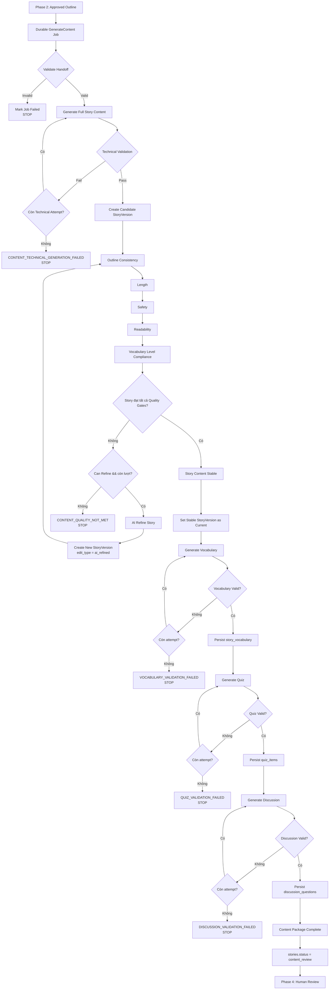

# PHASE 3 — STORY CONTENT GENERATION & SEQUENTIAL LEARNING ARTIFACTS

**Version:** 2.0  
**Status:** Ready for coding agent  
**Core rule:** Story phải hoàn thành và ổn định trước, sau đó mới lần lượt tạo `Vocabulary → Quiz → Discussion`.

---

## 1. Mục tiêu

Phase 3 nhận một **Outline Version đã được approve ở Phase 2** và xử lý tuần tự:

1. Generate Full Story Content.
2. Technical Validation.
3. Tạo `StoryVersion` mới cho Content.
4. Chạy Story Quality Gates.
5. Auto-refine Story nếu cần.
6. Khi Story Stable mới Generate Vocabulary.
7. Vocabulary Valid mới Generate Quiz.
8. Quiz Valid mới Generate Discussion.
9. Discussion Valid mới hoàn thành Content Package.
10. Chuyển `stories.status = content_review`.
11. Dừng Phase 3 và bàn giao Phase 4.

Phase 3 **không xử lý** Human Edit, User Regenerate Story, Approve, Archive, Publish, Scene, Image, TTS hoặc `ready`.

---

## 2. Sơ đồ tổng thể



---

## 3. Quy tắc tuần tự bắt buộc

```text
STORY
  ↓
VOCABULARY
  ↓
QUIZ
  ↓
DISCUSSION
```

- Story chưa Stable → không Generate Vocabulary.
- Vocabulary chưa Valid → không Generate Quiz.
- Quiz chưa Valid → không Generate Discussion.
- Discussion chưa Valid → không chuyển `content_review`.
- Không chạy song song các artifact trong Phase 3 phiên bản này.

---

# 4. P3-A — Consume Handoff từ Phase 2

Phase 2 tạo durable operation:

```text
operation = generate_content
```

Payload/reference tối thiểu:

```text
storyId
generationRequestId
approvedOutlineVersionId
acceptedInputSnapshotId
correlationId
```

Core kiểm tra:

```text
Story tồn tại
Story.source = ai
Story chưa archived
Generation Request tồn tại và hợp lệ
Approved Outline Version tồn tại
Version thuộc đúng Story
Version đã được approve
Version.content == null
Accepted Input Snapshot tồn tại
Không có generate_content operation khác active
```

Nếu fail:

```text
job.status = failed
error_code = INVALID_PHASE3_HANDOFF
STOP
```

---

# 5. P3-B — Generate Full Story

Core build command từ Approved Outline + Accepted Input Snapshot.

```csharp
public sealed record GenerateStoryContentCommand
{
    public int StoryId { get; init; }
    public int GenerationRequestId { get; init; }
    public int ApprovedOutlineVersionId { get; init; }

    public string Title { get; init; } = default!;
    public string OutlineOpening { get; init; } = default!;
    public string OutlineDevelopment { get; init; } = default!;
    public string OutlineEnding { get; init; } = default!;

    public string AgeBand { get; init; } = default!;
    public int ReadingLevel { get; init; }
    public string VocabularyLevel { get; init; } = default!;
    public string Language { get; init; } = default!;

    public string LessonGoal { get; init; } = default!;
    public int TargetLength { get; init; }
    public int MaximumLength { get; init; }
}
```

AI trả:

```csharp
public sealed record GenerateStoryContentResult
{
    public string Content { get; init; } = default!;
    public string Lesson { get; init; } = default!;
    public GenerationMetadataDto Metadata { get; init; } = default!;
}
```

Ở bước này chưa sinh Vocabulary, Quiz, Discussion.

---

# 6. Technical Validation & Retry

Technical Validation:

```text
Response parse được
Content != empty
Lesson hợp lệ
Schema hợp lệ
Required fields tồn tại
```

Retry cho:

```text
Timeout
Provider 5xx
Rate limit
Invalid JSON
Malformed structured output
Missing required fields
```

Config:

```text
MaxTechnicalAttempts = 3
```

Technical retry **không tạo StoryVersion**.

---

# 7. Tạo StoryVersion cho Content

Ví dụ Phase 2 kết thúc:

```text
V4
Approved Outline
content = null
is_current = true
```

Khi Content technical-valid:

```text
V5
title = copy từ V4
outline_* = copy từ V4
content = generated story
lesson = generated lesson
edit_type = initial
is_current = false
```

Không update V4.

---

# 8. Story Quality Gates

Thứ tự bắt buộc:

```text
1. Outline Consistency
2. Length
3. Safety
4. Readability
5. Vocabulary Level Compliance
```

## 8.1 Outline Consistency

Check:

```text
Opening
Development
Ending
Main characters
Setting
Conflict
Resolution
Lesson goal
```

## 8.2 Length

Core tự tính:

```text
content
↓
LengthEvaluator
↓
actualLength
```

Check:

```text
actualLength <= MaximumLength
```

Không truncate. Nếu fail → Auto-refine.

## 8.3 Safety

```text
Rule-based Safety
↓
Semantic Safety
```

Check:

```text
Blocked content
Age appropriateness
Harmful content
Violence
Sexual content
PII
Policy violations
```

Hard safety block → `CanRefine = false`.

## 8.4 Readability

```text
language = en → FKGL / FRE
language = vi → VI_READABILITY_V1
```

## 8.5 Vocabulary Level Compliance

Check toàn bộ Story có phù hợp `VocabularyLevel` hay không.

---

# 9. ContentEvaluationResult

```csharp
public sealed record QualityGateResult
{
    public bool Passed { get; init; }
    public bool CanRefine { get; init; }
    public string? ReasonCode { get; init; }
    public IReadOnlyList<string> Violations { get; init; } = [];
}

public sealed record ContentEvaluationResult
{
    public bool IsPassed { get; init; }

    public QualityGateResult OutlineConsistency { get; init; } = default!;
    public QualityGateResult Length { get; init; } = default!;
    public QualityGateResult Safety { get; init; } = default!;
    public QualityGateResult Readability { get; init; } = default!;
    public QualityGateResult VocabularyCompliance { get; init; } = default!;

    public IReadOnlyList<string> RefinementReasons { get; init; } = [];
}
```

---

# 10. Auto-refine Story

Nếu Quality Gate fail nhưng có thể sửa:

```text
Quality FAIL
↓
CanRefine = true
↓
AI Refine Story
↓
Create New StoryVersion
↓
Run lại toàn bộ Quality Gates
```

Auto-refine nhận:

```text
Current Story Content
Approved Outline
Lesson
Quality violations
AgeBand
ReadingLevel
VocabularyLevel
TargetLength
MaximumLength
```

Mỗi lần refine tạo version mới:

```text
V5 FAIL
↓
V6 = ai_refined

V6 FAIL
↓
V7 = ai_refined
```

Không update version cũ.

Config:

```text
MaxContentRefinementAttempts = 2
```

Hết lượt vẫn fail:

```text
CONTENT_QUALITY_NOT_MET
STOP
```

---

# 11. Khi nào Story Stable?

Chỉ khi:

```text
OutlineConsistency == PASS
AND Length == PASS
AND Safety == PASS
AND Readability == PASS
AND VocabularyCompliance == PASS
```

Khi đó transaction:

```text
PreviousCurrent.is_current = false
StableVersion.is_current = true
```

Ví dụ:

```text
V4 false
V5 false
V6 false
V7 true
```

Sau đó mới được Generate Vocabulary.

---

# 12. P3-C — Generate Vocabulary

Input:

```text
StableStoryVersionId
Story Content
AgeBand
ReadingLevel
VocabularyLevel
Language
```

AI output:

```text
term
definition
```

Validation:

```text
Required count
No duplicate term
Term relevant to story
Definition not empty
Definition age appropriate
Vocabulary level phù hợp
No unsafe vocabulary
```

Config:

```text
VocabularyMaxAttempts = 2
```

Nếu hết attempts:

```text
VOCABULARY_VALIDATION_FAILED
STOP
```

Nếu PASS:

```text
INSERT story_vocabulary
story_version_id = StableVersionId
```

Sau đó mới tạo Quiz Job.

---

# 13. P3-D — Generate Quiz

Prerequisite:

```text
Story Stable
Vocabulary Completed
```

Supported types:

```text
multiple_choice
true_false
short_answer
```

Persisted fields:

```text
type
question
correct_answer
choices
```

Validation:

```text
Question tồn tại
No duplicates
CorrectAnswer tồn tại
Question answerable from Story
```

Multiple Choice:

```text
choices != null
choices >= 2
correct_answer thuộc choices
```

True/False:

```text
correct_answer = true / false
```

Short Answer:

```text
correct_answer != empty
```

Config:

```text
QuizMaxAttempts = 2
```

Nếu PASS:

```text
INSERT quiz_items
story_version_id = StableVersionId
```

Sau đó mới tạo Discussion Job.

---

# 14. P3-E — Generate Discussion

Prerequisite:

```text
Story Stable
Vocabulary Completed
Quiz Completed
```

Input:

```text
Stable Story Content
Lesson
AgeBand
Language
```

Output:

```text
question[]
```

Không dùng `is_moral_lesson`.

Validation:

```text
Question not empty
No duplicates
Relevant to story
Relevant to lesson
Age appropriate
Required count
```

Config:

```text
DiscussionMaxAttempts = 2
```

Nếu PASS:

```text
INSERT discussion_questions
story_version_id = StableVersionId
```

---

# 15. Content Package Completion

Chỉ Complete khi:

```text
Stable StoryVersion exists
AND Vocabulary completed
AND Quiz completed
AND Discussion completed
```

Sau đó:

```text
stories.status = content_review
```

Phase 3 kết thúc.

---

# 16. Job Model

Operations:

```text
generate_content
refine_content
generate_vocabulary
generate_quiz
generate_discussion
```

Statuses:

```text
pending
processing
completed
failed
```

Không cần mở rộng `JobStage` thành hàng chục giá trị.

---

# 17. Strict Sequential Job Creation

Sau Phase 2:

```text
create generate_content
```

Khi Story Stable:

```text
create generate_vocabulary
```

Khi Vocabulary completed:

```text
create generate_quiz
```

Khi Quiz completed:

```text
create generate_discussion
```

Không tạo các artifact jobs cùng lúc.

---

# 18. Background Worker

Có thể dùng một generic worker:

```csharp
switch (job.Operation)
{
    case GenerateContent:
        await ProcessGenerateContentAsync(job);
        break;

    case GenerateVocabulary:
        await ProcessVocabularyAsync(job);
        break;

    case GenerateQuiz:
        await ProcessQuizAsync(job);
        break;

    case GenerateDiscussion:
        await ProcessDiscussionAsync(job);
        break;
}
```

---

# 19. Transaction Boundary

Không giữ DB transaction trong lúc gọi LLM.

Đúng:

```text
BEGIN
Claim Job
COMMIT

Call AI outside transaction

BEGIN
Persist Result
COMMIT
```

---

# 20. Idempotency

Phải bảo vệ:

```text
Duplicate Worker Execution
Process Restart
Same Job Picked Twice
```

Ví dụ Vocabulary đã insert rồi worker crash, lần chạy lại không được tạo duplicate.

Dùng:

```text
job idempotency
transaction
unique constraints
```

---

# 21. Stale Result Protection

Content/refine job phải biết:

```text
baseStoryVersionId
```

Trước khi persist:

```text
Base version vẫn hợp lệ?
Flow chưa thay đổi?
```

Nếu không:

```text
result = stale
```

Không promote version cũ.

---

# 22. Database

## `story_versions`

Reuse:

```text
id
story_id
version_no
edit_type
editor_user_id

title
outline_opening
outline_development
outline_ending

content
lesson

readability_metric
readability_score
readability_fkgl
readability_fre
safety_score

is_current
created_at
```

Có thể thêm:

```text
word_count
```

Không thêm:

```text
vocabulary_json
quiz_json
discussion_json
```

## `story_vocabulary`

```text
id
story_version_id
term
definition
```

## `quiz_items`

```text
id
story_version_id
type
question
correct_answer
choices
```

## `discussion_questions`

```text
id
story_version_id
question
```

---

# 23. Core Interfaces đề xuất

```text
IPhase3Orchestrator
IContentJobProcessor

IContentQualityEvaluator
IOutlineConsistencyEvaluator
ILengthEvaluator
ISafetyEvaluator
IReadabilityEvaluator
IVocabularyComplianceEvaluator

IVocabularyValidator
IQuizValidator
IDiscussionValidator
```

---

# 24. AI Handlers đề xuất

```text
GenerateStoryContentHandler
RefineStoryContentHandler

GenerateVocabularyHandler
GenerateQuizHandler
GenerateDiscussionHandler
```

Không dùng một generic `RefineArtifactHandler<string>` cho mọi artifact.

---

# 25. Public API Phase 3

Phase 3 tự chạy từ durable handoff, FE chủ yếu cần progress:

```http
GET /api/v1/stories/{storyId}/generation/progress
```

Ví dụ:

```json
{
  "storyId": 100,
  "storyStatus": "outline_review",
  "currentStep": "generating_quiz",
  "content": "stable",
  "vocabulary": "completed",
  "quiz": "processing",
  "discussion": "not_started",
  "isComplete": false
}
```

Khi hoàn tất:

```json
{
  "storyId": 100,
  "storyStatus": "content_review",
  "currentStep": "complete",
  "content": "stable",
  "vocabulary": "completed",
  "quiz": "completed",
  "discussion": "completed",
  "isComplete": true
}
```

Không implement trong Phase 3:

```http
POST /content/.../approve
POST /content/.../regenerate
```

Các action Human Review thuộc Phase 4.

---

# 26. Error Codes

Content:

```text
INVALID_PHASE3_HANDOFF
CONTENT_TECHNICAL_GENERATION_FAILED
CONTENT_SCHEMA_INVALID
CONTENT_QUALITY_NOT_MET
CONTENT_SAFETY_BLOCKED
CONTENT_REFINE_EXHAUSTED
```

Vocabulary:

```text
VOCABULARY_GENERATION_FAILED
VOCABULARY_VALIDATION_FAILED
```

Quiz:

```text
QUIZ_GENERATION_FAILED
QUIZ_VALIDATION_FAILED
```

Discussion:

```text
DISCUSSION_GENERATION_FAILED
DISCUSSION_VALIDATION_FAILED
```

---

# 27. Agent Task Breakdown

## TASK 1 — Audit existing code

Đọc:

```text
Story
StoryVersion
StoryGenerationRequest
StoryGenerationJob
AIStoryInputContextSnapshot

story_vocabulary
quiz_items
discussion_questions

AI handlers
prompt providers
LLM client
evaluation services
```

Không tạo duplicate abstraction.

## TASK 2 — Implement Job Operations

```text
generate_content
generate_vocabulary
generate_quiz
generate_discussion
```

Status:

```text
pending
processing
completed
failed
```

## TASK 3 — Generate Story Content

```text
Load Approved Outline
Build Command
Call AI
Technical Validation
Technical Retry
Create Candidate StoryVersion
```

## TASK 4 — Implement Story Quality Evaluator

```text
Outline Consistency
Length
Safety
Readability
Vocabulary Compliance
```

## TASK 5 — Implement Auto-refine

```text
Quality FAIL
↓
CanRefine?
↓
Refine budget?
↓
Call RefineStory
↓
Create New StoryVersion
↓
Evaluate again
```

## TASK 6 — Promote Stable Story

Atomic:

```text
old current = false
stable version = true
```

Sau đó tạo Vocabulary Job.

## TASK 7 — Vocabulary Pipeline

```text
Generate
Validate
Bounded Retry
Persist
Create Quiz Job
```

## TASK 8 — Quiz Pipeline

```text
Generate
Validate
Bounded Retry
Persist
Create Discussion Job
```

## TASK 9 — Discussion Pipeline

```text
Generate
Validate
Bounded Retry
Persist
```

## TASK 10 — Complete Phase 3

Check:

```text
Stable Story
Vocabulary
Quiz
Discussion
```

Sau đó:

```text
stories.status = content_review
```

---

# 28. Test Cases bắt buộc

### T01 — Happy Path

```text
Approved V4
→ V5 PASS
→ Vocabulary PASS
→ Quiz PASS
→ Discussion PASS
→ content_review
```

### T02 — Technical Retry

```text
Attempt 1 timeout
Attempt 2 valid
→ chỉ tạo V5
```

### T03 — Content Refine

```text
V5 readability fail
→ V6
→ PASS
```

### T04 — Multiple Refine

```text
V5 fail
→ V6 fail
→ V7 pass
```

### T05 — Refine Exhausted

```text
V5 fail
→ V6 fail
→ V7 fail
→ Phase 3 Failed
→ Vocabulary không chạy
```

### T06 — Hard Safety Block

```text
Content unsafe
→ CanRefine = false
→ fail immediately
```

### T07 — Vocabulary Fail

```text
Story Stable
→ Vocabulary invalid
→ Retry Vocabulary
→ Quiz chưa chạy
```

### T08 — Vocabulary Exhausted

```text
Vocabulary fail hết attempts
→ Phase 3 failed
→ Quiz not created
```

### T09 — Quiz Fail

```text
Story preserved
Vocabulary preserved
Quiz retry
Discussion not started
```

### T10 — Discussion Fail

```text
Story preserved
Vocabulary preserved
Quiz preserved
Discussion retry
```

### T11 — Duplicate Worker

```text
Same job processed twice
→ no duplicate records
```

### T12 — Current Version

```text
Only Stable StoryVersion is current
Failed candidate versions remain non-current
```

---

# 29. Definition of Done

```text
[ ] Approved Outline được consume đúng version

[ ] Full Story được generate
[ ] Technical retry bounded
[ ] Technical retry không tạo StoryVersion

[ ] Successful Story generation tạo StoryVersion mới
[ ] Approved Outline không bị mutate

[ ] Outline Consistency Gate implemented
[ ] Length Gate implemented
[ ] Safety Gate implemented
[ ] Readability Gate implemented
[ ] Vocabulary Compliance Gate implemented

[ ] Auto-refine có giới hạn
[ ] Mỗi Auto-refine tạo StoryVersion mới
[ ] Refined Story chạy lại toàn bộ Quality Gates

[ ] Chỉ Stable StoryVersion trở thành current

[ ] Vocabulary chỉ chạy sau Stable Story
[ ] Vocabulary validate + persist

[ ] Quiz chỉ chạy sau Vocabulary
[ ] Quiz validate + persist

[ ] Discussion chỉ chạy sau Quiz
[ ] Discussion validate + persist

[ ] Mọi artifact bind đúng Stable StoryVersion

[ ] Workflow tuần tự được enforce

[ ] Không Human Edit
[ ] Không User Regenerate Story
[ ] Không Approve
[ ] Không Archive
[ ] Không Media

[ ] Content Package Complete được xác định chính xác
[ ] stories.status chỉ chuyển content_review khi toàn bộ package hoàn tất

[ ] Unit tests pass
[ ] Integration tests pass
```

---

# 30. Final Business Rule Summary

> Phase 3 là pipeline tuần tự tuyệt đối: **Story → Vocabulary → Quiz → Discussion**.

> Story phải vượt toàn bộ Quality Gates và trở thành Stable trước khi Vocabulary được phép sinh.

> Vocabulary phải Valid trước khi Quiz sinh.

> Quiz phải Valid trước khi Discussion sinh.

> Chỉ khi Story + Vocabulary + Quiz + Discussion đều hoàn tất thì Story mới chuyển sang `content_review`.

> Phase 3 không thực hiện Human Edit, User Regenerate Story, Approve hoặc Archive.
