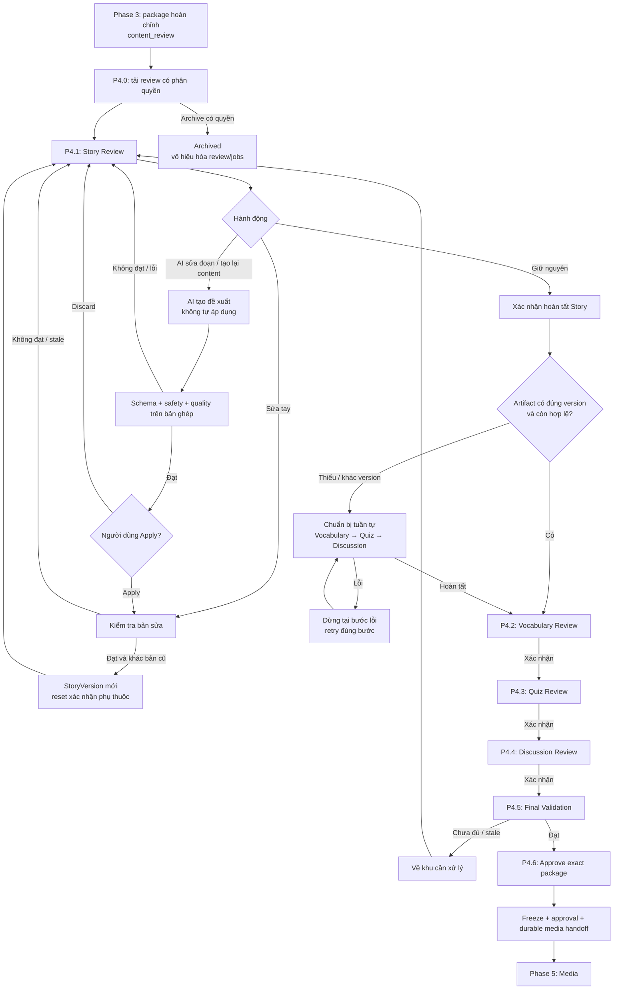

# PHASE 4 — HUMAN CONTENT REVIEW & CONTROLLED REVISION

**Dự án:** AI Storytelling / StoryPlatform
**Phạm vi:** Phase 4 của **Luồng 2**, không phải Luồng 4 Distribution/O2O
**Phiên bản kế hoạch:** 1.0 — 2026-09-15
**Trạng thái:** Đặc tả triển khai đề xuất; cần đối chiếu repository trước khi áp dụng migration
**Đối tượng sử dụng:** Coding agent, Backend, AI, Frontend, QA

> Thứ tự review: **P4.1 Story → P4.2 Vocabulary → P4.3 Quiz → P4.4 Discussion → Final Validation → Approve / Archive**.
>
> Hoàn tất một khu review không phải phê duyệt truyện cho trẻ. Chỉ bước Approve cuối cùng mới tạo phê duyệt cho toàn bộ package.

---

## 0. Cơ sở và cách sử dụng tài liệu

### 0.1. Những quyết định đã có trong cuộc trao đổi

- Phase 3 tự động tạo Story, ổn định nội dung, rồi sinh tuần tự Vocabulary → Quiz → Discussion.
- Phase 3 kết thúc ở `stories.status = content_review`; không thực hiện final approval.
- Phase 4 cho Parent/Teacher có quyền xem, chỉnh sửa và quyết định sử dụng package.
- P4.1 có ba hành động: sửa tay; nhờ AI sửa một đoạn; nhờ AI tạo lại toàn bộ content nhưng giữ approved outline.
- Phải hoàn tất P4.1 trước khi review các artifact.
- Vocabulary, Quiz và Discussion có thể thêm/sửa/xóa/tạo lại bằng AI trong khu review tương ứng.
- Đổi title/outline/content/lesson đã lưu thành một snapshot khác thì tạo StoryVersion mới.
- Chỉnh artifact riêng trước approval không tăng số StoryVersion; phải có audit và kiểm soát thay đổi riêng.
- Không sửa đè phiên bản truyện cũ. Không cho trẻ đọc package chưa được phép phát hành.
- `is_moral_lesson` không được sử dụng trong thiết kế mới; không tự thêm lại.

### 0.2. Cơ sở từ tài liệu đã cung cấp

**[S1] `Luong2_AI_Generation_Pipeline_DeepDive.docx`, mục 3.2, 5, 8–10.**
Tài liệu quy định Edit / Regenerate / Approve / Archive, versioning và media sau approval. Tài liệu còn có nhánh auto-publish và cửa sổ hậu kiểm; không được coi các quyết định đó đã bị xóa.

**[S2] Báo cáo đối chiếu repository trong `Pasted markdown(2).md`.**
Báo cáo ghi nhận `AcceptedInputJson`, `ContextSnapshotJson`, `StoryGenerationJob`, `OperationKey`, `ConcurrencyToken`, `LeaseExpiresAt` và các entity artifact. Đây là báo cáo người dùng cung cấp, không phải kết quả kiểm tra repository mới trong lần lập kế hoạch này.

**[S3] Các quyết định Phase 3 tuần tự và Phase 4 trong cuộc trao đổi.**
Đây là nguồn cho thứ tự bốn khu review và phạm vi AI partial edit / regenerate from outline.

**[S4] `Luong1_Profile_Supervision_DeepDive.docx`, phần giải thích supervision permission.**
`approve_story` là quyền duyệt truyện. Agent phải dùng policy/relationship resolver thực tế, không suy ra quyền chỉ từ role.

### 0.3. Những bổ sung kỹ thuật được đề xuất trong kế hoạch này

Các khái niệm `ReviewSession`, `PackageRevision`, checkpoint theo hash, AI proposal có Apply/Discard và manifest approval là **đề xuất triển khai**, chưa được xác nhận tồn tại trong DB.

Bổ sung chúng nhằm hiện thực hóa các quyết định đã có: không sửa nhầm version, không tự áp dụng đề xuất AI, không phê duyệt dựa trên bộ quiz/vocabulary cũ.

Không tự tạo tất cả thành bảng mới. Tái sử dụng workflow/audit/job metadata khi chúng đáp ứng đúng yêu cầu.

### 0.4. Phạm vi manual review và auto-publish

Plan này triển khai **nhánh human review theo bốn khu** mà người dùng vừa chọn. Không âm thầm xóa hoặc thay đổi `requiredApprovalMode` của ChildProfile.

Auto-publish theo DeepDive là nhánh riêng. Nếu source đã có auto-approval worker, nó phải kiểm tra package có đang ở vòng human revision hay không, có dữ liệu chưa xác nhận hay job/proposal đang chạy hay không. Không được auto-approve chen ngang vòng người dùng đang chỉnh sửa.

Cơ chế routing giữa nhánh auto và manual phải được ghi rõ khi khảo sát source. Chưa có implementation auto thì không báo hoàn tất toàn bộ scope auto-publish chỉ vì nhánh manual đã chạy.

---

## 1. Mục tiêu và điểm kết thúc

### 1.1. Đầu vào

- Story đang `content_review`.
- Một StoryVersion hiện hành có content đạt các quality gate bắt buộc.
- Vocabulary, Quiz, Discussion đã được Phase 3 tạo và kiểm tra cho đúng version đó.
- Có lineage đến approved outline và GenerationRequest.
- Người dùng có quyền review đối với đúng tài nguyên Child/Story.

Nếu package Phase 3 còn thiếu hoặc thất bại, API trả trạng thái chuẩn bị/chưa hoàn tất; không đánh dấu bốn khu review là completed.

### 1.2. Đầu ra thành công

- Chốt đúng StoryVersion và đúng tập artifact được người lớn xác nhận.
- Ghi approval: actor, thời điểm, version, package revision/hash, policy/evaluation tương ứng.
- Đóng băng package đã duyệt.
- Ghi ý định handoff media bền vững trong cùng transaction với approval.
- `stories.status = approved`; consumer media có thể chuyển tiếp `media_processing`.

Phase 4 không tuyên bố `ready` ngay khi approve.

### 1.3. Đầu ra Archive

- `stories.status = archived`.
- Vòng review kết thúc, công việc đang chạy bị vô hiệu hóa về nghiệp vụ.
- Không phát sinh handoff media mới.
- Giữ lịch sử truyện, artifact và audit theo chính sách lưu trữ.
- Kết quả AI đến muộn không được đổi current version hay khôi phục Story.

### 1.4. Ngoài phạm vi triển khai lần này

- Tạo/sửa lại approved outline; muốn đổi cốt truyện phải đi qua quy trình outline tương ứng.
- Nhánh nhập Manual Story từ đầu.
- Real-time collaborative editor.
- Xây renderer scene, sinh ảnh hoặc TTS.
- Chỉnh trực tiếp package đã approved/đã được trẻ sử dụng.
- Tự thay đổi Reading Level, Vocabulary Level, Language hoặc SafetyPolicy của trẻ trong màn hình review.

---

## 2. Sơ đồ tổng thể



`Retry đúng bước` phải có ngân sách hữu hạn và loại lỗi cho phép; mũi tên trong sơ đồ không phải vòng lặp vô hạn.

---

## 3. Năm khái niệm agent phải phân biệt

| Khái niệm | Ý nghĩa | Có cấp quyền cho trẻ đọc không? |
|---|---|---|
| Content Stable | Nội dung vượt quality gate theo policy/evaluator đã xác định | Không |
| Story Review Completed | Người dùng xác nhận xong P4.1 cho đúng nội dung | Không |
| Artifact Ready | Một bộ Vocabulary/Quiz/Discussion đã được tạo và validate | Không |
| Section Review Completed | Người dùng xác nhận xong một khu review cho đúng dữ liệu | Không |
| Package Approved | Người có quyền approve phê duyệt đúng version và toàn bộ artifact | Chưa đủ; còn media/readiness/visibility/access policy |

Không dùng `IsCurrent` thay cho approved hoặc child-visible.

---

## 4. Boundary Core, AI và Frontend

### Core Backend

- Quyền theo Story/Child, policy, checkpoint, revision và concurrency.
- Đọc GenerationRequest JSON từ nguồn thực tế.
- Xác định approved outline chính xác.
- Gửi dữ liệu sáng tác tối thiểu cho AI.
- Áp dụng patch vào đúng range bằng code.
- Tạo StoryVersion, cập nhật normalized artifact, ghi audit.
- Điều phối pipeline chuẩn bị artifact tuần tự.
- Final validation, approval/archive, freeze và durable handoff.

### AI Module

- Trả replacement text cho đoạn được chọn.
- Viết content mới từ approved outline khi được yêu cầu.
- Sinh lại một bộ artifact hoặc một item theo operation.
- Structured output, model integration, semantic evaluation.
- Không tự ghi bảng nghiệp vụ, không quyết định quyền hoặc approval.

### Frontend

- Bốn khu review có trạng thái mở/khóa/read-only rõ ràng.
- Giữ bản người dùng đang gõ; phân biệt chưa lưu / đang kiểm tra / đã lưu.
- Hiển thị preview AI, Apply / Discard, validation errors và conflict.
- Gửi đúng version, operation key, revision/token do server cấp.
- Không gửi plaintext form trong URL; không lưu nội dung nhạy cảm vào localStorage mặc định.
- UI disable không thay thế authorization và kiểm tra trạng thái ở backend.

Không buộc tách AI thành service/container mới trong nhiệm vụ này. Dùng boundary module/API mà repository đã có.

---

## 5. P4.0 — Foundation: source, quyền và review context

### P4.0.1. Khảo sát repository trước khi tạo file/migration

Đọc AGENTS.md, README, solution đang dùng, git status, migrations và test nền.

Tìm thực tế:
- Story, StoryVersion, GenerationRequest, StoryGenerationJob.
- Approved-outline linkage.
- AcceptedInputJson và ContextSnapshotJson.
- Các validator, content-generation handler và artifact pipeline Phase 3.
- Authorization, audit, notifications, outbox/jobs, recovery.
- API approve/archive đang tồn tại để tránh tạo lối bypass.
- FE repository/client nếu có.

Báo cáo ánh xạ đường dẫn thật; không coi tên interface trong plan là bằng chứng class đã tồn tại.

Báo cáo trước nêu rủi ro migration Phase 2 chạy trước Init. Phải kiểm tra cả DB sạch và DB đã có history. Không reset DB, xóa migration đã dùng hoặc sửa history môi trường dùng chung khi chưa được cho phép.

### P4.0.2. Ma trận quyền theo hành động

| Hành động | Capability cần kiểm tra |
|---|---|
| Xem package/history | Quyền đọc review của Story/Child |
| Sửa tay Story/artifact | Quyền edit nội dung tương ứng |
| Yêu cầu AI sửa/tạo lại | Quyền dùng AI generation/revision trên Child, quota nếu có |
| Xác nhận một khu review | Quyền thực hiện review khu đó |
| Apply AI proposal | Vẫn phải có quyền edit và dùng AI tương ứng |
| Final approve | `approve_story` của đúng Child |
| Archive | Quyền archive theo policy hiện có |

Các capability ngoài `approve_story` là tên nghiệp vụ, không khẳng định enum DB đã có.

Role Parent/Teacher, người tạo Story, hay bật auto-publish không tự cấp tất cả quyền. Nếu thiếu mapping quyền edit/archive trong source, ghi rõ điểm thiếu; không thay bằng `return true` hoặc chỉ kiểm tra role.

Kiểm tra quyền ở nhận request, lúc worker bắt đầu, lúc apply kết quả và khi approve/archive. Không đưa UserId do client khai báo vào principal.

### P4.0.3. API tải review

GET chỉ đọc; không gọi AI hay tạo một review session mỗi lần refresh.

Có thể khởi tạo review state một lần khi Phase 3 hoàn tất hoặc qua POST mở review có idempotency; chọn cách phù hợp source.

Response logic:
- StoryId, StoryStatus.
- ReviewSessionId nếu có, ReviewStoryVersionId.
- ApprovedOutlineVersionId đã được xác thực.
- PackageRevision, ConcurrencyToken.
- Nội dung truyện, lesson, artifact theo đúng version.
- Các checkpoint và khu đang được phép sửa.
- ActiveOperation, pending proposal.
- CanEditStory / CanEditArtifacts / CanApprove / CanArchive do backend tính.

### P4.0.4. Trạng thái review

Đề xuất state tách khỏi `stories.status`:

`story_review → preparing_artifacts → vocabulary_review → quiz_review → discussion_review → final_review → approved`

Có thể có `blocked`, `archived`, `superseded` theo cơ chế hiện có. Không thêm một StoryStatus cho từng tab.

`Story.status = content_review` không đủ để cho approve; phải kiểm tra đầy đủ review state.

---

## 6. P4.1 — STORY REVIEW

### P4.1.1. Hiển thị đúng bản cần review

Hiển thị title/content/lesson của version hiện hành, quality result thực có và approved outline ở chế độ tham chiếu.

Ba trường `outline_*` là tóm tắt cốt truyện, **không phải đoạn full content để thay trực tiếp**.

MVP cho chỉnh theo selection hoặc toàn content. Không giả định `outline_opening` chứa toàn văn phần mở đầu. Không thêm story_scenes chỉ để làm text editor.

### P4.1.2. Sửa tay Title / Content / Lesson

1. Người dùng mở editor; bản nháp UI chưa phải StoryVersion mới.
2. Submit Save kèm base version, package revision/token và operation key.
3. Core kiểm tra quyền, story/review state, concurrency, độ dài request và trường được phép.
4. Canonicalize theo quy tắc cố định của repository, không xóa dấu hoặc tự viết lại câu.
5. Nếu snapshot nội dung không đổi, trả no-change; không tạo version/reset checkpoint.
6. Chạy input/output safety và các quality gate bắt buộc trên toàn bản sửa.
7. Kiểm tra thất bại: giữ version cũ. FE giữ phần đã nhập và hiện diagnostics. Nếu lưu draft server thì phải là draft/candidate riêng có quyền truy cập, không thành current.
8. Thành công: transaction tạo StoryVersion mới, chuyển current, tăng revision, vô hiệu hóa checkpoint phụ thuộc và ghi audit.
9. Người dùng đọc lại version mới tại P4.1; chưa chuyển P4.2.

Giữ approved outline và mục tiêu học tập. Thay cách diễn đạt lesson được phép; đổi mục tiêu/cốt truyện thì báo cần quy trình đổi outline/context, không tự phê duyệt lại outline.

Không tự auto-refine toàn bộ phần người dùng gõ mà không có sự đồng ý. Có thể cung cấp hành động riêng “Nhờ AI sửa theo lỗi” và trả proposal để người dùng duyệt.

### P4.1.3. AI Partial Edit — nhờ AI sửa đoạn được chọn

**Mục tiêu:** chỉ thay đúng đoạn target, giữ phần còn lại nguyên vẹn.

Request logic:
```json
{
  "baseStoryVersionId": 107,
  "expectedPackageRevision": 12,
  "contentHash": "server-issued-content-hash",
  "selection": {
    "start": 420,
    "endExclusive": 486,
    "selectedText": "Đoạn cần viết lại."
  },
  "instruction": "Viết đơn giản hơn, giữ hành động và nhân vật.",
  "operationKey": "client-generated-idempotency-key"
}
```

Các con số chỉ minh họa, không phải range hợp lệ của một truyện có sẵn.

Quy trình:

1. Core tải base content từ DB, không lấy full content do client gửi làm nguồn chuẩn.
2. Kiểm tra base version thuộc đúng Story và vẫn là version được review.
3. Kiểm tra contentHash, range hợp lệ, text tại range trùng selectedText.
4. Chốt đơn vị offset FE/BE. Đề xuất UTF-16 code unit khi stack phù hợp; phải ngăn cắt giữa surrogate pair/grapheme. Test tiếng Việt tổ hợp dấu, emoji và nhiều đoạn giống nhau.
5. Range là `[start, endExclusive)`. Không dùng tìm chuỗi đầu tiên hay `Replace(selectedText, replacement)` thay toàn bộ các lần xuất hiện.
6. Guardrail instruction. Yêu cầu người dùng không được vượt safety policy, đổi outline hay đổi phần ngoài selection.
7. Core chuẩn bị context trước/sau, approved outline, toàn truyện nếu cần và constraints tối thiểu.
8. AI chỉ trả `replacementText`.
9. Core tự ghép: `prefix + replacementText + suffix`.
10. Kiểm tra bằng code prefix/suffix không thay đổi. Giữ nguyên newline/canonical text ngoài range.
11. Validate replacement và toàn bản ghép: schema, length, safety, readability, vocabulary compliance, outline consistency.
12. Nếu đạt: lưu proposal/candidate không-current theo cơ chế có kiểm soát; FE hiển thị diff.
13. Người dùng Apply hoặc Discard. Apply kiểm tra lại base/revision/quyền/policy và mới chuyển version hiện hành.
14. Nếu stale: không tự rebase; yêu cầu tải bản mới và chọn lại đoạn.
15. Nếu Discard/lỗi: bản cũ không đổi, không regenerate artifact.

Đề xuất `AiAssistedEdit` cho VersionEditType nếu source chưa có giá trị phù hợp. Phải map enum cũ trước khi thêm; không thay ordinal của enum đang lưu.

**Giới hạn sửa:** nếu quality gate yêu cầu sửa cả đoạn ngoài selection, trả lỗi scope/conflict. Không lén mở rộng phạm vi. Auto-refine nếu bật chỉ sửa replacement; mọi kết quả đều phải qua lại validation và preview.

### P4.1.4. AI tạo lại toàn bộ content, giữ approved outline

Request public chỉ cần base version, instruction tùy chọn, expected revision và operation key.

Core tự lấy:
- ApprovedOutlineVersionId từ lineage/approval thật.
- Approved outline ba phần.
- GenerationRequest.AcceptedInputJson và ContextSnapshotJson.
- Các constraint hiệu lực.
- Title hiện tại của version đang review làm mặc định cố định, tránh làm mất chỉnh sửa title của người dùng.

Không nhận outline mới từ FE trong endpoint này.

Flow:
`Request → Guardrail → Generate content-only → Technical/schema → Quality Gates → bounded refine nếu cho phép → Preview → Apply/Discard`.

Không dùng current full content làm output phải copy. Có thể gửi nó như tham chiếu “tránh lặp cách diễn đạt” nếu cần, nhưng không biến regenerate thành sửa outline.

- Candidate và các lần refine khác nhau đã được lưu phải là version khác nhau, không-current.
- Không tạo StoryVersion cho timeout/JSON hỏng.
- AI trả cùng snapshot hiện tại: no-change; không tạo bản trùng chỉ để tăng số.
- Apply chỉ promote version đạt gate, đúng base và được người dùng chọn.
- Final approved outline không bị mutate.
- Ghi `AiRegenerated` cho bản tạo lại, `AiRefined` cho các candidate được tự tinh chỉnh; root job giữ actor/yêu cầu người dùng.

### P4.1.5. Candidate / proposal không phải current version

Đề xuất trạng thái proposal:
`processing → ready_for_preview → applied / discarded / expired / stale / failed`.

Generation job `Completed` nghĩa là đã tạo xong proposal, không có nghĩa người dùng đã Apply.

Nếu proposal là whole Story, có thể dùng StoryVersion non-current + metadata proposal. Nếu proposal chỉ artifact, lưu kết quả đã kiểm tra trong vùng job/proposal được giới hạn truy cập, không đè collection hiện hành trước Apply.

Không lưu raw prompt/model trace vào API công khai. Chỉ lưu nội dung proposal phục vụ review với quyền/retention rõ ràng.

### P4.1.6. Hoàn tất Story Review

Nút: **“Xác nhận nội dung và tiếp tục”**.

Core kiểm tra:
- Version được xác nhận đúng review version hiện tại.
- Toàn bộ gate bắt buộc vẫn hợp lệ.
- Không còn draft đã gửi đang kiểm tra, mutation job hoặc proposal chưa xử lý.
- Outline/context/policy lineage còn hợp lệ.
- Người dùng có quyền xác nhận khu Story.

Ghi checkpoint cho đúng version/hash, actor và thời điểm.

**Quan trọng:** checkpoint P4.1 không đổi `stories.status` thành approved.

### P4.1.7. Chỉ sau khi hoàn tất P4.1 mới chuẩn bị lại artifact

Không phát sinh ba artifact sau mỗi lần Save/AI Apply trong P4.1.

- Story không thay đổi: dùng lại artifact Phase 3 cùng version nếu còn hợp lệ.
- Story đã đổi: các artifact cũ vẫn thuộc version cũ; không reparent FK.
- Khi người dùng xác nhận xong P4.1, mới chạy tuần tự `Vocabulary → Quiz → Discussion` cho version đã chốt.
- Hoàn tất cả ba rồi mở P4.2 theo flow đã thảo luận.
- Quiz lỗi thì retry Quiz; không sinh lại Story hoặc Vocabulary đã commit đúng version.
- Nếu người dùng muốn sửa Story trong lúc chuẩn bị artifact: dùng hành động reopen/cancel preparation rõ ràng, tăng review epoch/token và vô hiệu hóa job cũ. Không để job cũ hoàn thành rồi mở P4.2 cho sai version.

**Tái sử dụng Phase 3:** gọi các processor generate/validate/persist artifact hiện có, không gọi lại toàn bộ pipeline GenerateContent. Thêm thông tin origin/review target thực sự cần thiết vào job metadata nếu thiếu.

Khi processor hoàn tất cho Phase 4, nó chỉ cập nhật readiness/mở Vocabulary Review; không tự đánh dấu review của người dùng là completed và không tự approve.


---

## 7. P4.2 — VOCABULARY REVIEW

### P4.2.1. Điều kiện mở khu

- P4.1 đã xác nhận đúng StoryVersion.
- Chuẩn bị artifact cho version đó đã hoàn tất.
- Không có mutation/preparation đang chạy.
- `story_vocabulary.story_version_id` đúng review version.
- Người dùng có quyền đọc/chỉnh artifact.

Artifact chỉ “đã được AI tạo và validate”, chưa có nghĩa người dùng đã xác nhận học liệu.

### P4.2.2. Các thao tác

- Thêm từ/cụm từ.
- Sửa `term`.
- Sửa `definition`.
- Xóa item không muốn dùng.
- Nhờ AI tạo lại danh sách.
- Xác nhận hoàn tất Vocabulary.

Tái sử dụng `term/definition` của schema hiện có; không bắt buộc thêm example/phonetic/catalog nếu chưa có yêu cầu.

### P4.2.3. Validation

**Item:** không rỗng, giới hạn kích thước, ngôn ngữ phù hợp, không trùng sau chuẩn hóa có giữ dấu, đúng nghĩa trong ngữ cảnh, definition không chứa nội dung bị cấm.

**Liên kết với truyện:** trong scope “từ vựng trích xuất từ truyện”, term phải có evidence xuất hiện trong current content. Với tiếng Việt, xử lý cụm từ/nhiều tiếng bằng logic phù hợp; không chỉ tìm substring nằm trong từ khác. Muốn dạy từ mở rộng không có trong truyện phải là requirement khác, không âm thầm chấp nhận.

**Toàn bộ danh sách:** số lượng min/max theo cấu hình, độ khó và định nghĩa phù hợp mục tiêu học tập.

Nếu chưa có vocabulary catalog đã kiểm duyệt, không tuyên bố đã xác định độ khó chuẩn chỉ vì LLM trả “Level 2”. Tách kết quả chắc chắn/không đủ cơ sở; không coi evaluator chưa triển khai là pass.

### P4.2.4. Save và completion là hai thao tác khác nhau

Có thể lưu danh sách đang chỉnh dở, ví dụ vừa xóa bớt từ nên còn dưới minimum. Khi đó:
- Không đánh dấu “Vocabulary Review Completed”.
- Không cho tiếp tục Quiz Review.
- Hiển thị rõ còn thiếu gì.

Sai kiểu dữ liệu/nội dung bị block thì không thay collection hợp lệ hiện tại.

**Đề xuất API MVP:** lưu cả collection trong một request, validate toàn bộ và transaction một lần. Giữ item ID với item không đổi; item mới do backend cấp ID. Không nhận item của version khác.

### P4.2.5. AI Regenerate Vocabulary

Core nhận target version + instruction + operation key + expected review/collection revision.

AI trả proposed list → validate → preview → Apply/Discard.

- Không xóa danh sách cũ khi job mới bắt đầu.
- AI fail hoặc user Discard: danh sách cũ giữ nguyên.
- Apply thành công: thay collection trong transaction, audit before/after, tăng collection/package revision.
- Không tăng StoryVersion.
- Không tự hoàn tất P4.2; user vẫn phải xác nhận danh sách vừa áp dụng.

### P4.2.6. Hoàn tất Vocabulary

Revalidate full set, kiểm tra hash/revision và prerequisite P4.1.

Ghi checkpoint:
`ReviewStoryVersionId + VocabularySetRevision/Hash + actor + timestamp + validation reference`.

Mở P4.3.

---

## 8. P4.3 — QUIZ REVIEW

### P4.3.1. Điều kiện mở

P4.1 và P4.2 còn hiệu lực cho đúng review version; quiz hiện có đã qua kiểm tra; không có operation pending làm thay đổi dữ liệu.

### P4.3.2. Thao tác

- Add question.
- Edit question text.
- Change type.
- Edit choices.
- Edit correct answer.
- Remove question.
- AI regenerate cả bộ quiz.
- Xác nhận hoàn tất Quiz.

AI regenerate một câu có thể triển khai sau cả bộ nếu cần giảm phạm vi. Không tạo cả hai kiểu API khi chưa có nhu cầu UI tương ứng.

### P4.3.3. Validation từng loại

| Loại | Validation |
|---|---|
| `multiple_choice` | Câu hỏi rõ nghĩa; ít nhất số lựa chọn theo cấu hình; lựa chọn không trùng; đúng một đáp án hợp lệ theo contract |
| `true_false` | Đáp án boolean hợp lệ ở API; serialize về quy ước TEXT hiện có nếu DB lưu `correct_answer` dạng text; không để choices cũ còn sót |
| `short_answer` | Câu hỏi có cơ sở trả lời; expected/reference answer hợp lệ; không có choices; không áp dụng so khớp chuỗi tuyệt đối khi chấm về sau |

Bộ quiz phải đủ ba dạng theo scope Luồng 2, đáp ứng min/max cấu hình và không lặp câu.

`CorrectAnswer != empty` chưa đủ để kết luận đáp án đúng. Cần kiểm tra consistency với content, tránh câu không thể trả lời hoặc nhiều đáp án cùng đúng.

Không tạo requirement `explanation` bắt buộc nếu schema không lưu. Có thể bổ sung sau bằng thay đổi contract + DB riêng.

### P4.3.4. Chuẩn choices/answer

Dùng đúng contract đã triển khai ở Phase 3. Không đồng thời chấp nhận tùy tiện cả index, chữ cái và nguyên câu mà không có discriminator/quy tắc.

Nếu chưa có chuẩn, đề xuất choices có key ổn định và correct answer tham chiếu key; thay đổi phải có migration/adapter tương thích dữ liệu cũ.

Đổi question type phải làm sạch các field không còn có ý nghĩa.

### P4.3.5. Lưu và audit

Update/insert/delete collection chỉ trong review chưa frozen, đúng version, có concurrency check. Không xóa hay sửa quiz của version lịch sử/đã được dùng để chấm bài.

Không tạo StoryVersion chỉ vì sửa đáp án.

Tăng QuizSetRevision/Hash và PackageRevision; invalid P4.3/P4.4/final confirmation. Giữ P4.1 và P4.2 nếu dữ liệu chúng không đổi.

### P4.3.6. Hoàn tất Quiz

Validate whole set → ghi checkpoint bound đúng revision/hash → mở P4.4.

Không gọi `approve_story` để đánh dấu quiz completed; đây chưa phải final approval.

---

## 9. P4.4 — DISCUSSION REVIEW

### P4.4.1. Điều kiện mở

Story, Vocabulary, Quiz review đều completed và còn đúng dữ liệu hiện hành.

### P4.4.2. Thao tác

Thêm, sửa, xóa câu hỏi, AI regenerate cả bộ và xác nhận hoàn tất.

Dữ liệu:
`discussion_questions(id, story_version_id, question)`.

Không tự thêm lại `is_moral_lesson`.

### P4.4.3. Validation

- Câu hỏi không rỗng, không trùng, đúng ngôn ngữ.
- Phù hợp độ tuổi và nội dung/lesson.
- Không đòi trẻ tiết lộ dữ liệu cá nhân nhạy cảm không cần thiết.
- Không buộc mọi câu phải có một “đáp án đạo đức đúng” như quiz chấm điểm.
- Bộ câu hỏi đủ min/max cấu hình.

Các câu hỏi phục vụ Parent/Teacher trao đổi với trẻ. Không trả bộ này qua Child API khi scope vẫn quy định supervisor-only.

### P4.4.4. Save / AI Apply / Complete

Dùng quy trình chung như Vocabulary/Quiz: validate, transaction, audit, revision.

Chỉnh Discussion không làm tăng StoryVersion. Sau xác nhận đúng set/hash, mở P4.5 Final Review.

---

## 10. Reopen và invalidation — phải tách dữ liệu khỏi trạng thái đã review

### 10.1. Quy tắc chung

Xem lại tab trước **không** làm reset.

Một thay đổi đã Apply/Save thành công mới invalid dữ liệu/checkpoint phụ thuộc. Trong lúc mutation/proposal đang chờ, chặn Complete/Approve để không xác nhận bản sẽ thay đổi.

Nếu UI cần nút “Mở lại để sửa”, backend ghi review đang chỉnh; không giữ DB lock trong lúc người dùng gõ.

### 10.2. Bảng invalidation

| Thay đổi đã commit | StoryVersion mới? | Checkpoint cần làm lại | Có phải sinh lại artifact khác? |
|---|---:|---|---|
| Title/content/lesson trong P4.1 | Có | P4.1, P4.2, P4.3, P4.4, final | MVP: tạo bộ mới cho version mới sau khi P4.1 xác nhận |
| Vocabulary riêng | Không | P4.2, P4.3, P4.4, final | Không tự động; giữ Quiz/Discussion nếu dependency content không đổi, revalidate/review lại |
| Quiz riêng | Không | P4.3, P4.4, final | Không sinh lại Vocabulary; Discussion chỉ cần revalidate/review nếu không phụ thuộc quiz |
| Discussion riêng | Không | P4.4, final | Không |
| Chỉ navigation hoặc Save cùng dữ liệu | Không | Không | Không |
| Policy/evaluator constraints thay đổi | Không tự tạo | Checkpoint/evaluation chịu ảnh hưởng | Revalidate theo thay đổi; không tự rewrite |

MVP reset downstream confirmation theo thứ tự review để không approve dựa trên bước trước vừa đổi. **Reset xác nhận không đồng nghĩa xóa hay regenerate toàn bộ dữ liệu.**

Nếu Quiz có dependency thật vào danh sách Vocabulary (khác với pipeline hiện mặc định lấy Story content), lưu dependency hash và invalidate đúng phần bị ảnh hưởng; không đoán.

### 10.3. Ví dụ

V7 đã được xác nhận qua Quiz. Parent quay lại sửa content và Apply thành V8.

- P4.1 phải xác nhận lại V8.
- Vocabulary/Quiz/Discussion V7 giữ nguyên lịch sử, không đổi FK sang V8.
- Khi P4.1 xác nhận V8, tạo artifact cho V8 theo thứ tự đã chốt.
- Không đem các checkpoint V7 sang V8.
- Chỉ final approve được package V8 sau khi cả bốn khu được xác nhận lại.

---

## 11. P4.5 — FINAL VALIDATION

### P4.5.1. Đầu vào

ReviewStoryVersionId, PackageRevision/token và các checkpoint hiện tại. Backend tự load dữ liệu chuẩn, không tin boolean `allReviewed=true` do FE gửi.

### P4.5.2. Điều kiện phải đạt

1. Story đang ở nhánh review, không archived/frozen.
2. Review version đúng current version và có content stable.
3. Approved outline lineage đúng.
4. Checkpoint Story/Vocabulary/Quiz/Discussion tồn tại cho đúng dữ liệu hiện tại.
5. Tất cả required artifact có đủ dữ liệu và đã validate.
6. Không có job/AI proposal chưa xử lý hoặc thay đổi chưa được commit.
7. Không có kết quả stale hay safety block.
8. Policy/supervision/Child status còn hợp lệ.
9. Không bị editor khác thay đổi trong lúc kiểm tra.
10. Người thực hiện action cuối có quyền tương ứng.

### P4.5.3. Đánh giá lại đúng mức cần thiết

Tái sử dụng evaluation đã có chỉ khi content/artifact hash, policy fingerprint và evaluator version vẫn khớp.

Không buộc gọi toàn bộ LLM evaluators mỗi khi refresh. Nếu cần check mới, dùng bounded job; tuyệt đối không giữ transaction trong lúc gọi provider.

Kết quả cuối phải bound vào đúng package fingerprint. Nếu data đổi sau validation, không sử dụng kết quả cũ để approve.

### P4.5.4. UI

Hiển thị đúng version/title, tổng số vocabulary/quiz/discussion, checkpoint hoàn tất, người thực hiện và lỗi còn lại.

Nút Approve chỉ enabled theo `CanApprove` từ server. Đây là hỗ trợ UX; backend vẫn kiểm tra lại khi submit.

---

## 12. P4.6 — APPROVE EXACT PACKAGE

### P4.6.1. Approval không chỉ duyệt StoryVersionId

Một StoryVersion có thể có Quiz đã sửa vài lần trong review.

Vì vậy approval cần ít nhất:
- StoryId.
- Approved StoryVersionId.
- PackageRevision/PackageHash.
- Actor approve và ApprovedAt.
- Policy/evaluation reference thực tế.
- ReviewSession/checkpoint reference.
- Approval operation key.

`PackageHash` là dấu nhận diện nội dung, không tự chứng minh nội dung an toàn.

### P4.6.2. Transaction phê duyệt

Trong cùng transaction ngắn:

1. Khóa/kiểm tra concurrency cho review + Story.
2. Kiểm tra idempotency: cùng action/payload đã xong thì trả cùng kết quả.
3. Kiểm tra lại quyền và snapshot policy hiện hành theo cơ chế hệ thống.
4. Kiểm tra exact package revision/hash và toàn bộ checkpoint.
5. Ghi approval.
6. Freeze StoryVersion và các collection artifact của package.
7. Set Story `approved`; đánh dấu review `approved`.
8. Lưu durable media handoff, gắn approval ID/version/package fingerprint.
9. Ghi audit.
10. Commit.

Không tạo StoryVersion mới chỉ vì approve.

Nếu dùng một database, các bước ghi dữ liệu cốt lõi phải atomic. Nếu quyền/policy ở dịch vụ khác thì phải mô tả version check thực tế; không hứa transaction nguyên tử xuyên dịch vụ.

### P4.6.3. Bàn giao media

Reuse job/outbox có sẵn. Nội dung thông điệp cần xác định chính xác:
`StoryId + ApprovedStoryVersionId + ApprovalRef + PackageRevision/Hash`.

Không bắt đầu image/TTS trước khi transaction approval commit. Consumer phải idempotent và kiểm tra Story chưa archived.

Phase 4 chỉ hoàn thành phần handoff. Phase 5 chịu trách nhiệm scene/image/TTS và readiness.

Nếu consumer chưa có, để job pending đúng nghĩa và báo rõ chưa có consumer. Không mock một job completed rồi trả “ready”.

### P4.6.4. Visibility

Theo nhánh manual approval trong DeepDive, `child_visible_at` có thể được đặt bằng thời điểm approval nếu cột đó thực sự đã có. Tuy nhiên việc truy cập vẫn cần đủ readiness và authorization.

Không dùng `child_visible_at <= now()` hoặc `is_current=true` làm điều kiện duy nhất để trẻ truy cập.

### P4.6.5. Freeze sau approve

Mọi mutation endpoint phải từ chối sửa package đã approved/media_processing/ready trong phạm vi v1.

Nếu người dùng muốn chỉnh sau approval, cần workflow tạo revision mới riêng; không đơn thuần set Story về review rồi sửa Quiz đang được trẻ sử dụng.

---

## 13. P4.7 — ARCHIVE / CANCEL

### P4.7.1. Phân biệt ba hành động

- Cancel editor: bỏ thay đổi chưa lưu; không archive Story.
- Discard AI proposal: bỏ đề xuất; version/package cũ còn nguyên.
- Archive Story: dừng sử dụng Story, có quyền và xác nhận rõ.

### P4.7.2. Archive trong vòng review

Có thể thực hiện ở bất kỳ khu nào, không bắt phải hoàn tất bốn khu.

Transaction:
- Recheck quyền.
- Story → archived.
- Review → archived; tăng epoch/token.
- Pending jobs bị cancel/invalidate bằng trạng thái/cơ chế hiện có.
- Proposal chưa apply không còn được áp dụng.
- Không tạo media handoff mới.
- Audit actor/time/reason.

Provider đang xử lý có thể không hủy được hoặc vẫn phát sinh chi phí. Dù vậy kết quả trả về không được ghi đè trạng thái archived hoặc promote version.

### P4.7.3. Archive sau phát hành

Ngoài happy path v1, nhưng phải giữ tương thích service archive hiện có. Không phá cơ chế `archived_reason`, `safety_concern` và xử lý phiên đọc trong DeepDive.

Không hứa cơ chế poll ngắt truyện bảo đảm thời gian tuyệt đối trên thiết bị offline.

---

## 14. Quy tắc versioning, snapshot và audit

### 14.1. StoryVersion

Snapshot canonical:
`title + outline_opening + outline_development + outline_ending + content + lesson`.

Mỗi snapshot khác nhau được lưu có version riêng. Phiên bản cũ không bị sửa nội dung.

Candidate valid được lưu có thể là non-current. Candidate failed/abandoned không tự trở thành version phục vụ trẻ.

Không tạo version cho từng keystroke, timeout, JSON lỗi, approval hoặc chỉ đổi checkpoint.

### 14.2. Artifact revision

Sửa Vocabulary/Quiz/Discussion trước approval:
- Giữ StoryVersionId.
- Tăng revision/hash của collection và PackageRevision.
- Ghi before/after hoặc snapshot audit để truy vết.
- Vô hiệu hóa checkpoint đúng phạm vi.
- Không kế thừa kết quả validation của nội dung cũ.

Không được nói “package bất biến” nếu artifact vẫn mutable. Chính xác là: **canonical StoryVersion content bất biến; artifact draft được sửa có audit; approved package được freeze toàn bộ**.

### 14.3. Sau approval

Artifact đã approved không được update/delete trực tiếp. Nếu đã có quiz attempts/learning evidence trỏ tới item, không thay nội dung câu hỏi/đáp án khiến lịch sử bị diễn giải lại.

Lịch sử draft cũng cần audit khi user edit. Nếu repo chưa có khả năng audit before/after, ghi rõ đây là phần bổ sung cần thiết, không coi generation job log là audit của mọi human action.

---

## 15. Mô hình persistence tối thiểu được đề xuất

### 15.1. Tái sử dụng các bảng chuẩn

- `stories`: lifecycle.
- `story_versions`: canonical content snapshots.
- `story_vocabulary`: danh sách phục vụ version.
- `quiz_items`: bộ câu hỏi của version.
- `discussion_questions`: câu hỏi thảo luận của version.
- `story_generation_requests`: snapshot JSON theo source thực.
- `story_generation_jobs`: execution/attempts.
- Audit/approval/outbox/notification hiện có.

Không thêm `vocabulary_json`, `quiz_json`, `discussion_json` vào StoryVersion làm nguồn dữ liệu nghiệp vụ thứ hai.

Snapshot JSON trong audit/approval hoặc temporary proposal là mục đích khác; không dùng nó làm collection vận hành cạnh tranh với các bảng chuẩn.

### 15.2. ReviewSession — logical aggregate

Nếu chưa có nơi lưu, đề xuất **một** aggregate/bảng review state, không bốn bảng theo bốn tab.

Thông tin cần biểu diễn:
```text
Id
StoryId
GenerationRequestId
ReviewStoryVersionId
ApprovedOutlineVersionId
Status
CurrentStep
PackageRevision
ConcurrencyToken
ReviewEpoch / equivalent invalidation token
StoryCheckpoint
VocabularyCheckpoint
QuizCheckpoint
DiscussionCheckpoint
CreatedAt
UpdatedAt
```

Checkpoint có version/hash/revision, actor, timestamp và evaluation reference. Có thể dùng JSON checkpoint có schema ở review metadata hoặc entity riêng theo quy ước repo; agent chọn một phương án nhất quán và ghi mapping.

Không tự thêm FK đến `AcceptedInputSnapshotId`/`CorrelationId` vì báo cáo source nói chưa có. Dùng `GenerationRequestId` để đọc `AcceptedInputJson` và `ContextSnapshotJson`.

### 15.3. Package identity

Đề xuất hai vai trò khác nhau:

- `PackageRevision`: tăng khi dữ liệu package đã commit thay đổi; phục vụ stale check.
- `ConcurrencyToken`: thay khi trạng thái review/job reservation/checkpoint thay đổi; phục vụ tranh chấp thao tác.

Có thể hợp nhất bằng một token nếu source thiết kế được đúng. Không dùng Job.ConcurrencyToken thay cho token của Story/Review mà các mutation không cùng cập nhật.

Package fingerprint tính trên serialization có thứ tự rõ ràng của canonical story + các collection, cùng context/outline reference cần thiết.

### 15.4. Job semantics

- `BaseStoryVersionId`: snapshot Story dùng làm đầu vào thao tác.
- `StoryVersionId`: version do operation sinh ra, nếu có.
- Artifact-only job không sinh StoryVersion: dùng base/target reference đã được định nghĩa rõ; không tự gán nhầm thành produced version.
- ApprovedOutlineVersionId của regenerate từ outline phải có nguồn riêng trong lineage/payload.
- ReviewSessionId / expected revision / epoch phải truy vết được ở metadata hoặc trường thực.
- Human edit actor, người yêu cầu AI và ai approve là ba sự kiện khác nhau.

### 15.5. Migration

Chỉ bổ sung phần thiếu sau source audit. Giữ numeric enum IDs đang lưu; không sửa thứ tự enum tùy ý.

Kiểm tra FK Story/Version cùng aggregate, unique version number, một current version, unique idempotency key đúng phạm vi và quy tắc chống item duplicate.

Không tự reset database hoặc rewrite migration history đang dùng chung để làm task này.

---

## 16. API/handler gợi ý, cần ánh xạ vào source

| Mục đích | Route gợi ý | Ghi chú |
|---|---|---|
| Đọc review | `GET /stories/{storyId}/review` | Read-only |
| Khởi tạo vòng review nếu cần | `POST /stories/{storyId}/review` | Idempotent |
| Sửa tay Story | `POST /stories/{storyId}/review/story-edits` | BaseVersion + revision; tạo version nếu khác |
| AI sửa một đoạn | `POST /stories/{storyId}/review/ai/partial-rewrites` | Async proposal |
| AI tạo lại content | `POST /stories/{storyId}/review/ai/regenerations` | Approved outline server-side |
| Xem proposal/job | `GET /stories/{storyId}/review/proposals/{proposalId}` | Có quyền tài nguyên |
| Áp dụng đề xuất | `POST /stories/{storyId}/review/proposals/{proposalId}/apply` | Recheck stale/quyền |
| Bỏ đề xuất | `POST /stories/{storyId}/review/proposals/{proposalId}/discard` | Không archive Story |
| Hoàn tất Story | `POST /stories/{storyId}/review/story/complete` | Chốt version; chuẩn bị artifact nếu cần |
| Lưu Vocabulary | `PUT /stories/{storyId}/review/vocabulary` | Toàn set draft, version-bound |
| Hoàn tất Vocabulary | `POST /stories/{storyId}/review/vocabulary/complete` | Không final approve |
| Lưu Quiz | `PUT /stories/{storyId}/review/quiz` | Whole-set validation |
| Hoàn tất Quiz | `POST /stories/{storyId}/review/quiz/complete` | Mở Discussion |
| Lưu Discussion | `PUT /stories/{storyId}/review/discussion` | Đúng version |
| Hoàn tất Discussion | `POST /stories/{storyId}/review/discussion/complete` | Mở Final Review |
| AI tạo lại artifact | `POST /stories/{storyId}/review/artifacts/{kind}/regenerate` | kind whitelist; typed body/result |
| Retry technical failure | `POST /stories/{storyId}/review/operations/{jobId}/retry` | Resume đúng step, không đổi ý tưởng |
| Kiểm tra cuối | `POST /stories/{storyId}/review/final-validation` | Có thể async nếu phải evaluate |
| Final approve | `POST /stories/{storyId}/review/approve` | Exact package revision/hash |
| Archive | Reuse Story archive endpoint | Không tạo lối mới yếu quyền |

Không bắt buộc tạo toàn bộ controller/service mới. Dùng route/version prefix, envelopes và type ID thật của repo.

Nếu HTTP chỉ nhận durable job thì 202; đã commit đồng bộ thì 200/201 theo convention. Lỗi validation/concurrency/forbidden phải là mã có phân loại, không dùng 500 cho mọi trường hợp.

Payload partial rewrite, artifact edit, approve đều cần exact resource binding + expected revision/token + idempotency key khi có ghi/cost.

---

## 17. Worker, retry và recovery

### 17.1. Worker

Reuse worker/queue bền vững của Phase 2–3; không thêm broker/service riêng chỉ vì Phase 4.

Claim job bằng thao tác atomic; lease/heartbeat/checkpoint phải hoạt động thật, không chỉ khai báo hằng `JobLease`.

Không giữ DB transaction khi gọi AI/semantic evaluator.

### 17.2. Retry budget

Reuse cấu hình đã chốt:
- Technical attempts hữu hạn, tính cả lần đầu.
- Semantic/content correction có ngân sách riêng.
- Rate limit tôn trọng tín hiệu provider; không retry lỗi credential/permanent.
- Không nhân retries ở SDK, HTTP client và worker mà không tính tổng.
- Safety block/unknown result không được coi là lỗi mạng để thử vô hạn.
- Partial edit không được đổi sang full-content refine trong retry.

### 17.3. Recovery

Technical retry sau terminal failure cần explicit action có quyền + operation key; kiểm tra base/revision/context còn nguyên.

Tạo attempt/job recovery liên kết nguồn theo source hiện có; giữ lịch sử lỗi. Không reset counters vô hạn để bypass quota.

Trong `preparing_artifacts`, chỉ tiếp tục từ artifact thất bại. Reuse dữ liệu trước đó chỉ nếu target version và dependency fingerprint còn đúng.

### 17.4. Stale/cancel

Recheck trước gọi AI và trước commit/Apply:
`ReviewEpoch + baseVersion + package revision + job lease owner/token + permission/policy`.

Nếu mismatch: kết quả stale/cancelled, không mutate package.

Một Story chỉ có một active mutation operation trong MVP. Có thể nhiều người đọc. Không giữ khóa trong khi họ đang xem UI.

Proposal đã xong nhưng chưa Apply phải được xử lý/discard trước khi complete/approve. Proposal có TTL hữu hạn được cấu hình để tránh chặn review vĩnh viễn.

---

## 18. Safety và privacy

- Mọi text instruction mới được guardrail trước khi gọi AI.
- Model output là dữ liệu không tin cậy; cần schema, policy và semantic checks phù hợp.
- Thay một đoạn vẫn phải kiểm tra full merged story.
- Semantic evaluator lỗi hoặc thiếu cấu hình → chưa đủ điều kiện, không default pass.
- Human approval không override hard-block policy.
- Không coi keyword matching đơn giản là bằng chứng semantic safety hoàn chỉnh.
- Title/content/lesson/definition/question/choices/answer đều nằm trong phạm vi kiểm tra theo vai trò.
- Khống chế input/output size, timeout, cost quota và tốc độ yêu cầu AI.
- Không đưa ID/email/tên thật hoặc toàn bộ ChildProfile vào prompt nếu không cần.
- Preview UI render dưới dạng text hoặc output được sanitize; không thực thi HTML/model instructions.
- Audit chỉ giữ dữ liệu được phép và giới hạn truy cập; không body-log raw story/instruction ở mọi middleware.


---

## 19. Công việc nhỏ giao cho coding agent

Triển khai theo thứ tự dưới đây. Mỗi phần phải build/test được trước khi ghép phần kế tiếp; không bắt đầu bằng migration dựa trên tên field suy đoán.

| Mã | Công việc | Đầu ra cần có | Kiểm chứng |
|---|---|---|---|
| P4-T00 | Audit source, schema, routes, Phase 3 finalizer | Bảng mapping thật và lỗi nền | Build/test baseline; xác nhận migration không phá DB |
| P4-T01 | Chốt contract review, permission matrix | DTO và policy resolver mapping | Không cấp quyền chỉ vì Parent/Teacher |
| P4-T02 | Persistence review/checkpoint/revision | Entity/metadata + migration tối thiểu nếu thiếu | Resume sau restart, constraint đúng |
| P4-T03 | Review read API và bốn khu FE skeleton | GET review, step statuses, allowed actions | GET không tạo job hoặc làm đổi data |
| P4-T04 | Human Story Edit | Validate → new version → reset đúng checkpoint | No-op không tạo version; unsafe edit không current |
| P4-T05 | Complete Story và artifact preparation | Reuse Phase 3 handlers; sequential jobs | Không sinh artifact sau từng Save; chỉ sau confirm |
| P4-T06 | Partial AI rewrite | Exact range, instruction guardrail, replacement-only | Không đổi prefix/suffix; stale selection bị chặn |
| P4-T07 | Proposal preview/apply/discard | Durable result và human decision | Không auto-apply; Apply gửi trùng không tạo bản thứ hai |
| P4-T08 | Regenerate content giữ outline | Resolve lineage, content-only, preview | Outline không đổi; bản cũ còn nguyên khi fail |
| P4-T09 | Vocabulary CRUD + complete | Set validation/audit/revision | Không tăng StoryVersion; block Quiz nếu chưa confirm |
| P4-T10 | Quiz CRUD + complete | Type/answer/choices validation | Giữ đủ 3 type khi complete; không chấm short-answer bằng exact-string trong scope này |
| P4-T11 | Discussion CRUD + complete | Validation + supervisor-only DTO | Không phục hồi is_moral_lesson |
| P4-T12 | AI regenerate các artifact | Typed handlers + preview/apply | Chỉ đổi đúng collection; không ghi đè trước Apply |
| P4-T13 | Reopen/reset downstream | State transitions + invalidation matrix | Back chỉ xem không reset; commit thay đổi reset đúng |
| P4-T14 | Final validation | Package fingerprint và current policy check | Dữ liệu thay đổi sau validate thì reject approval |
| P4-T15 | Approve + freeze + handoff | Atomic approval record/state/pending media job | Không approve checkpoint-only; không job trùng |
| P4-T16 | Archive/cancel/fencing | Archive dùng chung, stale guards | Job trả muộn không hồi sinh Story |
| P4-T17 | Technical recovery | Retry đúng operation, giữ lịch sử/counters | Quiz lỗi không chạy lại Story/Vocabulary |
| P4-T18 | FE tích hợp hoàn chỉnh | Step locks, preview, unsaved changes, conflicts | Không mất bản đang gõ khi lỗi |
| P4-T19 | Regression, báo cáo bàn giao | Test logs, migrations, known gaps | Phase 1–3 không regress; không mock-pass production |

### 19.1. Mốc bàn giao đề xuất

**Mốc A — Foundation và sửa tay:** T00–T05.
Kết quả: mở package, sửa tay Story, xác nhận P4.1 và chuẩn bị artifact đúng version.

**Mốc B — AI hỗ trợ Story:** T06–T08.
Kết quả: sửa đoạn và tạo lại content có preview/apply, giữ approved outline.

**Mốc C — Ba khu artifact:** T09–T13.
Kết quả: thêm/sửa/xóa/tạo lại bằng AI; checkpoint tuần tự và invalidation đúng.

**Mốc D — Quyết định sử dụng:** T14–T17.
Kết quả: approve exact package, archive, frozen data và durable handoff.

**Mốc E — Hoàn thiện:** T18–T19.
Kết quả: UI/BE/AI tích hợp và test nghiệp vụ, concurrency, hồi phục.

Không coi một mốc dùng fake evaluator là đã đáp ứng quality/safety thật. Có thể dùng fake trong test có khai báo, còn runtime phải fail closed khi dịch vụ bắt buộc chưa có.

---

## 20. Gợi ý chia source code

Tên dưới đây là logical component, phải thay bằng naming/layer thật sau source audit.

```text
Core Application
  Review/
    LoadReview/
    InitializeReview/
    StoryEditing/
    CompleteStoryReview/
    VocabularyReview/
    QuizReview/
    DiscussionReview/
    ReopenReview/
    FinalValidation/
    ApprovePackage/
    ArchiveReview/

  Review Operations/
    CreatePartialRewriteProposal/
    CreateContentRegenerationProposal/
    ApplyProposal/
    DiscardProposal/
    PrepareArtifactsForReview/
    RetryReviewOperation/

  Policies/
    ReviewAuthorization
    ReviewCheckpointPolicy
    PackageMutationPolicy
    ReviewCompletionPolicy

AI Application
  StoryRevision/
    RewriteSelectedTextHandler
    RegenerateContentFromOutlineHandler
  ArtifactRevision/
    Reuse Vocabulary / Quiz / Discussion generation handlers
  Evaluation/
    Reuse Phase 3 validators

Infrastructure
  Reuse repositories / unit of work
  Review persistence mapping nếu thiếu
  Job dispatcher / leases / concurrency
  Audit / outbox / notifications
```

Không tạo “Phase4Service” chứa tất cả mutation, SQL, prompt, worker và HTTP response trong một class khổng lồ.

Domain/Application dùng interface; AI/provider implementation theo boundary hiện có. Không đổi toàn repo sang kiến trúc mới để làm feature review.

---

## 21. Test matrix bắt buộc

| Mã | Tình huống | Expected |
|---|---|---|
| P4-01 | Package Phase 3 đủ dữ liệu và đúng version | Mở P4.1, các khu sau chưa editable |
| P4-02 | Phase 3 thiếu Quiz | Không giả `package_complete`, không approve |
| P4-03 | GET review nhiều lần | Không tạo Story/version/job mới |
| P4-04 | Parent/Teacher không có quyền trên Child | Bị từ chối, không lộ package |
| P4-05 | Có quyền edit nhưng không approve_story | Edit hợp lệ, final approve bị từ chối |
| P4-06 | Human Save cùng snapshot | No-change, không tăng version/revision nội dung |
| P4-07 | Human Save content hợp lệ khác | Version mới, bản cũ nguyên vẹn |
| P4-08 | Human Save bị hard safety block | Không current, không artifact mới |
| P4-09 | Quality evaluator không sẵn sàng | Không pass, hiển thị lỗi kiểm tra |
| P4-10 | Mỗi lần Save P4.1 | Chưa enqueue artifact khi chưa CompleteStory |
| P4-11 | CompleteStory không thay nội dung | Reuse đúng artifact đã có |
| P4-12 | CompleteStory có version mới | Vocabulary → Quiz → Discussion tuần tự |
| P4-13 | Quiz prepare thất bại | Không Discussion; retry giữ Story/Vocabulary |
| P4-14 | Có hai đoạn text giống nhau | Partial rewrite thay đúng range đã chọn |
| P4-15 | Selection dùng base/hash cũ | 409/stale theo convention, không patch nhầm |
| P4-16 | Emoji/tiếng Việt tổ hợp dấu ở ranh giới | Không cắt hỏng ký tự; range invalid bị từ chối |
| P4-17 | AI trả full story thay replacement | Schema/scope validation fail |
| P4-18 | AI sửa đoạn làm phần còn lại mâu thuẫn | Whole-story consistency fail, không Apply |
| P4-19 | Partial repair cần sửa ngoài selection | Không tự mở rộng phạm vi |
| P4-20 | AI proposal thành công | Hiển thị preview, current chưa đổi |
| P4-21 | User Discard proposal | Current/checkpoint nội dung cũ không đổi |
| P4-22 | Apply bị gửi trùng | Một áp dụng duy nhất, không tạo hai version |
| P4-23 | Regenerate from outline | Cốt truyện/outline giữ nguyên, content mới |
| P4-24 | FE gửi outline giả trong regenerate | Không dùng outline do FE cung cấp |
| P4-25 | Regenerate/refine hết lượt | Giữ bản cũ, không auto-approve |
| P4-26 | Mở P4.2 khi P4.1 chưa xong | Backend từ chối, dù UI bị bypass |
| P4-27 | Term trùng sau chuẩn hóa | Không lưu trùng; giữ dấu tiếng Việt |
| P4-28 | Term không có evidence trong truyện | Fail rule trích xuất |
| P4-29 | Xóa từ làm dưới minimum | Draft có thể lưu nếu cho phép; Complete bị chặn |
| P4-30 | Sửa Vocabulary riêng | Không StoryVersion mới; tăng artifact/package revision |
| P4-31 | MCQ correct answer không thuộc choices | Validation fail |
| P4-32 | Đổi MCQ thành short_answer | Choices cũ bị xóa/null theo contract |
| P4-33 | Xóa câu cuối cùng của một required quiz type | Không CompleteQuiz |
| P4-34 | Discussion chứa yêu cầu PII không cần thiết | Validation block phù hợp |
| P4-35 | Reopen trước đó chỉ để xem | Không reset checkpoint |
| P4-36 | Commit sửa Vocabulary sau Quiz review | Reset P4.2–P4.4, giữ Story confirmation |
| P4-37 | Commit Story mới sau Discussion review | Reset toàn bộ, chuẩn bị artifact đúng version mới |
| P4-38 | Hai reviewer cùng sửa | Chỉ kết quả đúng expected token được commit |
| P4-39 | Approve khi AI proposal/job chưa giải quyết | Conflict/not ready, không freeze |
| P4-40 | Quiz đổi sau final validation | Approval fingerprint stale, phải validate/review lại |
| P4-41 | Approve gửi trùng cùng key/payload | Trả cùng approval, không thêm media job |
| P4-42 | Cùng key nhưng payload khác | Conflict, không reuse sai kết quả |
| P4-43 | Lỗi DB giữa approval và handoff | Rollback hoặc outbox nhất quán; không lost handoff |
| P4-44 | Process chết sau commit trước dispatch | Dispatcher phục hồi pending handoff |
| P4-45 | Artifact edit sau approve | Từ chối; không đổi quiz đã phát hành |
| P4-46 | Archive khi AI đang chạy | Late result không promote, không media handoff mới |
| P4-47 | Quyền bị thu hồi trước Apply/Approve | Từ chối theo quyền hiện tại |
| P4-48 | Policy thay đổi trong lúc chạy AI | Không commit/approve dựa trên policy cũ chưa kiểm tra lại |
| P4-49 | Auto worker gặp vòng human review có dirty/pending data | Không bypass review hoặc approve dữ liệu khác |
| P4-50 | Mở story của một người tạo khác nhưng có supervision hợp lệ | Theo resource authorization, không deny chỉ vì khác creator |
| P4-51 | Child gọi review/proposal API | Không được nhận dữ liệu supervisor-only |
| P4-52 | Worker cũ mất lease trả kết quả | Token/fencing chặn commit |
| P4-53 | Phase 3 worker nhận job prepare từ Phase 4 | Chỉ chuẩn bị artifact; không đánh dấu human checkpoints completed |
| P4-54 | Nhấn Complete liên tục cùng revision | Idempotent, không tăng revision vô lý hay tạo job trùng |
| P4-55 | Candidate history có version_no cao hơn current | Chọn theo explicit current/review ref, không chọn MAX(version_no) |
| P4-56 | Final Approve | Story approved, package frozen, chưa giả media ready |

Ưu tiên integration test bằng database phù hợp cho uniqueness, transaction, FK và race conditions. Unit mocks không chứng minh được tính atomic của persistence.

---

## 22. Definition of Done

### Nghiệp vụ

- [ ] P4.1 bắt buộc trước review các artifact.
- [ ] Sửa tay, AI sửa đoạn, AI tạo lại content giữ outline đều hoạt động.
- [ ] AI proposals có Apply/Discard, không tự thay current.
- [ ] Story đổi tạo version mới; source/outline lineage không bị đổi lén.
- [ ] Chỉ sau P4.1 completed mới chuẩn bị lại artifact khi cần.
- [ ] Artifact preparation tuần tự và bound đúng version.
- [ ] P4.2/P4.3/P4.4 có Add/Edit/Remove/AI Regenerate/Complete theo scope đã ghi.
- [ ] Artifact-only edits không tăng StoryVersion trước approval.
- [ ] Review checkpoint bound đúng nội dung và invalid đúng phạm vi.
- [ ] Final approve và archive là hai hành động khác nhau.
- [ ] Approved package bị khóa sửa toàn bộ.

### Kỹ thuật

- [ ] Không lặp abstraction hoặc bảng đã tồn tại.
- [ ] Snapshot từ request JSON được dùng đúng, không bịa SnapshotId.
- [ ] Permission/resource checks trên mọi read/mutation/apply/approve.
- [ ] Idempotency, lease, stale-result và concurrent edit được kiểm thử.
- [ ] Approval + pending media handoff atomic.
- [ ] Raw input/prompt/model error không lọt log/API ngoài phạm vi.
- [ ] Không sửa DB migration/history đang dùng chung không được phép.
- [ ] Readiness không suy ra chỉ từ counts, completed job cũ hoặc IsCurrent.
- [ ] Test/build/source diff được rà soát.
- [ ] Báo rõ evaluator/provider/FE/consumer nào chưa được kiểm chứng.

### Báo cáo cuối của agent

Gồm:
1. File thực sự đã sửa và mục đích.
2. Mapping business rule → handler/API/entity.
3. Migration/config cần triển khai; môi trường đã chạy.
4. Command build/test và kết quả thực.
5. Chức năng đã chạy bằng adapter thật so với test double.
6. Vấn đề còn thiếu, ảnh hưởng và phần chưa triển khai.
7. Thay đổi tương thích với Phase 1–3 và nhánh auto-publish.

Không ghi “Ready/Completed toàn bộ” khi mới có interface, fake provider hoặc chưa đối chiếu schema.

---

## 23. Ví dụ hoàn chỉnh

**Bắt đầu:** Phase 3 bàn giao V7, có Vocabulary/Quiz/Discussion V7, Story content_review.

**P4.1:** Teacher chọn một đoạn và nhờ AI viết đơn giản hơn. Core kiểm tra range V7, AI trả replacement, Core ghép và validate. Teacher xem preview rồi Apply. V8 trở thành current; V7 giữ lịch sử. Các xác nhận artifact chưa có hiệu lực cho V8.

Teacher sửa thêm lesson bằng tay, Save đạt kiểm tra thành V9. Hệ thống chưa sinh artifact sau từng thay đổi.

Teacher bấm “Xác nhận nội dung và tiếp tục” cho V9. Core ghi checkpoint P4.1 và khởi chạy:
`Vocabulary V9 → Quiz V9 → Discussion V9`.

**P4.2:** Teacher bỏ một từ, sửa một định nghĩa; Story vẫn V9, PackageRevision tăng. Sau khi danh sách đủ rule, xác nhận Vocabulary.

**P4.3:** Teacher sửa đáp án một câu. Quiz được kiểm tra với V9, lưu revision mới và xác nhận.

**P4.4:** Teacher sửa một câu thảo luận rồi xác nhận.

**Final:** Parent có approve_story mở bản tổng kết, xem đúng package V9 và revision mới nhất. Final validation đạt, Parent approve. Core freeze V9 + đúng các bộ artifact, ghi approval và pending media handoff.

Nếu một người khác sửa Quiz trước khi approval commit, thao tác approve cũ nhận conflict; không duyệt bộ Quiz mà Parent chưa thấy.

---

## 24. Nguồn kỹ thuật tham khảo cho agent

Các nguồn bên dưới hỗ trợ cách triển khai; không thay thế quyết định nghiệp vụ của dự án.

- **[T1] Microsoft Learn — Handling Concurrency Conflicts, EF Core.**
  `https://learn.microsoft.com/en-us/ef/core/saving/concurrency`
  Dùng làm cơ sở cho concurrency token/conflict handling; không tự dùng SQL Server rowversion cho PostgreSQL.

- **[T2] Microsoft Learn — Using Transactions, EF Core.**
  `https://learn.microsoft.com/en-us/ef/core/saving/transactions`
  Cơ sở cho các transaction lưu package/checkpoint/approval; tương thích execution strategy cần kiểm tra theo provider thực.

- **[T3] Microsoft Learn — Retry pattern.**
  `https://learn.microsoft.com/en-us/azure/architecture/patterns/retry`
  Phân loại transient failures, bounded retry và tránh retries chồng lớp.

- **[T4] Microsoft Learn — Transactional Outbox pattern.**
  `https://learn.microsoft.com/en-us/azure/architecture/databases/guide/transactional-out-box-cosmos`
  Tham khảo nguyên tắc lưu state và event bền vững; ví dụ trong nguồn dùng Cosmos DB, không phải yêu cầu chuyển database của dự án.

- **[T5] OWASP — LLM Prompt Injection Prevention Cheat Sheet.**
  `https://cheatsheetseries.owasp.org/cheatsheets/LLM_Prompt_Injection_Prevention_Cheat_Sheet.html`
  Cơ sở cho tách instruction/data, kiểm tra output và human oversight. Không coi prompt đơn lẻ là ranh giới bảo mật.

---

## 25. Câu lệnh giao việc cho agent

> Hãy triển khai Phase 4 của Luồng 2 theo plan này, ưu tiên các mốc A → B → C → D → E.
>
> Trước hết đọc source/migrations thật và lập mapping. Giữ behavior Phase 1–3 đã có. Tái sử dụng normalized tables, authorization, jobs, validators và outbox/audit hiện hữu.
>
> Không tự bỏ guardrail, không tự mở quyền Parent/Teacher, không overwrite StoryVersion, không tự áp dụng đề xuất AI và không xóa dữ liệu để làm migration chạy.
>
> Chỉ triển khai nhánh human review bốn khu đã mô tả. Bảo vệ tương thích auto-publish nếu đã tồn tại; ghi rõ phần routing/behavior ngoài phạm vi chưa được xác nhận.
>
> Với mỗi mốc, hoàn thành code có source, test tương ứng, kiểm tra diff và ghi rõ điều gì đã kiểm chứng. Nếu thiếu source/cấu hình/quyền nghiệp vụ thiết yếu, báo đúng phần thiếu và tiếp tục phần độc lập, không tạo fake success.
