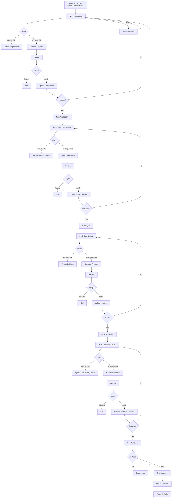

# PHASE 4 — HUMAN CONTENT REVIEW & CONTROLLED REVISION

**Dự án:** AI Storytelling / StoryPlatform
**Phạm vi:** Phase 4 của **Luồng 2**, không phải Luồng 4 Distribution/O2O
**Phiên bản kế hoạch:** 2.0 — 2026-09-15
**Trạng thái:** Đã thiết kế lại theo hướng đơn giản hóa

> **Update v2.0:** Đã bàn bạc với team, đơn giản hóa tối đa:
> - Không cần thêm entities (ReviewSession, ReviewCheckpoint, StoryApproval)
> - Không cần thêm tracking fields
> - Dùng StoryStatus transitions cho workflow
> - Dùng AIProposal cache cho AI edit proposals

---

## Mục lục

1. [Tổng quan](#1-tổng-quan)
2. [Luồng xử lý](#2-luồng-xử-lý)
3. [P4.1 - Story Review](#3-p41--story-review)
4. [P4.2 - Vocabulary Review](#4-p42--vocabulary-review)
5. [P4.3 - Quiz Review](#5-p43--quiz-review)
6. [P4.4 - Discussion Review](#6-p44--discussion-review)
7. [P4.5 - Final Validation](#7-p45--final-validation)
8. [P4.6 - Approve/Archive](#8-p46--approvearchive)
9. [Database Schema](#9-database-schema)
10. [API Endpoints](#10-api-endpoints)
11. [AI Proposal Cache](#11-ai-proposal-cache)
12. [Task List](#12-task-list)
13. [Test Cases](#13-test-cases)

---

## 1. Tổng quan

### 1.1 Mục tiêu

Phase 4 cho Parent/Teacher có quyền xem, chỉnh sửa và quyết định sử dụng package truyện đã tạo ở Phase 3, với sự hỗ trợ của AI để edit/rebuild artifacts.

### 1.2 Nguyên tắc thiết kế

| Nguyên tắc | Mô tả |
|-------------|--------|
| **Không tracking** | Không lưu audit trail, không tracking version |
| **Đơn giản** | Không thêm entities mới, dùng existing infrastructure |
| **AI Support** | AI hỗ trợ edit/rebuild nhưng user quyết định |
| **Preview-first** | Mọi AI suggestion đều cần preview trước khi apply |

### 1.3 Thứ tự Review

```
P4.1 Story → P4.2 Vocabulary → P4.3 Quiz → P4.4 Discussion → P4.5 Validation → P4.6 Approve
```

### 1.4 Design Decisions

| Decision | Rationale |
|----------|-----------|
| Không thêm ReviewSession entity | Dùng StoryStatus transitions |
| Không thêm tracking fields | Không cần audit trail |
| Không thêm StoryApproval entity | Dùng StoryStatus = Approved |
| AIProposal dùng Cache | Chỉ lưu tạm, auto-expire |

---

## 2. Luồng xử lý

### 2.1 Full Flow



### 2.2 Story Status Transitions

```
StoryStatus Transitions:

ContentReview (3)
    │
    ├── [Complete Story + Vocab + Quiz + Discussion + Validate] → Approved (4)
    │
    └── [Archive] → Archived (8)
```

---

## 3. P4.1 — STORY REVIEW

### 3.1 Mục tiêu

Parent/Teacher có thể:
- Xem story content
- Sửa title/content/lesson bằng tay
- Yêu cầu AI sửa một phần (partial edit)
- Preview và Apply/Discard AI suggestions
- Đánh dấu hoàn tất

### 3.2 Endpoints

| Method | Endpoint | Mô tả |
|--------|----------|--------|
| GET | `/review/story` | Get story content |
| PUT | `/review/story` | Edit story (manual) |
| POST | `/review/story/ai/partial-edit` | AI partial edit |
| POST | `/review/story/complete` | Mark complete |

### 3.3 API Contracts

**GET /review/story**
```json
{
  "storyId": 120,
  "versionId": 301,
  "title": "Cuộc phiêu lưu",
  "content": "Nội dung truyện...",
  "lesson": "Bài học..."
}
```

**PUT /review/story**
```json
{
  "versionId": 301,
  "title": "Tiêu đề mới",
  "content": "Nội dung mới...",
  "lesson": "Bài học mới..."
}
```

**POST /review/story/ai/partial-edit**
```json
{
  "versionId": 301,
  "selection": {
    "start": 100,
    "endExclusive": 200,
    "text": "Đoạn cần sửa"
  },
  "instruction": "Viết đơn giản hơn"
}
```

### 3.4 Logic

1. **GET**: Load current StoryVersion where IsCurrent = true
2. **PUT**: Validate input, update StoryVersion fields
3. **AI Partial Edit**:
   - Verify selection text
   - Call AI with context
   - Store proposal in cache (AIProposal)
   - Return proposalId
4. **Complete**: Set Story.IsStoryReviewed = true (optional, if tracking needed)

---

## 4. P4.2 — VOCABULARY REVIEW

### 4.1 Mục tiêu

Parent/Teacher có thể:
- Xem vocabulary list
- Add/Edit/Delete vocabulary items
- Yêu cầu AI regenerate vocabulary
- Preview và Apply/Discard AI suggestions
- Đánh dấu hoàn tất

### 4.2 Endpoints

| Method | Endpoint | Mô tả |
|--------|----------|--------|
| GET | `/review/vocabulary` | Get vocabulary list |
| PUT | `/review/vocabulary` | Save vocabulary (add/edit/delete) |
| POST | `/review/vocabulary/ai/regenerate` | AI regenerate |
| POST | `/review/vocabulary/complete` | Mark complete |

### 4.3 API Contracts

**GET /review/vocabulary**
```json
{
  "storyId": 120,
  "versionId": 301,
  "items": [
    { "id": 1, "term": "rừng", "definition": "Nơi có nhiều cây" },
    { "id": 2, "term": "phiêu lưu", "definition": "Đi chơi xa" }
  ]
}
```

**PUT /review/vocabulary**
```json
{
  "versionId": 301,
  "items": [
    { "id": 1, "term": "rừng", "definition": "Nơi có nhiều cây" },
    { "id": 2, "term": "phiêu lưu", "definition": "Đi chơi xa" },
    { "id": null, "term": "mới", "definition": "Từ mới" }
  ]
}
```

### 4.4 Logic

1. **GET**: Load StoryVocabulary items by StoryVersionId
2. **PUT**:
   - Validate (no duplicate terms, terms exist in story)
   - Add new items (where Id = null)
   - Update existing items
   - Delete items (not in payload)
3. **AI Regenerate**:
   - Call AI with story content + current vocabulary
   - Store proposal in cache
   - Return proposalId
4. **Complete**: Proceed to Quiz Review

### 4.5 Validation Rules

- Term không rỗng
- Definition không rỗng
- Không trùng term (case-insensitive)
- Term phải có trong story content
- Số lượng phù hợp với age band

---

## 5. P4.3 — QUIZ REVIEW

### 5.1 Mục tiêu

Parent/Teacher có thể:
- Xem quiz questions
- Add/Edit/Delete questions
- Change question type
- Yêu cầu AI regenerate quiz
- Preview và Apply/Discard AI suggestions
- Đánh dấu hoàn tất

### 5.2 Endpoints

| Method | Endpoint | Mô tả |
|--------|----------|--------|
| GET | `/review/quiz` | Get quiz questions |
| PUT | `/review/quiz` | Save quiz (add/edit/delete) |
| POST | `/review/quiz/ai/regenerate` | AI regenerate |
| POST | `/review/quiz/complete` | Mark complete |

### 5.3 API Contracts

**GET /review/quiz**
```json
{
  "storyId": 120,
  "versionId": 301,
  "items": [
    {
      "id": 1,
      "type": "multiple_choice",
      "question": "Con gì sống trong rừng?",
      "choices": ["Sư tử", "Mèo nhà", "Cá heo"],
      "correctAnswer": "Sư tử"
    },
    {
      "id": 2,
      "type": "true_false",
      "question": "Truyện xảy ra trong thành phố?",
      "correctAnswer": "false"
    },
    {
      "id": 3,
      "type": "short_answer",
      "question": "Bài học của truyện là gì?",
      "correctAnswer": "Giúp đỡ người khác"
    }
  ]
}
```

**PUT /review/quiz**
```json
{
  "versionId": 301,
  "items": [
    { "id": 1, "type": "multiple_choice", "question": "...", "choices": [...], "correctAnswer": "..." },
    { "id": null, "type": "true_false", "question": "...", "correctAnswer": "true" }
  ]
}
```

### 5.4 Logic

1. **GET**: Load QuizItem by StoryVersionId
2. **PUT**:
   - Validate (3 types required, valid answers)
   - Add/Update/Delete items
3. **AI Regenerate**:
   - Call AI with story + vocabulary
   - Store proposal in cache
   - Return proposalId
4. **Complete**: Proceed to Discussion Review

### 5.5 Validation Rules

- At least 3 questions
- All 3 types present (multiple_choice, true_false, short_answer)
- Question text không rỗng
- Correct answer valid for type
- No duplicate questions

---

## 6. P4.4 — DISCUSSION REVIEW

### 6.1 Mục tiêu

Parent/Teacher có thể:
- Xem discussion questions
- Add/Edit/Delete questions
- Yêu cầu AI regenerate discussion
- Preview và Apply/Discard AI suggestions
- Đánh dấu hoàn tất

### 6.2 Endpoints

| Method | Endpoint | Mô tả |
|--------|----------|--------|
| GET | `/review/discussion` | Get discussion questions |
| PUT | `/review/discussion` | Save discussion |
| POST | `/review/discussion/ai/regenerate` | AI regenerate |
| POST | `/review/discussion/complete` | Mark complete |

### 6.3 API Contracts

**GET /review/discussion**
```json
{
  "storyId": 120,
  "versionId": 301,
  "items": [
    { "id": 1, "question": "Bạn có muốn giúp đỡ người khác không?", "isMoralLesson": true },
    { "id": 2, "question": "Nếu bạn gặp khó khăn, bạn sẽ làm gì?", "isMoralLesson": false }
  ]
}
```

**PUT /review/discussion**
```json
{
  "versionId": 301,
  "items": [
    { "id": 1, "question": "...", "isMoralLesson": true },
    { "id": null, "question": "...", "isMoralLesson": false }
  ]
}
```

### 6.4 Logic

1. **GET**: Load DiscussionQuestion by StoryVersionId
2. **PUT**:
   - Validate (at least 2 questions, related to lesson)
   - Add/Update/Delete items
3. **AI Regenerate**:
   - Call AI with story content + lesson
   - Store proposal in cache
   - Return proposalId
4. **Complete**: Proceed to Validation

### 6.5 Validation Rules

- At least 2 questions
- Questions related to story lesson
- Age-appropriate complexity
- No PII requests

---

## 7. P4.5 — FINAL VALIDATION

### 7.1 Mục tiêu

Verify tất cả artifacts đã được review trước khi approve.

### 7.2 Endpoints

| Method | Endpoint | Mô tả |
|--------|----------|--------|
| GET | `/review/validation` | Validate all artifacts |

### 7.3 API Contracts

**GET /review/validation**
```json
{
  "canApprove": true,
  "checks": [
    { "name": "story_complete", "passed": true, "message": null },
    { "name": "vocabulary_valid", "passed": true, "message": null },
    { "name": "vocabulary_count", "passed": true, "message": "8 items" },
    { "name": "quiz_valid", "passed": true, "message": "5 questions, all 3 types" },
    { "name": "discussion_valid", "passed": true, "message": "3 questions" },
    { "name": "all_types_present", "passed": true, "message": null }
  ],
  "issues": []
}
```

### 7.4 Validation Checks

1. **Story Complete**: Title, Content, Lesson not empty
2. **Vocabulary Valid**:
   - At least 5 items
   - No duplicate terms
   - All terms in story content
3. **Quiz Valid**:
   - At least 3 questions
   - All 3 types present
   - All answers valid
4. **Discussion Valid**:
   - At least 2 questions
   - Related to lesson

---

## 8. P4.6 — APPROVE/ARCHIVE

### 8.1 Approve

**Endpoint:** `POST /review/approve`

**Logic:**
1. Run validation checks
2. If all pass → Update Story.Status = Approved
3. If validation fails → Return error

**Response:**
```json
{
  "success": true,
  "storyId": 120,
  "status": "approved",
  "approvedAt": "2026-09-15T10:30:00Z"
}
```

### 8.2 Archive

**Endpoint:** `POST /review/archive`

**Request:**
```json
{
  "reason": "Not suitable"
}
```

**Logic:**
1. Update Story.Status = Archived
2. Discard any pending proposals in cache

---

## 9. Database Schema

### 9.1 KHÔNG cần thêm tables

| Table | Status | Reason |
|-------|--------|--------|
| ReviewSession | ❌ Không cần | Dùng StoryStatus transitions |
| ReviewCheckpoint | ❌ Không cần | Không tracking |
| StoryApproval | ❌ Không cần | Dùng StoryStatus = Approved |
| AIProposal | ❌ Không cần | Dùng Cache |

### 9.2 Existing Tables Đủ dùng

| Table | Used For |
|-------|---------|
| `stories` | Status = ContentReview/Approved/Archived |
| `story_versions` | Content storage |
| `story_vocabulary` | Vocabulary storage |
| `quiz_items` | Quiz storage |
| `discussion_questions` | Discussion storage |
| `story_generation_jobs` | Job tracking |

### 9.3 Migration (nếu cần)

```sql
-- Không cần migration mới
-- Tất cả entities đã có sẵn
```

---

## 10. API Endpoints

### 10.1 Complete Route Table

| Method | Endpoint | Phase | Description |
|--------|----------|-------|-------------|
| GET | `/api/v1/stories/{id}/review` | P4.0 | Load review package |
| GET | `/api/v1/stories/{id}/review/story` | P4.1 | Get story |
| PUT | `/api/v1/stories/{id}/review/story` | P4.1 | Edit story |
| POST | `/api/v1/stories/{id}/review/story/ai/partial-edit` | P4.1 | AI partial edit |
| POST | `/api/v1/stories/{id}/review/story/complete` | P4.1 | Complete story |
| GET | `/api/v1/stories/{id}/review/vocabulary` | P4.2 | Get vocabulary |
| PUT | `/api/v1/stories/{id}/review/vocabulary` | P4.2 | Save vocabulary |
| POST | `/api/v1/stories/{id}/review/vocabulary/ai/regenerate` | P4.2 | AI regenerate |
| POST | `/api/v1/stories/{id}/review/vocabulary/complete` | P4.2 | Complete vocabulary |
| GET | `/api/v1/stories/{id}/review/quiz` | P4.3 | Get quiz |
| PUT | `/api/v1/stories/{id}/review/quiz` | P4.3 | Save quiz |
| POST | `/api/v1/stories/{id}/review/quiz/ai/regenerate` | P4.3 | AI regenerate |
| POST | `/api/v1/stories/{id}/review/quiz/complete` | P4.3 | Complete quiz |
| GET | `/api/v1/stories/{id}/review/discussion` | P4.4 | Get discussion |
| PUT | `/api/v1/stories/{id}/review/discussion` | P4.4 | Save discussion |
| POST | `/api/v1/stories/{id}/review/discussion/ai/regenerate` | P4.4 | AI regenerate |
| POST | `/api/v1/stories/{id}/review/discussion/complete` | P4.4 | Complete discussion |
| GET | `/api/v1/stories/{id}/review/validation` | P4.5 | Final validation |
| POST | `/api/v1/stories/{id}/review/approve` | P4.6 | Approve |
| POST | `/api/v1/stories/{id}/review/archive` | P4.7 | Archive |

### 10.2 Proposal Management

| Method | Endpoint | Description |
|--------|----------|-------------|
| GET | `/api/v1/stories/{id}/review/proposals/{proposalId}` | Get proposal preview |
| POST | `/api/v1/stories/{id}/review/proposals/{proposalId}/apply` | Apply proposal |
| POST | `/api/v1/stories/{id}/review/proposals/{proposalId}/discard` | Discard proposal |

---

## 11. AI Proposal Cache

### 11.1 Purpose

Lưu tạm AI suggestions để user preview trước khi apply. Auto-expire sau 1 giờ.

### 11.2 Cache Structure

```json
{
  "proposalId": "abc-123-xyz",
  "storyId": 120,
  "storyVersionId": 301,
  "artifactType": "vocabulary",
  "operationType": "regenerate",
  "originalContent": [...],
  "suggestedContent": [...],
  "status": "pending",
  "createdAt": "2026-09-15T10:00:00Z",
  "expiresAt": "2026-09-15T11:00:00Z"
}
```

### 11.3 Operation Types

| Type | Description |
|------|-------------|
| `partial_edit` | Sửa một phần story content |
| `regenerate` | Tạo lại toàn bộ artifact |
| `vocabulary_regenerate` | Tạo lại vocabulary |
| `quiz_regenerate` | Tạo lại quiz |
| `discussion_regenerate` | Tạo lại discussion |

### 11.4 Status Transitions

```
pending → applied (user accepts)
pending → discarded (user rejects)
pending → expired (TTL exceeded)
```

### 11.5 Cache Provider

```csharp
public interface IAIProposalCache
{
    Task<string> CreateAsync(AIProposal proposal);
    Task<AIProposal?> GetAsync(string proposalId);
    Task UpdateStatusAsync(string proposalId, ProposalStatus status);
    Task DeleteAsync(string proposalId);
}
```

**Implementation:** Redis or in-memory with TTL

---

## 12. Task List

### Task P4-T00: ReviewController Foundation

- [ ] Create `ReviewController.cs`
- [ ] Add route prefix `/api/v1/stories/{storyId}/review`
- [ ] Implement authorization (ApproveStory permission)
- [ ] GET /review - Load review package

### Task P4-T01: Story Review (P4.1)

- [ ] GET /review/story
- [ ] PUT /review/story
- [ ] POST /review/story/ai/partial-edit
- [ ] POST /review/story/complete
- [ ] Unit tests

### Task P4-T02: Vocabulary Review (P4.2)

- [ ] GET /review/vocabulary
- [ ] PUT /review/vocabulary
- [ ] POST /review/vocabulary/ai/regenerate
- [ ] POST /review/vocabulary/complete
- [ ] Validation (terms, duplicates)
- [ ] Unit tests

### Task P4-T03: Quiz Review (P4.3)

- [ ] GET /review/quiz
- [ ] PUT /review/quiz
- [ ] POST /review/quiz/ai/regenerate
- [ ] POST /review/quiz/complete
- [ ] Validation (3 types required)
- [ ] Unit tests

### Task P4-T04: Discussion Review (P4.4)

- [ ] GET /review/discussion
- [ ] PUT /review/discussion
- [ ] POST /review/discussion/ai/regenerate
- [ ] POST /review/discussion/complete
- [ ] Unit tests

### Task P4-T05: Proposal Management

- [ ] GET /review/proposals/{id}
- [ ] POST /review/proposals/{id}/apply
- [ ] POST /review/proposals/{id}/discard
- [ ] Cache implementation (Redis or in-memory)
- [ ] Unit tests

### Task P4-T06: Validation & Approval (P4.5-P4.6)

- [ ] GET /review/validation
- [ ] POST /review/approve
- [ ] POST /review/archive
- [ ] Unit tests

### Task P4-T07: AI Integration

- [ ] AI Partial Edit handler
- [ ] AI Vocabulary Regenerate handler
- [ ] AI Quiz Regenerate handler
- [ ] AI Discussion Regenerate handler
- [ ] Unit tests

---

## 13. Test Cases

### P4.1 Story Review

| ID | Test | Expected |
|----|------|----------|
| T01 | GET /review/story | Returns story content |
| T02 | PUT /review/story with valid data | Story updated |
| T03 | PUT /review/story with invalid data | 400 error |
| T04 | AI partial edit | Proposal created in cache |
| T05 | Apply proposal | Story updated |
| T06 | Discard proposal | No change |

### P4.2 Vocabulary Review

| ID | Test | Expected |
|----|------|----------|
| T07 | GET /review/vocabulary | Returns list |
| T08 | PUT with new item | Item added |
| T09 | PUT with duplicate term | 400 error |
| T10 | AI regenerate | Proposal created |

### P4.3 Quiz Review

| ID | Test | Expected |
|----|------|----------|
| T11 | GET /review/quiz | Returns questions |
| T12 | PUT missing type | 400 error |
| T13 | PUT invalid answer | 400 error |
| T14 | AI regenerate | Proposal created |

### P4.4 Discussion Review

| ID | Test | Expected |
|----|------|----------|
| T15 | GET /review/discussion | Returns questions |
| T16 | PUT < 2 questions | 400 error |
| T17 | AI regenerate | Proposal created |

### P4.5-P4.6 Final

| ID | Test | Expected |
|----|------|----------|
| T18 | Validation with all valid | canApprove = true |
| T19 | Validation with issues | canApprove = false |
| T20 | Approve | Status = Approved |
| T21 | Archive | Status = Archived |

---

## 14. Dependencies

### From Phase 3

- StoryVersion entity
- StoryVocabulary entity
- QuizItem entity
- DiscussionQuestion entity
- AI generation handlers
- Quality evaluators

### New Dependencies

- ReviewController
- ReviewService
- AIProposalCache (Redis or in-memory)

---

## 15. Implementation Order

1. **P4-T00**: ReviewController + GET /review
2. **P4-T01**: Story Review CRUD
3. **P4-T02**: Vocabulary Review CRUD
4. **P4-T03**: Quiz Review CRUD
5. **P4-T04**: Discussion Review CRUD
6. **P4-T05**: Proposal Management
7. **P4-T06**: Validation + Approve/Archive
8. **P4-T07**: AI Integration

---

**Document Status:** Final v2.0
**Last Updated:** 2026-09-15
**Next Steps:** Start implementation with P4-T00
