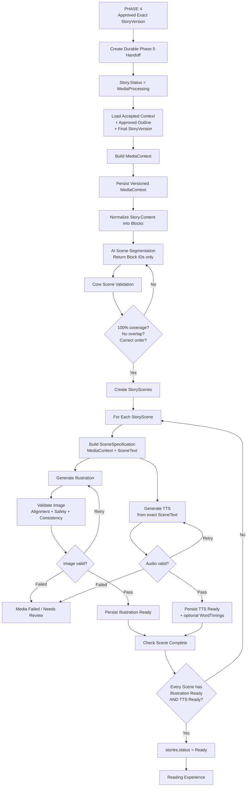

# PHASE 5 IMPLEMENTATION PLAN
## Media Generation, Story Continuity, Scene-Image-Audio Alignment

**Project:** AI Storytelling Platform for Children  
**Flow:** Luong 2 - Guided AI Story Generation Pipeline  
**Phase:** Phase 5 - Media Generation & Story Continuity  
**Status:** Implementation Planning  
**Primary Goal:** Chuyen mot StoryVersion da duoc duyet thanh trai nghiem doc hoan chinh, trong do moi Scene co dung phan text, hinh minh hoa va audio tuong ung, dong thoi duy tri nhat quan ngu canh xuyen suot toan Luong 2.

---

# 1. Muc tieu Phase 5

Phase 5 bat dau sau khi Phase 4 hoan tat:

```text
Human Review
        ↓
Exact StoryVersion duoc approve
        ↓
Package da duoc khoa
        ↓
stories.status = Approved
```

Phase 5 phai tao:

```text
StoryVersion da duoc duyet
        ↓
Media Context
        ↓
Story Scenes
        ↓
Moi Scene:
    Exact Text
    + Illustration
    + TTS Audio
        ↓
Validate
        ↓
stories.status = Ready
```

Ba muc tieu bat buoc:

1. **Duy tri ngu canh xuyen suot tu dau den cuoi Luong 2**
2. **Moi Scene co dung hinh va audio tuong ung voi noi dung Scene do**
3. **Khong sua hoac viet lai Story da duoc Phase 4 approve**

---

# 2. Nguyen tac kien truc

## 2.1 StoryVersion da approve la canonical source

`StoryVersion.Content` la nguon noi dung chinh thuc cua truyen.

Phase 5:

```text
KHONG rewrite Story
KHONG thay Lesson
KHONG thay Approved Outline
KHONG tao StoryVersion moi
```

Neu can sua noi dung truyen:

```text
Phase 5
→ STOP
→ quay lai Revision / Review
```

## 2.2 AI khong duoc dua vao "memory"

Khong dua vao:

```text
RAM
previous prompt
conversation memory
"nhu canh truoc"
"tiep tuc hinh truoc"
```

Moi AI request phai duoc dung lai context tu du lieu persisted.

```text
Database
   ↓
Context Builder
   ↓
AI Request
```

## 2.3 StoryScene la don vi trung tam

Khong dung:

```text
StoryVersion
→ Image
→ Audio
```

Ma dung:

```text
StoryVersion
    ↓
StoryScene
    ├── Exact Text
    ├── Illustration
    └── TTS Audio
```

## 2.4 Scene text phai truy vet duoc ve canonical content

Moi Scene phai luu:

```text
TextRangeStart
TextRangeEnd
SceneText
```

va verify:

```text
StoryVersion.Content[start:end]
==
StoryScene.SceneText
```

## 2.5 Retry media khong duoc regenerate Story

```text
Image loi
→ retry Image

TTS loi
→ retry TTS

Scene segmentation loi
→ retry segmentation

Story khong regenerate
```

---

# 3. Context xuyen suot Luong 2

Ngu canh duoc truyen theo tang:

```text
PHASE 1
User Input
Child Profile
Age Band
Reading Level
Language
Safety
Interests
        ↓
Accepted Context
        ↓
PHASE 2
Approved Outline
        ↓
PHASE 3
Story Content
Lesson
Vocabulary
Quiz
Discussion
        ↓
PHASE 4
Human Review
Human Edit
AI Assisted Edit
Final Approval
        ↓
FINAL APPROVED STORY VERSION
        ↓
PHASE 5
Media Context
Scene Context
Image + Audio
```

---

# 4. Context Hierarchy

## Level 1 - Accepted Input Context

```text
Child profile
Age band
Reading level
Language
Topic
Interests
Safety constraints
Content category constraints
```

Nguon co the den tu:

```text
Generation Request
AcceptedInputJson
ContextSnapshotJson
Story metadata
```

## Level 2 - Approved Narrative Context

```text
Approved Outline
Story Title
Final Story Content
Lesson
```

Nguon chinh:

```text
Approved StoryVersion
```

## Level 3 - Media Context

```text
Characters
Character visual identities
Locations
Important objects
Visual style
Story timeline
Environment continuity
```

## Level 4 - Scene Context

```text
Exact SceneText
Characters present
Main action
Current location
Current story state
Important objects
Emotion
Must Show
Must Not Contradict
```

---

# 5. Database Design cho MVP

## 5.1 Reuse

```text
stories
story_versions
media_assets
story_generation_jobs
reading_sessions
```

## 5.2 Add

```text
story_scenes
media_contexts
```

## 5.3 Extend

```text
media_assets
+ StorySceneId
```

## 5.4 Chua can trong MVP

```text
media_manifests
media_manifest_items
characters
character_profiles
scene_specifications table
media_generation_jobs rieng
```

---

# 6. Proposed `story_scenes`

```text
story_scenes
├── Id
├── StoryVersionId
├── SceneIndex
├── TextRangeStart
├── TextRangeEnd
├── SceneText
├── VisualDescription
├── CreatedAt
└── IsDeleted
```

Unique:

```text
UNIQUE(StoryVersionId, SceneIndex)
```

Candidate validation:

```text
SceneIndex >= 0
TextRangeStart >= 0
TextRangeEnd > TextRangeStart
```

---

# 7. Proposed `media_contexts`

MVP su dung versioned JSON.

```text
media_contexts
├── Id
├── StoryVersionId
├── Revision
├── ContextJson jsonb
├── CreatedAt
└── IsDeleted
```

Unique logic:

```text
StoryVersionId + Revision
```

Context khong bi overwrite khi retry.

---

# 8. Extend `media_assets`

Hien MediaAsset da co:

```text
StoryVersionId
SceneIndex
Type
Status
Url
WordTimings
```

Phase 5 them:

```text
StorySceneId
```

Logical structure:

```text
media_assets
├── Id
├── StoryVersionId
├── StorySceneId
├── SceneIndex
├── Type
├── Status
├── Url
├── WordTimings
└── ...
```

Unique logical slot:

```text
UNIQUE(StorySceneId, Type)
```

MVP rule:

```text
1 Scene
├── 1 Illustration
└── 1 TtsAudio
```

---

# 9. So do du lieu Phase 5

```text
stories
   │
   ▼
story_versions
   │
   ├─────────────────┐
   │                 │
   ▼                 ▼
story_scenes    media_contexts
   │
   ▼
media_assets
   ├── Illustration
   └── TtsAudio

story_versions
   │
   ▼
reading_sessions
```

---

# 10. P5.1 - Durable Handoff tu Phase 4

## Input

```text
StoryId
ApprovedStoryVersionId
ApprovalRef
PackageRevision
OperationKey
```

Khong duoc chi dung:

```text
Story.IsCurrent
```

de suy ra approved version.

Flow:

```text
Phase 4 Approval
        ↓
Persist exact approved version reference
        ↓
Create durable Phase 5 job/handoff
        ↓
Story.Status = MediaProcessing
```

Neu duplicate approval/handoff, `OperationKey` phai chong duplicate work.

---

# 11. P5.2 - Build Media Context

Input:

```text
Accepted Context
+
Approved Outline
+
Approved StoryVersion
```

AI duoc phep:

```text
extract characters
extract locations
extract important objects
extract timeline
suggest visual design
```

AI khong duoc:

```text
rewrite story
change plot
invent new event
change lesson
```

Output:

```text
MediaContext
```

duoc persisted vao `media_contexts`.

---

# 12. Story Fact vs Visual Design

Phan biet:

```text
StoryFact
```

va:

```text
VisualDesignChoice
```

VisualDesignChoice sau khi duoc chot phai on dinh cho toan bo media cua StoryVersion do.

---

# 13. P5.3 - Normalize Story thanh Blocks

Core parser xu ly:

```text
StoryVersion.Content
```

thanh:

```text
P1
P2
P3
...
```

hoac:

```text
P1.S1
P1.S2
P2.S1
...
```

Moi block:

```text
BlockId
StartOffset
EndOffset
Text
```

AI khong rewrite block text.

---

# 14. P5.4 - AI Scene Segmentation

AI input:

```text
Full Story
+
Block IDs
+
MediaContext
```

AI output:

```json
[
  {
    "sceneIndex": 1,
    "blockIds": ["P1", "P2"],
    "focus": "Tho bat dau hanh trinh"
  },
  {
    "sceneIndex": 2,
    "blockIds": ["P3", "P4"],
    "focus": "Tho phat hien cay cau bi hong"
  }
]
```

AI chi quyet dinh:

```text
block nao thuoc scene nao
```

AI khong tra lai canonical SceneText.

---

# 15. P5.5 - Core Scene Validation

Core validate:

```text
Coverage = 100%
Overlap = 0
Order = Correct
No Missing Block
No Duplicate Block
```

Chi khi PASS:

```text
Create StoryScenes
```

---

# 16. P5.6 - Persist StoryScenes

Core assemble text tu source blocks.

Khong dung text do AI viet lai.

Validate:

```text
StoryVersion.Content[start:end]
==
SceneText
```

---

# 17. P5.7 - Build Scene Specification

Input:

```text
StoryScene
+
MediaContext
```

Output logical:

```text
SceneSpecification
├── SceneText
├── Characters
├── MainAction
├── Location
├── StoryState
├── Objects
├── Emotion
├── MustShow
└── MustNotContradict
```

MVP chua can bang `scene_specifications`; co the giu trong job metadata hoac structured request.

---

# 18. P5.8 - Generate Illustration

Input:

```text
MediaContext
+
SceneSpecification
+
Reference Images neu co
```

Output:

```text
Candidate Illustration
```

Khong mark Ready ngay.

---

# 19. P5.9 - Validate Illustration

Phai kiem tra:

```text
Characters
Main Action
Objects
Location
Story State
Safety
Character Consistency
Visual Continuity
```

Output:

```text
PASS
FAIL
UNCERTAIN
```

Neu fail:

```text
Retry dung Illustration
```

Khong regenerate Story hay SceneText.

Neu het retry:

```text
Failed / Needs Review
```

---

# 20. P5.10 - Generate TTS

Input noi dung:

```text
StoryScene.SceneText
```

Khong dung:

```text
Outline
Summary
VisualDescription
```

Flow:

```text
SceneText
    ↓
TTS Provider
    ↓
Audio
    ↓
Optional WordTimings
```

Audio phai doc dung SceneText.

---

# 21. P5.11 - Persist Media Assets

Image:

```text
StoryScene
→ Illustration MediaAsset
```

Audio:

```text
StoryScene
→ TtsAudio MediaAsset
```

Moi asset phai reference:

```text
StoryVersionId
StorySceneId
SceneIndex
Type
Status
```

---

# 22. Khong can `media_manifests` cho MVP

Business rule MVP:

```text
Every StoryScene
=
1 Illustration
+
1 TtsAudio
```

Expected assets derive truc tiep:

```text
Expected media
=
StoryScenes.Count × 2
```

---

# 23. P5.12 - Readiness Check

Story chi Ready khi:

```text
For every StoryScene:
Illustration.Status == Ready
AND
TtsAudio.Status == Ready
```

Ngoai ra:

```text
Approved version van hop le
Story chua Archived
Khong co required job pending/processing
Scene coverage hop le
Khong co stale result
```

Khi PASS:

```text
stories.status = Ready
```

---

# 24. P5.13 - Reader Handoff

Reader dung:

```text
ReadingSession.StoryVersionId
```

de pin dung version.

Query:

```text
StoryVersion
    ↓
StoryScenes ORDER BY SceneIndex
    ↓
SceneText
Illustration
TtsAudio
```

---

# 25. Job Operations de xuat

Co the mo rong existing generation job voi:

```text
BuildMediaContext
SegmentStory
GenerateIllustration
GenerateTts
ValidateIllustration
FinalizeMedia
```

Co the dung `GenerateMediaPackage` lam orchestrator va child operations noi bo.

Reuse:

```text
LeaseExpiresAt
ConcurrencyToken
AttemptNo
MaxAttempts
OperationKey
```

---

# 26. Retry Strategy

## Segmentation

Retry segmentation chi truoc khi scenes finalized.

## Illustration

Retry per Scene.

## TTS

Retry per Scene.

## Het retry

```text
Failed / NeedsReview
```

## Khong bao gio

```text
Image loi
→ regenerate entire Story
```

---

# 27. Stale Result Protection

Moi media job phai biet:

```text
StoryId
StoryVersionId
StorySceneId
MediaContextRevision
OperationKey
ConcurrencyToken
```

Truoc persist:

```text
StoryVersion van la approved target?
Story chua Archived?
Scene van thuoc StoryVersion nay?
Context revision con dung?
Job con active?
```

Neu khong:

```text
Discard stale result
```

---

# 28. Storage Responsibility

Media binary khong nen luu truc tiep trong database.

Database luu metadata:

```text
Url / StorageKey
MimeType
ProviderAssetId
Status
```

---

# 29. WordTimings

Phase 5 MVP:

```text
TTS Audio = Required
WordTimings = Optional
```

Neu provider tra timing:

```text
MediaAsset.WordTimings = serialized timing data
```

Neu khong:

```text
Audio van co the Ready
WordTimings = null
```

---

# 30. So do hoat dong tong quan Phase 5



---

# 31. So do duy tri Context xuyen suot

```text
PHASE 1
Accepted User / Child Context
        │
        ▼
PHASE 2
Approved Outline
        │
        ▼
PHASE 3
Generated Story + Lesson
        │
        ▼
PHASE 4
Human Review + Final Approved StoryVersion
        │
        ├───────────────────────────┐
        │                           │
        ▼                           ▼
Accepted Context              Final Story
        │                           │
        └──────────────┬────────────┘
                       ▼
                MediaContext
                       │
        ┌──────────────┼──────────────┐
        ▼              ▼              ▼
 Characters        Locations      Visual Style
        │              │              │
        └──────────────┴──────────────┘
                       ▼
                  Story Timeline
                       ▼
                  StoryScenes
                       │
           ┌───────────┴───────────┐
           ▼                       ▼
      Scene Context            Scene Text
           │                       │
           ▼                       ▼
        IMAGE                    AUDIO
```

---

# 32. Implementation Packages

## P5-A - Handoff Foundation

- Trace exact approved StoryVersion
- Create durable Phase 5 handoff
- Add media job operation(s)
- Transition `Approved → MediaProcessing`
- Add duplicate protection

**DoD:** Phase 5 always starts from exact approved version.

## P5-B - Database Foundation

- Add `story_scenes`
- Add `media_contexts`
- Add `MediaAsset.StorySceneId`
- Add FK/index/unique constraints
- Verify migration history
- Do not add media manifest tables

**DoD:** DB can represent `StoryVersion → Scene → Image/Audio`.

## P5-C - Media Context Engine

Implement `MediaContextBuilder`:

- Load original accepted context
- Load approved outline
- Load final StoryVersion
- Extract characters
- Extract locations
- Extract important objects
- Build story timeline
- Establish visual design
- Persist versioned context

**DoD:** Context can be rebuilt after server restart.

## P5-D - Story Segmentation Engine

Implement:

```text
StoryBlockParser
SceneSegmentationService
SceneCoverageValidator
```

Rules:

```text
AI returns block IDs only
Core assembles canonical text
100% coverage
0 overlap
correct order
```

**DoD:** Every character/block in final Story is assigned exactly once.

## P5-E - Scene Specification Builder

Input:

```text
StoryScene + MediaContext
```

Output structured generation context.

**DoD:** Every Scene has enough context for media generation.

## P5-F - Illustration Pipeline

Implement abstraction:

```text
IImageGenerationProvider
```

Responsibilities:

- Build image request
- Pass reference image if supported
- Generate candidate illustration
- Persist provider metadata
- Handle technical errors

**DoD:** Image generation runs independently per Scene.

## P5-G - Image Validation Pipeline

Implement:

```text
IMediaAlignmentEvaluator
IMediaSafetyEvaluator
```

Validate:

```text
character
action
object
location
story state
safety
visual consistency
```

**DoD:** Image is not Ready until validated.

## P5-H - TTS Pipeline

Implement abstraction:

```text
ITtsProvider
```

Input:

```text
StoryScene.SceneText
```

Output:

```text
Audio
Optional WordTimings
```

**DoD:** Audio corresponds exactly to SceneText.

## P5-I - Media Worker / Orchestration

Reuse existing job/worker pattern.

Responsibilities:

- Claim job
- Lease
- Retry
- Idempotency
- Context reconstruction
- Stale protection
- Persist results in short transactions

**DoD:** Restart/retry does not lose context or create duplicate logical assets.

## P5-J - Finalization & Ready

Implement readiness checker.

For every Scene:

```text
Illustration Ready
AND
TTS Ready
```

Then:

```text
Story.Status = Ready
```

**DoD:** No Story becomes Ready while any required Scene media is missing.

---

# 33. Recommended Implementation Order

```text
P5-A Handoff
        ↓
P5-B Database
        ↓
P5-C MediaContext
        ↓
P5-D Segmentation
        ↓
P5-E Scene Specification
        ↓
P5-F Image Generation
        ↓
P5-G Image Validation
        ↓
P5-H TTS
        ↓
P5-I Worker / Retry / Stale Protection
        ↓
P5-J Ready / Reader Handoff
```

Khong tich hop provider truoc khi hoan tat:

```text
StoryScene
MediaContext
Scene mapping
Storage strategy
```

---

# 34. Required Tests

## Context

```text
Context rebuild after restart
Same StoryVersion uses same MediaContext revision
Old MediaContext does not overwrite new revision
```

## Scene

```text
100% content coverage
No missing block
No overlap
Correct order
Scene text equals canonical content range
Duplicate SceneIndex rejected
```

## Image

```text
Image links correct Scene
Wrong action fails validation
Wrong character fails validation
Wrong story state fails validation
Unsafe image fails validation
Retry does not create duplicate active image
```

## Audio

```text
TTS input equals SceneText
Audio belongs correct Scene
Retry does not duplicate active audio
WordTimings optional
```

## Concurrency

```text
Duplicate job
Stale worker
Archived Story during generation
Old StoryVersion result arrives late
Context revision changed
```

## Ready

```text
Zero assets != Ready
Missing one image != Ready
Missing one audio != Ready
Failed asset != Ready
All Scenes complete => Ready
```

---

# 35. Definition of Done - Phase 5

```text
[ ] Exact approved StoryVersion pinned
[ ] Durable Phase 5 handoff exists
[ ] Story enters MediaProcessing
[ ] MediaContext persisted and versioned
[ ] Context reconstructable after restart
[ ] Story normalized into stable blocks
[ ] AI segmentation returns boundaries/IDs only
[ ] Scene coverage = 100%
[ ] Scene overlap = 0
[ ] StoryScenes persisted
[ ] SceneText traces to StoryVersion.Content
[ ] Every Scene gets structured Scene context
[ ] Every Scene has 1 validated Illustration
[ ] Every Scene has 1 TTS Audio
[ ] TTS reads exact SceneText
[ ] Image aligns with SceneText
[ ] Character/style continuity maintained
[ ] Image safety validated
[ ] Retry does not duplicate logical media
[ ] Stale results cannot overwrite current work
[ ] Archived Story cannot become Ready
[ ] Reader pins exact StoryVersion
[ ] Story becomes Ready only when all Scenes complete
```

---

# 36. Final Architecture Summary

```text
FINAL APPROVED STORYVERSION
            ↓
    PERSISTENT MEDIA CONTEXT
            ↓
      STORY BLOCK PARSING
            ↓
       AI SEGMENTATION
            ↓
      CORE VALIDATION
            ↓
        STORY SCENES
            ↓
      FOR EACH SCENE
         /       \
        /         \
   IMAGE         AUDIO
     ↓              ↓
VALIDATION      EXACT TEXT TTS
     \              /
      \            /
       MEDIA ASSETS
            ↓
     ALL SCENES COMPLETE
            ↓
          READY
```

---

# 37. Critical Rules for Agent

```text
1. Khong dung IsCurrent de thay the exact approval neu chua chung minh invariant.
2. Khong de AI rewrite SceneText.
3. Khong tao image/audio truc tiep tu full Story ma bo qua StoryScene.
4. Khong de image Ready truoc alignment/safety validation.
5. Khong tao lai toan Story khi mot media asset loi.
6. Khong phu thuoc conversation memory cua provider.
7. Khong tao media_manifests table cho MVP neu rule 1 image + 1 audio/scene van co dinh.
8. Khong normalize character/media context thanh nhieu bang neu JSONB versioned da du.
9. Khong set Story Ready dua tren "khong co asset failed".
10. Moi Scene phai co du Image Ready + Audio Ready.
```

---

# 38. Prompt giao Agent

```text
Implement Phase 5 according to this plan.

Before changing code:
1. Re-check exact Phase 4 approval/version semantics.
2. Re-check migrations and EF mappings.
3. Re-check MediaAsset enum/string mapping.
4. Confirm storage strategy.

Do NOT:
- regenerate Story content
- use AI memory as source of truth
- allow AI to rewrite SceneText
- add unnecessary normalized tables
- add media manifest tables for MVP
- mark Story Ready with missing media
- persist stale provider results

Core requirements:
Approved StoryVersion
→ versioned MediaContext
→ exact Scene segmentation
→ StoryScene
→ matching Illustration
→ matching TTS
→ validation
→ Ready.
```
