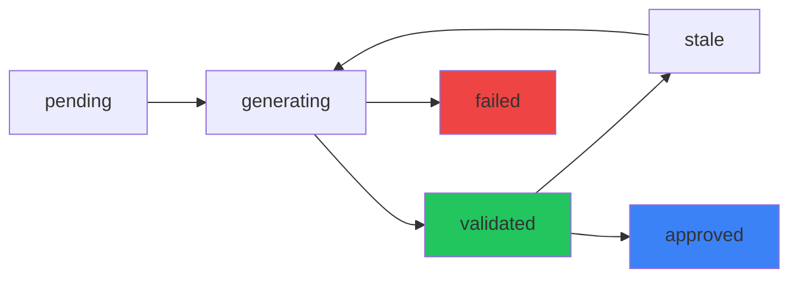

# Phase 3 → Phase 4: Verification Checklist

**Mục tiêu:** Đảm bảo Phase 3 output đúng dữ liệu để Phase 4 (Human Review) hoạt động.

---

## Phase 4 Requirements Summary

### Từ Phase4_Human_Review_Sequential_Implementation_Plan.md

#### Thứ tự Review: P4.1 → P4.2 → P4.3 → P4.4 → Final → Approve

| Phase | Section | Mô tả |
|-------|---------|--------|
| P4.1 | Story | Parent/Teacher review + edit content |
| P4.2 | Vocabulary | Review + edit vocabulary list |
| P4.3 | Quiz | Review + edit quiz questions |
| P4.4 | Discussion | Review + edit discussion questions |
| P4.5 | Final Validation | Verify all artifacts |
| P4.6 | Approve | Final approval + handoff |

---

## ⚠️ Thiết kế quan trọng: KHÔNG trùng dữ liệu

### Sai: Thêm JSON columns vào StoryVersion

```json
// ❌ SAI - Trùng dữ liệu
StoryVersion {
  "content_json": "...story...",
  "vocabulary_json": "[...]",      // TRÙNG với story_vocabulary
  "quiz_json": "[...]",            // TRÙNG với quiz_items
  "discussion_json": "[...]"       // TRÙNG với discussion_questions
}
```

### Đúng: Dùng DTO Contract + Bảng Normalized

```json
// ✅ ĐÚNG - Contract DTO + Bảng normalized
ContentPackageDto {
  "storyId": 120,
  "storyVersionId": 301,
  "storyStatus": "content_review",
  "readyForReview": true,
  "content": {
    "state": "validated",
    "sourceStoryVersionId": 301
  },
  "vocabulary": {
    "state": "validated",
    "sourceStoryVersionId": 301
    // Data thực: đọc từ story_vocabulary
  },
  "quiz": {
    "state": "validated",
    "sourceStoryVersionId": 301
    // Data thực: đọc từ quiz_items
  },
  "discussion": {
    "state": "validated",
    "sourceStoryVersionId": 301
    // Data thực: đọc từ discussion_questions
  }
}
```

---

## Phase 3 Database Schema (Đúng)

### Chỉ thêm vào StoryVersion

| Column | Type | Mô tả |
|--------|------|--------|
| `content_json` | jsonb | Story content (sections) |
| `content_generation_fingerprint` | varchar(64) | SHA256 hash để detect changes |

### KHÔNG thêm

| Column | Lý do |
|--------|--------|
| `vocabulary_json` | Đã có `story_vocabulary` |
| `quiz_json` | Đã có `quiz_items` |
| `discussion_json` | Đã có `discussion_questions` |

---

## Phase 3 PHẢI output cho Phase 4

### Dữ liệu trong Contract DTO

| Field | Location | Phase 4 Usage |
|-------|----------|---------------|
| `StoryId` | stories table | Identity |
| `StoryStatus` | stories table | Entry: `content_review` |
| `StoryVersionId` | story_versions | P4.1 Review |
| `ApprovedOutlineVersionId` | story_versions | Reference |
| `ContextFingerprint` | GenerationRequest | Validate consistency |
| `PackageRevision` | Computed | Concurrency check |
| `ReadyForReview` | Computed | All validated + same version |
| `Content.state` | Computed | Phase 3 validation result |
| `Content.sourceStoryVersionId` | Computed | Link to content_json |
| `Vocabulary.state` | Computed | Phase 3 validation result |
| `Vocabulary.sourceStoryVersionId` | FK | Link to story_vocabulary |
| `Quiz.state` | Computed | Phase 3 validation result |
| `Quiz.sourceStoryVersionId` | FK | Link to quiz_items |
| `Discussion.state` | Computed | Phase 3 validation result |
| `Discussion.sourceStoryVersionId` | FK | Link to discussion_questions |

---

## Artifact States

### Định nghĩa

| State | Ý nghĩa | Ai set |
|-------|----------|--------|
| `pending` | Đã queued, chưa bắt đầu | System |
| `generating` | Đang sinh bằng AI | System |
| `validated` | Đạt quality gate Phase 3 | System |
| `failed` | Lỗi sau max attempts | System |
| `stale` | Content đã thay đổi | System |
| `approved` | Người lớn đã duyệt | Human (Phase 4) |

### State Transitions



---

## Verification Checklist

### ✅ Phase 3 Output

- [ ] **ContentPackageDto structure**
  - StoryId, StoryStatus, StoryVersionId
  - Content, Vocabulary, Quiz, Discussion states
  - SourceStoryVersionId for each artifact

- [ ] **Story status transition**
  ```
  Draft → OutlineReview → ContentReview → ContentApproved
  ```

- [ ] **Artifacts in normalized tables**
  - Vocabulary: `story_vocabulary` table
  - Quiz: `quiz_items` table
  - Discussion: `discussion_questions` table

- [ ] **Content in StoryVersion**
  - `content_json` populated
  - `content_generation_fingerprint` computed

### ✅ Phase 4 Entry

- [ ] **GET /stories/{id}/content** returns ContentPackageDto
- [ ] **ReadyForReview = true** when all artifacts validated
- [ ] **State tracking** works correctly

---

## Phase 4 Implementation Tasks

### Phase 4.1: Story Review (P4.1)

**Mục tiêu:** Parent/Teacher có thể xem và chỉnh sửa story content.

| Task | Description |
|------|-------------|
| P4.1.1 | Load story content cho review |
| P4.1.2 | Hiển thị approved outline để reference |
| P4.1.3 | Manual edit title/content/lesson |
| P4.1.4 | AI partial edit (chỉ đoạn được chọn) |
| P4.1.5 | AI regenerate full content (giữ outline) |
| P4.1.6 | Preview + Apply/Discard proposal |
| P4.1.7 | Complete Story review |

**Output:**
```csharp
public sealed record StoryReviewDto
{
    public int StoryId { get; init; }
    public int VersionId { get; init; }
    public string Title { get; init; }
    public string Content { get; init; }  // Full story content
    public string Lesson { get; init; }
    public StoryOutlineDto ApprovedOutline { get; init; }  // Reference
    public bool IsConfirmed { get; init; }
}
```

### Phase 4.2: Vocabulary Review (P4.2)

**Mục tiêu:** Parent/Teacher review và edit vocabulary list.

| Task | Description |
|------|-------------|
| P4.2.1 | Load vocabulary list |
| P4.2.2 | Add/Edit/Delete vocabulary items |
| P4.2.3 | AI regenerate vocabulary |
| P4.2.4 | Preview + Apply/Discard |
| P4.2.5 | Complete Vocabulary review |

**Output:**
```csharp
public sealed record VocabularyReviewDto
{
    public int StoryId { get; init; }
    public IReadOnlyList<VocabularyItemDto> Items { get; init; }
    public bool IsConfirmed { get; init; }
}
```

### Phase 4.3: Quiz Review (P4.3)

**Mục tiêu:** Parent/Teacher review và edit quiz.

| Task | Description |
|------|-------------|
| P4.3.1 | Load quiz questions |
| P4.3.2 | Add/Edit/Delete questions |
| P4.3.3 | Change question type |
| P4.3.4 | AI regenerate quiz |
| P4.3.5 | Preview + Apply/Discard |
| P4.3.6 | Complete Quiz review |

**Output:**
```csharp
public sealed record QuizReviewDto
{
    public int StoryId { get; init; }
    public IReadOnlyList<QuizItemDto> Questions { get; init; }
    public bool IsConfirmed { get; init; }
}
```

### Phase 4.4: Discussion Review (P4.4)

**Mục tiêu:** Parent/Teacher review và edit discussion questions.

| Task | Description |
|------|-------------|
| P4.4.1 | Load discussion questions |
| P4.4.2 | Add/Edit/Delete questions |
| P4.4.3 | AI regenerate discussion |
| P4.4.4 | Preview + Apply/Discard |
| P4.4.5 | Complete Discussion review |

**Output:**
```csharp
public sealed record DiscussionReviewDto
{
    public int StoryId { get; init; }
    public IReadOnlyList<DiscussionQuestionDto> Questions { get; init; }
    public bool IsConfirmed { get; init; }
}
```

### Phase 4.5: Final Validation (P4.5)

**Mục tiêu:** Verify tất cả artifacts và checkpoint.

| Task | Description |
|------|-------------|
| P4.5.1 | Validate all artifacts |
| P4.5.2 | Check checkpoint integrity |
| P4.5.3 | Verify version consistency |
| P4.5.4 | Display summary |

### Phase 4.6: Approve (P4.6)

**Mục tiêu:** Final approval và handoff.

| Task | Description |
|------|-------------|
| P4.6.1 | Verify all sections confirmed |
| P4.6.2 | Check permissions |
| P4.6.3 | Create approval record |
| P4.6.4 | Update story status |
| P4.6.5 | Create media handoff job |

---

## Sequential Flow Diagram

```mermaid
flowchart TD
    subgraph PHASE3_END["Phase 3 End"]
        P3A["stories.status = content_review"]
        P3B["Content Stable ✅"]
        P3C["Vocabulary Stable ✅"]
        P3D["Quiz Stable ✅"]
        P3E["Discussion Stable ✅"]
    end

    subgraph PHASE4_REVIEW["Phase 4: Human Review"]
        P4_1["P4.1: Story Review"]
        P4_1 --> P4_2{"Story Confirmed?"}
        P4_2 -->|"Yes"| P4_2A["Prepare Vocabulary for V2"]
        P4_2 -->|"No"| P4_1

        P4_2A --> P4_2B["P4.2: Vocabulary Review"]
        P4_2B --> P4_3{"Vocabulary Confirmed?"}
        P4_3 -->|"Yes"| P4_3A["Prepare Quiz for V2"]
        P4_3 -->|"No"| P4_2B

        P4_3A --> P4_3B["P4.3: Quiz Review"]
        P4_3B --> P4_4{"Quiz Confirmed?"}
        P4_4 -->|"Yes"| P4_4A["Prepare Discussion for V2"]
        P4_4 -->|"No"| P4_3B

        P4_4A --> P4_4B["P4.4: Discussion Review"]
        P4_4B --> P4_5{"Discussion Confirmed?"}
        P4_5 -->|"Yes"| P4_5A["P4.5: Final Validation"]
        P4_5 -->|"No"| P4_4B
    end

    P4_5A --> P4_6A["P4.6: Approve"]
    P4_6A --> P4_END["Phase 4 End\nstories.status = approved"]

    style PHASE3_END fill:#1a3d2e,stroke:#22c55e
    style PHASE4_REVIEW fill:#1e3a5f,stroke:#3b82f6
    style P4_END fill:#22c55e,stroke:#166534
```



---

## Edit Actions trong Phase 4

### Story Edit (P4.1)

| Action | Description | Creates New Version? |
|--------|-------------|---------------------|
| Edit Title | Sửa title | Yes |
| Edit Content | Sửa story content | Yes |
| Edit Lesson | Sửa lesson/moral | Yes |
| AI Partial Edit | Sửa đoạn được chọn | Yes |
| AI Regenerate | Tạo lại từ outline | Yes |

### Vocabulary Edit (P4.2)

| Action | Description | Creates New Version? |
|--------|-------------|---------------------|
| Add Word | Thêm từ mới | No (chỉ update JSON) |
| Edit Word | Sửa từ | No |
| Delete Word | Xóa từ | No |
| AI Regenerate | Tạo lại danh sách | No |

### Quiz Edit (P4.3)

| Action | Description | Creates New Version? |
|--------|-------------|---------------------|
| Add Question | Thêm câu hỏi | No |
| Edit Question | Sửa câu hỏi | No |
| Delete Question | Xóa câu hỏi | No |
| Change Type | Đổi loại câu hỏi | No |
| AI Regenerate | Tạo lại bộ quiz | No |

### Discussion Edit (P4.4)

| Action | Description | Creates New Version? |
|--------|-------------|---------------------|
| Add Question | Thêm câu hỏi | No |
| Edit Question | Sửa câu hỏi | No |
| Delete Question | Xóa câu hỏi | No |
| AI Regenerate | Tạo lại bộ câu hỏi | No |

---

## Key Distinction: Story vs Artifacts

| Aspect | Story Content | Artifacts (Vocab/Quiz/Discussion) |
|--------|--------------|-----------------------------------|
| Versioning | Mỗi lần sửa tạo StoryVersion mới | Chỉ update JSON, không tạo version |
| Lineage | Giữ history đầy đủ | Đơn giản hơn |
| Checkpoint | Cần checkpoint cho từng version | Chỉ cần hash/revision |
| Invalidations | Sửa Story → reset all checkpoints | Sửa Vocab → reset Vocab + downstream |

---

## Implementation Order Recommendation

### Phase 3 Complete → Phase 4 Start

1. **Phase 3 hoàn thành**
   - Tất cả artifacts stable
   - `stories.status = content_review`
   - Background worker idle

2. **Phase 4.1: Story Review (Priority: High)**
   - Most critical - Parent/Teacher primary action
   - Implement: Load, Edit, AI Partial, AI Regenerate

3. **Phase 4.2-4.4: Artifact Reviews (Priority: Medium)**
   - Sequential, dependency on P4.1
   - Implement: Load, Add/Edit/Delete, AI Regenerate

4. **Phase 4.5-4.6: Validation & Approval (Priority: Low)**
   - Final steps
   - Implement: Validate, Approve, Archive

---

## Open Questions

| Question | Status | Notes |
|----------|--------|-------|
| AI Partial Edit range | Pending | UTF-16 code units vs byte offset |
| Review Session tracking | Pending | Single table vs separate per section |
| Proposal TTL | Pending | How long before discard? |
| Concurrent editing | Pending | Lock mechanism? |

---

**Document Status:** Draft
**Phase 3 File:** `src/AI/phase_3.md`
**Phase 4 File:** `src/AI/Phase4_Human_Review_Sequential_Implementation_Plan.md`
