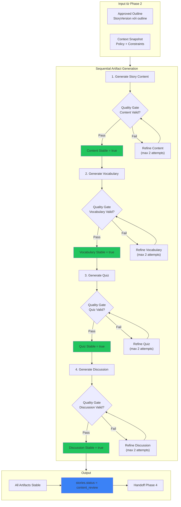
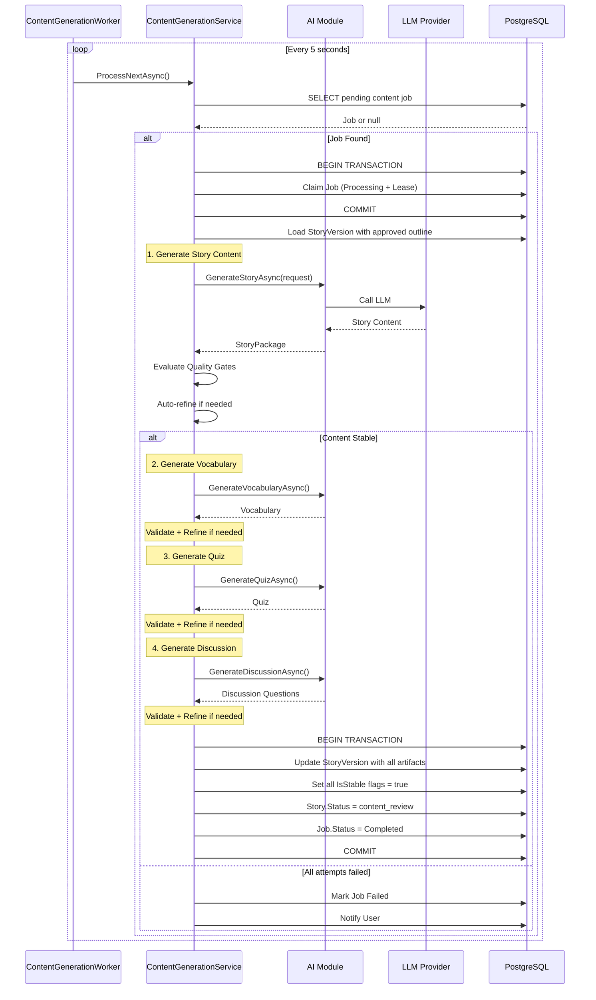
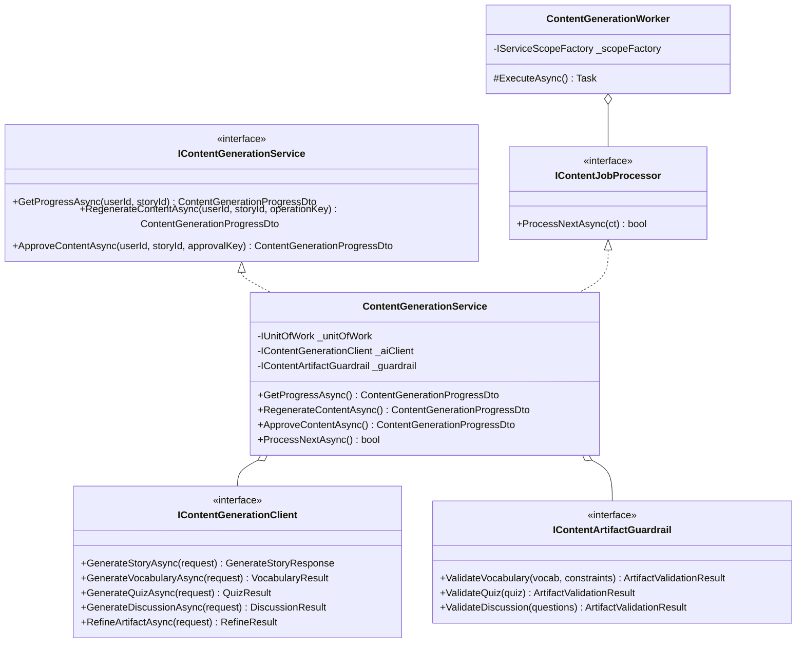

# Phase 3: Content Generation - Chi tiết triển khai

**Phiên bản:** 1.0  
**Ngày:** 2026-09-13  
**Trạng thái:** Planning  

---

## Mục lục

1. [Tổng quan](#1-tổng-quan)
2. [Luồng xử lý](#2-luồng-xử-lý)
3. [Kiến trúc](#3-kiến-trúc)
4. [Database Schema Changes](#4-database-schema-changes)
5. [AI Module - Sequential Handlers](#5-ai-module---sequential-handlers)
6. [Core Service - ContentGenerationService](#6-core-service---contentgenerationservice)
7. [Background Worker](#7-background-worker)
8. [API Endpoints](#8-api-endpoints)
9. [Task List chi tiết](#9-task-list-chi-tiết)
10. [Files cần tạo/sửa](#10-files-cần-tạosửa)
11. [Test Cases](#11-test-cases)
12. [API Contract](#12-api-contract)

---

## 1. Tổng quan

### Mục tiêu

Từ một Outline đã được Parent/Teacher approve ở Phase 2, hệ thống tạo ra một Content Package hoàn chỉnh, đạt các Quality Gate, rồi đưa Story sang trạng thái `content_review` để người lớn review ở Phase 4.

### Phase 3 Workflow

```
PHASE 2
Approved Outline
        ↓
────────────────────────
PHASE 3
        ↓
Generate Full Story
        ↓
Quality Gates
        ↓
Refine nếu chưa đạt
        ↓
Stable Story Content
        ↓
Generate
├── Vocabulary
├── Quiz
└── Discussion Questions
        ↓
Validate từng artifact
        ↓
Content Package Complete
        ↓
stories.status = content_review
        ↓
────────────────────────
PHASE 4
Human Content Review
```

### 6 Mục tiêu chính

| # | Mục tiêu | Mô tả |
|---|-----------|--------|
| 1 | **Sinh nội dung truyện hoàn chỉnh** | Từ `approvedOutlineVersionId`, sinh `content` và `lesson` |
| 2 | **Kiểm định chất lượng Content** | Quality Gates: Schema → Outline Consistency → Length → Safety → Readability → Vocabulary Level |
| 3 | **Auto-refine có giới hạn** | Mỗi lần refine tạo StoryVersion mới, rerun Quality Gates |
| 4 | **Sinh artifacts khi Content ổn định** | Chỉ sinh Vocabulary, Quiz, Discussion khi Content stable |
| 5 | **Validate từng artifact độc lập** | Quiz fail → chỉ regenerate Quiz, không sinh lại Story |
| 6 | **Handoff Phase 4** | `stories.status = content_review` |

### Phase 3 KHÔNG xử lý

- Final Approval
- Archive quyết định cuối
- Scene Segmentation
- Image Generation
- TTS (Text-to-Speech)
- `ready` status

---

## 2. Luồng xử lý

### 2.1 Sequential Generation Flow



### 2.2 Background Worker Flow



---

## 3. Kiến trúc

### 3.1 Component Architecture

```
┌─────────────────────────────────────────────────────────────────────────────┐
│                              PHASE 3 COMPONENTS                              │
├─────────────────────────────────────────────────────────────────────────────┤
│                                                                              │
│  ┌──────────────┐         ┌───────────────────────┐                         │
│  │   FE/Client  │────────▶│  ContentController    │                         │
│  └──────────────┘         │  (Core API)          │                         │
│                            └───────────┬───────────┘                         │
│                                        │                                     │
│                            ┌───────────▼───────────┐                         │
│                            │  ContentGenerationService │                       │
│                            │  (Orchestrator)      │                         │
│                            └───────────┬───────────┘                         │
│                                        │                                     │
│         ┌──────────────────────────────┼──────────────────────────────┐       │
│         │                              │                              │       │
│         ▼                              ▼                              ▼       │
│  ┌──────────────┐           ┌──────────────────┐           ┌─────────────┐  │
│  │ Authorization│           │ AI ContentClient │           │ JobManager  │  │
│  │   Service    │           │  (Internal HTTP) │           │             │  │
│  └──────────────┘           └────────┬─────────┘           └─────────────┘  │
│                                       │                                      │
│         ┌──────────────────────────────┼──────────────────────────────┐       │
│         ▼                              ▼                              ▼       │
│  ┌──────────────┐           ┌──────────────────┐           ┌────────────────┐ │
│  │  Artifact    │           │  GenerateHandlers│           │ StoryVersion  │ │
│  │  Guardrails  │           │  - Story         │           │ Repository    │ │
│  │              │           │  - Vocabulary    │           │               │ │
│  │              │           │  - Quiz          │           │               │ │
│  │              │           │  - Discussion    │           │               │ │
│  └──────────────┘           └──────────────────┘           └────────────────┘ │
│                                                                              │
└─────────────────────────────────────────────────────────────────────────────┘
```

### 3.2 Class Diagram



---

## 4. Database Schema Changes

### 4.1 StoryVersion Updates

**Bảng hiện có:** `story_versions`

Thêm columns:

| Column | Type | Nullable | Default | Mô tả |
|--------|------|----------|---------|--------|
| `is_content_stable` | boolean | No | false | Content đã đạt quality gate |
| `is_vocabulary_stable` | boolean | No | false | Vocabulary đã đạt quality gate |
| `is_quiz_stable` | boolean | No | false | Quiz đã đạt quality gate |
| `is_discussion_stable` | boolean | No | false | Discussion đã đạt quality gate |
| `content_json` | jsonb | Yes | null | Story content (sections) |
| `vocabulary_json` | jsonb | Yes | null | Vocabulary items |
| `quiz_json` | jsonb | Yes | null | Quiz items |
| `discussion_json` | jsonb | Yes | null | Discussion questions |

### 4.2 StoryStatus Enum

Thêm values:

```csharp
public enum StoryStatus
{
    // Existing Phase 1-2
    Draft,
    OutlineReview,
    
    // New Phase 3
    ContentReview,    // Đang chờ human review content
    ContentApproved,  // Human đã approve content
    
    // Keep existing
    Generated,
    Published,
    Archived,
    Rejected
}
```

### 4.3 JobStage Enum

Thêm values:

```csharp
public enum JobStage
{
    // Phase 1
    InputPending,
    InputProcessing,
    InputValidated,
    
    // Phase 2
    OutlinePending,
    OutlineGenerating,
    OutlineGenerated,
    OutlineApproved,
    OutlineRejected,
    
    // Phase 3 - Content
    ContentPending,        // Job mới tạo, chờ xử lý
    ContentGenerating,    // Đang generate content
    ContentGenerated,      // Content đã generated
    ContentFailed,         // Content generation failed
    
    // Phase 3 - Vocabulary
    VocabularyGenerating,
    VocabularyGenerated,
    VocabularyFailed,
    
    // Phase 3 - Quiz
    QuizGenerating,
    QuizGenerated,
    QuizFailed,
    
    // Phase 3 - Discussion
    DiscussionGenerating,
    DiscussionGenerated,
    DiscussionFailed,
}
```

### 4.4 Indexes

```sql
-- Index cho content generation jobs
CREATE INDEX idx_jobs_content_pending
ON story_generation_jobs(stage, status)
WHERE stage IN ('content_pending', 'content_generating', 
                'vocabulary_generating', 'quiz_generating', 'discussion_generating');

-- Index cho story versions đang chờ content
CREATE INDEX idx_story_versions_content_pending
ON story_versions(story_id)
WHERE is_content_stable = false;
```

---

## 5. AI Module - Sequential Handlers

### 5.1 Overview

Thay vì dùng `GenerateStoryHandler` (sinh full package trong 1 call), Phase 3 sử dụng **sequential handlers** cho từng artifact.

### 5.2 Handler Specifications

#### GenerateVocabularyHandler

**Input:**
```csharp
public sealed record VocabularyRequest
{
    public string RequestId { get; init; } = string.Empty;
    public string StoryContent { get; init; } = string.Empty;
    public string Title { get; init; } = string.Empty;
    public string AgeBand { get; init; } = string.Empty;
    public string ReadingLevel { get; init; } = string.Empty;
    public string VocabularyLevel { get; init; } = string.Empty;
    public string Language { get; init; } = "vi";
    public int TargetWordCount { get; init; } = 5;  // Based on age band
}
```

**Output:**
```csharp
public sealed record VocabularyResult
{
    public IReadOnlyList<VocabularyItemDto> Vocabulary { get; init; }
    public GenerationMetadataDto Metadata { get; init; }
}
```

**Quality Gates:**
- Minimum 3 words
- Each word has: Word, Meaning, Example
- No duplicates
- Words appropriate for vocabulary level

#### GenerateQuizHandler

**Input:**
```csharp
public sealed record QuizRequest
{
    public string RequestId { get; init; } = string.Empty;
    public string StoryContent { get; init; } = string.Empty;
    public string Title { get; init; } = string.Empty;
    public string AgeBand { get; init; } = string.Empty;
    public string Language { get; init; } = "vi";
    public int QuestionCount { get; init; } = 5;  // Based on age
}
```

**Output:**
```csharp
public sealed record QuizResult
{
    public IReadOnlyList<QuizItemDto> Quiz { get; init; }
    public GenerationMetadataDto Metadata { get; init; }
}
```

**Quality Gates:**
- Must include: multiple_choice, true_false, short_answer
- Each question has: Question, Type, CorrectAnswer, Explanation
- Multiple choice has at least 2 options
- True/False has boolean answer

#### GenerateDiscussionHandler

**Input:**
```csharp
public sealed record DiscussionRequest
{
    public string RequestId { get; init; } = string.Empty;
    public string StoryContent { get; init; } = string.Empty;
    public string Lesson { get; init; } = string.Empty;
    public string AgeBand { get; init; } = string.Empty;
    public string Language { get; init; } = "vi";
    public int QuestionCount { get; init; } = 3;  // Based on age
}
```

**Output:**
```csharp
public sealed record DiscussionResult
{
    public IReadOnlyList<DiscussionQuestionDto> Questions { get; init; }
    public GenerationMetadataDto Metadata { get; init; }
}
```

**Quality Gates:**
- At least 2 questions
- Questions relate to story lesson/moral
- Age-appropriate complexity

#### RefineArtifactHandler

**Input:**
```csharp
public sealed record RefineArtifactRequest
{
    public string RequestId { get; init; } = string.Empty;
    public ArtifactType ArtifactType { get; init; }
    public string CurrentContent { get; init; } = string.Empty;
    public string StoryContent { get; init; } = string.Empty;
    public IReadOnlyList<string> RefinementReasons { get; init; } = [];
    public string AgeBand { get; init; } = string.Empty;
    public string Language { get; init; } = "vi";
}

public enum ArtifactType
{
    Content,
    Vocabulary,
    Quiz,
    Discussion
}
```

**Output:**
```csharp
public sealed record RefineResult
{
    public ArtifactType ArtifactType { get; init; }
    public string Content { get; init; } = string.Empty;
    public GenerationMetadataDto Metadata { get; init; }
}
```

---

## 6. Core Service - ContentGenerationService

### 6.1 Interface

```csharp
public interface IContentGenerationService : IContentJobProcessor
{
    Task<ContentGenerationProgressDto> GetProgressAsync(
        int userId,
        int storyId,
        CancellationToken cancellationToken = default);

    Task<ContentGenerationProgressDto> RegenerateContentAsync(
        int userId,
        int storyId,
        int versionId,
        string operationKey,
        CancellationToken cancellationToken = default);

    Task<ContentGenerationProgressDto> ApproveContentAsync(
        int userId,
        int storyId,
        int versionId,
        string approvalKey,
        CancellationToken cancellationToken = default);
}

public interface IContentJobProcessor
{
    Task<bool> ProcessNextAsync(CancellationToken cancellationToken = default);
}
```

### 6.2 Progress DTO

```csharp
public sealed record ContentGenerationProgressDto
{
    public int StoryId { get; init; }
    public int VersionId { get; init; }
    public string StoryStatus { get; init; } = string.Empty;
    
    public ContentGenerationPhase CurrentPhase { get; init; }
    public ContentArtifactStatus Content { get; init; }
    public ContentArtifactStatus Vocabulary { get; init; }
    public ContentArtifactStatus Quiz { get; init; }
    public ContentArtifactStatus Discussion { get; init; }
    
    public bool IsComplete => Content == ContentArtifactStatus.Stable &&
                              Vocabulary == ContentArtifactStatus.Stable &&
                              Quiz == ContentArtifactStatus.Stable &&
                              Discussion == ContentArtifactStatus.Stable;
    
    public string? LastErrorCode { get; init; }
    public string? LastErrorMessage { get; init; }
    public DateTime? GeneratedAt { get; init; }
}

public enum ContentGenerationPhase
{
    None,
    GeneratingContent,
    ValidatingContent,
    RefiningContent,
    GeneratingVocabulary,
    ValidatingVocabulary,
    RefiningVocabulary,
    GeneratingQuiz,
    ValidatingQuiz,
    RefiningQuiz,
    GeneratingDiscussion,
    ValidatingDiscussion,
    RefiningDiscussion,
    Complete,
    Failed
}

public enum ContentArtifactStatus
{
    NotStarted,
    InProgress,
    Stable,
    Failed,
    Refining
}
```

### 6.3 ProcessNextAsync Implementation

```csharp
public async Task<bool> ProcessNextAsync(CancellationToken cancellationToken)
{
    // 1. Poll job
    var job = await PollPendingJobAsync(cancellationToken);
    if (job == null) return false;

    // 2. Claim job
    await ClaimJobAsync(job, cancellationToken);

    try
    {
        // 3. Load story version with approved outline
        var version = await LoadApprovedVersionAsync(job.StoryVersionId, cancellationToken);
        var story = await LoadStoryAsync(job.StoryId, cancellationToken);
        var context = LoadContextSnapshot(version);

        // 4. Sequential Generation
        var contentResult = await GenerateAndValidateContentAsync(version, context, cancellationToken);
        if (!contentResult.Success) return await HandleFailureAsync(job, contentResult.Error, cancellationToken);

        var vocabResult = await GenerateAndValidateVocabularyAsync(version, contentResult.Content, cancellationToken);
        if (!vocabResult.Success) return await HandleFailureAsync(job, vocabResult.Error, cancellationToken);

        var quizResult = await GenerateAndValidateQuizAsync(version, contentResult.Content, cancellationToken);
        if (!quizResult.Success) return await HandleFailureAsync(job, quizResult.Error, cancellationToken);

        var discussionResult = await GenerateAndValidateDiscussionAsync(version, contentResult.Content, cancellationToken);
        if (!discussionResult.Success) return await HandleFailureAsync(job, discussionResult.Error, cancellationToken);

        // 5. Save all artifacts
        await SaveAllArtifactsAsync(version, contentResult, vocabResult, quizResult, discussionResult, cancellationToken);

        // 6. Update story status
        await UpdateStoryStatusAsync(story, StoryStatus.ContentReview, cancellationToken);

        // 7. Complete job
        await CompleteJobAsync(job, cancellationToken);

        return true;
    }
    catch (Exception ex)
    {
        return await HandleFailureAsync(job, ex.Message, cancellationToken);
    }
}
```

### 6.4 Per-Artifact Generation with Refinement

```csharp
private async Task<ArtifactGenerationResult> GenerateAndValidateContentAsync(
    StoryVersion version,
    AIStoryInputContextSnapshot context,
    CancellationToken ct)
{
    var request = BuildGenerateStoryRequest(version, context);
    var maxAttempts = 2;
    var attempt = 0;

    while (attempt <= maxAttempts)
    {
        attempt++;
        var result = await _aiClient.GenerateStoryAsync(request, ct);
        var validation = _guardrail.ValidateContent(result.Story);

        if (validation.IsAllowed)
        {
            return ArtifactGenerationResult.Success(result.Story);
        }

        if (!validation.CanRefine || attempt > maxAttempts)
        {
            return ArtifactGenerationResult.Failed(validation.ReasonCode, validation.FallbackMessage);
        }

        // Refine
        request = BuildRefineRequest(result.Story, validation.Issues, context);
    }

    return ArtifactGenerationResult.Failed("MAX_REFINE_EXCEEDED");
}
```

---

## 7. Background Worker

### 7.1 Implementation

```csharp
public sealed class ContentGenerationWorker : BackgroundService
{
    private readonly IServiceScopeFactory _scopeFactory;
    private static readonly TimeSpan PollingInterval = TimeSpan.FromSeconds(5);
    private static readonly TimeSpan JobLease = TimeSpan.FromMinutes(4);

    public ContentGenerationWorker(IServiceScopeFactory scopeFactory)
    {
        _scopeFactory = scopeFactory;
    }

    protected override async Task ExecuteAsync(CancellationToken stoppingToken)
    {
        while (!stoppingToken.IsCancellationRequested)
        {
            try
            {
                using var scope = _scopeFactory.CreateScope();
                var processor = scope.ServiceProvider
                    .GetRequiredService<IContentJobProcessor>();

                var hasWork = await processor.ProcessNextAsync(stoppingToken);

                if (!hasWork)
                {
                    await Task.Delay(PollingInterval, stoppingToken);
                }
            }
            catch (OperationCanceledException) when (stoppingToken.IsCancellationRequested)
            {
                break;
            }
            catch (Exception ex)
            {
                _logger.LogError(ex, "Error in ContentGenerationWorker");
                await Task.Delay(PollingInterval, stoppingToken);
            }
        }
    }
}
```

### 7.2 Registration

```csharp
// In DependencyInjection.cs
services.AddScoped<IContentGenerationService, ContentGenerationService>();
services.AddScoped<IContentJobProcessor>(sp => sp.GetRequiredService<IContentGenerationService>());
services.AddScoped<IContentArtifactGuardrail, RuleBasedContentArtifactGuardrail>();
services.AddHostedService<ContentGenerationWorker>();
```

---

## 8. API Endpoints

### 8.1 Routes

| Method | Route | Mô tả | Auth |
|--------|-------|--------|------|
| `GET` | `/api/v1/stories/{storyId}/content` | Lấy tiến độ content generation | GenerateStory hoặc ApproveStory |
| `POST` | `/api/v1/stories/{storyId}/content/versions/{versionId}/regenerate` | Regenerate content | GenerateStory |
| `POST` | `/api/v1/stories/{storyId}/content/versions/{versionId}/approve` | Approve content | ApproveStory |

### 8.2 Response Codes

| Status | Ý nghĩa | Khi nào |
|--------|---------|---------|
| `200 OK` | Thành công | GET operations |
| `202 Accepted` | Đã nhận request, đang xử lý | Regenerate, Approve |
| `400 Bad Request` | Input không hợp lệ | Validation failed |
| `401 Unauthorized` | Chưa đăng nhập | Missing auth |
| `403 Forbidden` | Không có quyền | Permission denied |
| `404 Not Found` | Resource không tồn tại | Story/Version not found |
| `409 Conflict` | Conflict | Already generating, already approved |
| `422 Unprocessable Entity` | Không thể thực hiện | Invalid state transition |
| `503 Service Unavailable` | Lỗi tạm thời | LLM unavailable |

---

## 9. Task List chi tiết

### Task 1: Database Migration - Phase 3 Schema

**Thời gian ước tính:** 2-3 giờ

| Step | Mô tả | Output |
|------|--------|--------|
| 1.1 | Thêm columns vào `story_versions` | Migration up/down |
| 1.2 | Thêm values vào `story_status` enum | Migration SQL |
| 1.3 | Thêm values vào `job_stage` enum | Migration SQL |
| 1.4 | Tạo indexes | Migration SQL |
| 1.5 | Update StoryVersion entity | C# class |
| 1.6 | Update enums | C# files |
| 1.7 | Chạy migration | Database updated |

### Task 2: AI Module - Sequential Handlers

**Thời gian ước tính:** 4-6 giờ

| Step | Mô tả | Output |
|------|--------|--------|
| 2.1 | Tạo `VocabularyRequest/Result` DTOs | C# records |
| 2.2 | Tạo `QuizRequest/Result` DTOs | C# records |
| 2.3 | Tạo `DiscussionRequest/Result` DTOs | C# records |
| 2.4 | Tạo `RefineArtifactRequest/Result` DTOs | C# records |
| 2.5 | Implement `GenerateVocabularyHandler` | Handler class |
| 2.6 | Implement `GenerateQuizHandler` | Handler class |
| 2.7 | Implement `GenerateDiscussionHandler` | Handler class |
| 2.8 | Implement `RefineArtifactHandler` | Handler class |
| 2.9 | Tạo prompt templates | JSON files |
| 2.10 | Unit tests cho handlers | Test files |

### Task 3: Core - ContentGenerationService

**Thời gian ước tính:** 6-8 giờ

| Step | Mô tả | Output |
|------|--------|--------|
| 3.1 | Tạo DTOs (Progress, Requests) | C# records |
| 3.2 | Tạo `IContentGenerationService` interface | Interface |
| 3.3 | Tạo `IContentJobProcessor` interface | Interface |
| 3.4 | Implement `ContentGenerationService` | Service class |
| 3.5 | Implement artifact validation | Guardrail class |
| 3.6 | Unit tests cho service | Test files |

### Task 4: Core - ContentGenerationWorker

**Thời gian ước tính:** 1-2 giờ

| Step | Mô tả | Output |
|------|--------|--------|
| 4.1 | Implement `ContentGenerationWorker` | Worker class |
| 4.2 | Register in DI | DI registration |
| 4.3 | Unit tests | Test files |

### Task 5: Core - ContentController

**Thời gian ước tính:** 2-3 giờ

| Step | Mô tả | Output |
|------|--------|--------|
| 5.1 | Implement `ContentController` | Controller class |
| 5.2 | Add authorization | Attributes |
| 5.3 | Integration tests | Test files |

### Task 6: Core - ContentGenerationClient

**Thời gian ước tính:** 2-3 giờ

| Step | Mô tả | Output |
|------|--------|--------|
| 6.1 | Implement `IContentGenerationClient` | Interface |
| 6.2 | Implement HTTP client | Client class |
| 6.3 | Unit tests | Test files |

### Task 7: Testing - Unit Tests

**Thời gian ước tính:** 4-6 giờ

| Test Area | Test Cases |
|-----------|------------|
| ContentGenerationService | GetProgress, Regenerate, Approve, ProcessNext |
| ContentArtifactGuardrail | ValidateVocabulary, ValidateQuiz, ValidateDiscussion |
| Handlers | GenerateVocabulary, GenerateQuiz, GenerateDiscussion |
| Worker | Polling, Job claiming |

### Task 8: Testing - Integration Tests

**Thời gian ước tính:** 4-6 giờ

| Test Flow | Description |
|-----------|-------------|
| Full generation flow | Content → Vocab → Quiz → Discussion → Complete |
| Quality gate failure | Content fail → Refine → Pass |
| Max refine exceeded | All attempts fail → Failed status |
| Human approval | All stable → Approve → ContentApproved |
| API endpoints | GetProgress, Regenerate, Approve |

---

## 10. Files cần tạo/sửa

### 10.1 Core (StoryPlatform.Application)

| File | Action | Mô tả |
|------|--------|--------|
| `Features/ContentGeneration/DTOs/ContentGenerationDtos.cs` | **CREATE** | Progress, Request, Response DTOs |
| `Features/ContentGeneration/Interfaces/IContentGenerationService.cs` | **CREATE** | Service interface |
| `Features/ContentGeneration/Interfaces/IContentJobProcessor.cs` | **CREATE** | Processor interface |
| `Features/ContentGeneration/Services/ContentGenerationService.cs` | **CREATE** | Main service |
| `Features/ContentGeneration/Guardrails/IContentArtifactGuardrail.cs` | **CREATE** | Guardrail interface |
| `Features/ContentGeneration/Guardrails/RuleBasedContentArtifactGuardrail.cs` | **CREATE** | Guardrail implementation |
| `DependencyInjection.cs` | **MODIFY** | Register services |

### 10.2 Core (StoryPlatform.Api)

| File | Action | Mô tả |
|------|--------|--------|
| `Controllers/ContentController.cs` | **CREATE** | API endpoints |

### 10.3 Core (StoryPlatform.Infrastructure)

| File | Action | Mô tả |
|------|--------|--------|
| `AI/ContentGenerationClient.cs` | **CREATE** | HTTP client to AI module |
| `DependencyInjection.cs` | **MODIFY** | Register client |

### 10.4 Core (StoryPlatform.Domain)

| File | Action | Mô tả |
|------|--------|--------|
| `Entities/StoryVersion.cs` | **MODIFY** | Add artifact columns |
| `Enums/StoryStatus.cs` | **MODIFY** | Add ContentReview, ContentApproved |
| `Enums/JobStage.cs` | **MODIFY** | Add Phase 3 stages |

### 10.5 AI Module (StoryPlatform.AI.Application)

| File | Action | Mô tả |
|------|--------|--------|
| `StoryGeneration/VocabularyRequest.cs` | **CREATE** | Vocabulary request DTO |
| `StoryGeneration/VocabularyResult.cs` | **CREATE** | Vocabulary result DTO |
| `StoryGeneration/QuizRequest.cs` | **CREATE** | Quiz request DTO |
| `StoryGeneration/QuizResult.cs` | **CREATE** | Quiz result DTO |
| `StoryGeneration/DiscussionRequest.cs` | **CREATE** | Discussion request DTO |
| `StoryGeneration/DiscussionResult.cs` | **CREATE** | Discussion result DTO |
| `StoryGeneration/RefineArtifactRequest.cs` | **CREATE** | Refine request DTO |
| `StoryGeneration/GenerateVocabularyHandler.cs` | **CREATE** | Vocabulary handler |
| `StoryGeneration/GenerateQuizHandler.cs` | **CREATE** | Quiz handler |
| `StoryGeneration/GenerateDiscussionHandler.cs` | **CREATE** | Discussion handler |
| `StoryGeneration/RefineArtifactHandler.cs` | **CREATE** | Refine handler |

### 10.6 Tests

| File | Action | Mô tả |
|------|--------|--------|
| `StoryPlatform.UnitTests/ContentGenerationServiceTests.cs` | **CREATE** | Service unit tests |
| `StoryPlatform.AI.UnitTests/VocabularyHandlerTests.cs` | **CREATE** | Vocabulary tests |
| `StoryPlatform.AI.UnitTests/QuizHandlerTests.cs` | **CREATE** | Quiz tests |
| `StoryPlatform.AI.UnitTests/DiscussionHandlerTests.cs` | **CREATE** | Discussion tests |
| `StoryPlatform.IntegrationTests/ContentGenerationFlowTests.cs` | **CREATE** | E2E tests |

### 10.7 Database

| File | Action | Mô tả |
|------|--------|--------|
| `Migrations/YYYYMMDDHHMMSS_AddPhase3ContentGeneration.cs` | **CREATE** | EF migration |

---

## 11. Test Cases

### 11.1 Happy Path

| ID | Test | Expected |
|----|------|----------|
| TP-01 | Full sequential generation | All artifacts generated, status = content_review |
| TP-02 | Get content progress | Returns correct phase and artifact statuses |
| TP-03 | Regenerate content | New content generated, others preserved |
| TP-04 | Approve content | Status changes to content_approved |

### 11.2 Quality Gate & Refinement

| ID | Test | Expected |
|----|------|----------|
| TQ-01 | Content fail quality gate | Auto-refine triggered |
| TQ-02 | Vocabulary fail quality gate | Only vocabulary regenerated |
| TQ-03 | Max refinement exceeded | Job marked as failed |
| TQ-04 | Safety gate fail | No refinement, immediate fail |

### 11.3 Authorization

| ID | Test | Expected |
|----|------|----------|
| TA-01 | User without permission | 403 Forbidden |
| TA-02 | User with GenerateStory | Can regenerate |
| TA-03 | User with ApproveStory | Can approve |
| TA-04 | Different child's story | 404 Not Found |

### 11.4 Error Handling

| ID | Test | Expected |
|----|------|----------|
| TE-01 | LLM timeout | Retry, then fail with error code |
| TE-02 | Invalid LLM response | Retry with backoff |
| TE-03 | Story not in ContentReview state | 400 Bad Request |
| TE-04 | Already generating | 409 Conflict |

---

## 12. API Contract

### 12.1 GET /api/v1/stories/{storyId}/content

**Response 200:**
```json
{
  "success": true,
  "data": {
    "storyId": 123,
    "versionId": 456,
    "storyStatus": "content_review",
    "currentPhase": "complete",
    "content": "stable",
    "vocabulary": "stable",
    "quiz": "stable",
    "discussion": "stable",
    "isComplete": true,
    "generatedAt": "2026-09-13T10:00:00Z"
  }
}
```

### 12.2 POST /api/v1/stories/{storyId}/content/versions/{versionId}/regenerate

**Request:**
```json
{
  "operationKey": "regenerate-content-001",
  "artifactType": "content"  // content, vocabulary, quiz, discussion
}
```

**Response 202:**
```json
{
  "success": true,
  "message": "Đã ghi nhận yêu cầu regenerate.",
  "data": {
    "storyId": 123,
    "currentPhase": "generating_content",
    "content": "in_progress"
  }
}
```

### 12.3 POST /api/v1/stories/{storyId}/content/versions/{versionId}/approve

**Request:**
```json
{
  "approvalKey": "approve-content-001"
}
```

**Response 202:**
```json
{
  "success": true,
  "message": "Content đã được duyệt và chuyển sang Phase 4.",
  "data": {
    "storyId": 123,
    "storyStatus": "content_approved"
  }
}
```

---

## Appendix A: Configuration

```json
{
  "Phase3": {
    "ContentGeneration": {
      "MaxRefinementAttempts": 2,
      "PollingIntervalSeconds": 5,
      "JobLeaseMinutes": 4,
      "VocabularyWordCount": {
        "6-8": 5,
        "9-12": 8
      },
      "QuizQuestionCount": {
        "6-8": 5,
        "9-12": 8
      },
      "DiscussionQuestionCount": {
        "6-8": 3,
        "9-12": 5
      }
    }
  }
}
```

---

## Appendix B: Dependencies

### From Phase 2 (Existing)

| Component | Status |
|-----------|--------|
| `StoryVersion` entity | ✅ Exists |
| `StoryGenerationJob` entity | ✅ Exists |
| `StoryGenerationRequest` entity | ✅ Exists |
| `AIStoryInputContextSnapshot` | ✅ Exists |
| `OutlineGenerationHandler` | ✅ Exists |
| `RuleBasedStoryEvaluationService` | ✅ Exists |

### New Dependencies

| Component | Description |
|-----------|-------------|
| `GenerateVocabularyHandler` | New |
| `GenerateQuizHandler` | New |
| `GenerateDiscussionHandler` | New |
| `RefineArtifactHandler` | New |
| `ContentGenerationService` | New |
| `ContentGenerationWorker` | New |
| `ContentController` | New |
| `ContentGenerationClient` | New |

---

**Document Status:** Draft  
**Last Updated:** 2026-09-13  
**Next Steps:** 
1. Review and approve this plan
2. Start with Task 1: Database Migration
3. Continue with AI Module handlers (Task 2)
